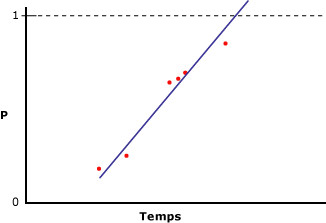
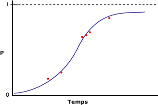

# <a name="microsoft-logistic-regression-algorithm-technical-reference"></a>Références techniques relatives à l'algorithme MLR (Microsoft Logistic Regression)
[!INCLUDE[ssas-appliesto-sqlas](../../includes/ssas-appliesto-sqlas.md)]Le [!INCLUDE[msCoName](../../includes/msconame-md.md)] algorithme de régression logistique est une variante de la [!INCLUDE[msCoName](../../includes/msconame-md.md)] algorithme de réseau neuronal, où le *HIDDEN_NODE_RATIO* paramètre est défini sur 0. Ce paramètre crée un modèle de réseau neuronal qui ne contient pas de couche masquée et qui, par conséquent, est équivalent à la régression logistique.  
  
## <a name="implementation-of-the-microsoft-logistic-regression-algorithm"></a>Implémentation de l'algorithme MLR (Microsoft Logistic Regression)  
 Supposons que la colonne prédictible contient uniquement deux états, mais que vous souhaitez tout de même effectuer une analyse de régression, en associant les colonnes d'entrée à la probabilité que la colonne prédictible contiendra un état spécifique. Le diagramme suivant représente les résultats obtenus en attribuant les valeurs 1 et 0 aux états de la colonne prédictible, en calculant la probabilité que la colonne contiendra un état spécifique et en effectuant une régression linéaire par rapport à une variable d'entrée.  
  
   
  
 L'axe des abscisses (X) contient les valeurs d'une colonne d'entrée. L'axe des ordonnées (Y) contient les probabilités que la colonne prédictible contiendra l'un ou l'autre des états. Le problème de cette méthode est que la régression linéaire ne contraint pas la colonne à avoir une valeur comprise entre 0 et 1, même s'il s'agit des valeurs minimale et maximale de la colonne. Vous pouvez effectuer une régression logistique pour résoudre ce problème. Au lieu de créer une ligne droite, l'analyse de régression logistique crée une courbe en forme de « S » contenant les contraintes de valeur maximale et minimale. Par exemple, le diagramme suivant représente les résultats obtenus en effectuant une régression logistique par rapport aux mêmes données que pour l'exemple précédent.  
  
   
  
 Notez que la courbe reste toujours entre la valeur 1 et la valeur 0. Vous pouvez utiliser la régression logistique pour identifier les colonnes d'entrée qui jouent un rôle important dans la détermination de l'état de la colonne prédictible.  
  
### <a name="feature-selection"></a>Sélection des fonctionnalités  
 La sélection des fonctionnalités est automatiquement utilisée par tous les algorithmes d'exploration de données Analysis Services pour améliorer l'analyse et réduire la charge de traitement. La méthode utilisée pour la sélection des fonctionnalités dans un modèle de régression logistique dépend du type de données de l'attribut. La régression logistique étant basée sur l'algorithme MNN (Microsoft Neural Network), elle utilise un sous-ensemble de méthodes de sélection de fonctionnalités qui s'appliquent aux réseaux neuronaux. Pour plus d’informations, consultez [Sélection des fonctionnalités &#40;Exploration de données&#41;](../../analysis-services/data-mining/feature-selection-data-mining.md).  
  
### <a name="scoring-inputs"></a>Calcul de score des entrées  
 Dans le contexte d’un modèle de réseau neuronal ou de régression logistique, le*ing* désigne le processus de conversion des valeurs présentes dans les données d’un jeu de valeurs qui utilisent la même échelle et qui, par conséquent, peuvent être comparées les unes aux autres. Par exemple, supposons que les entrées pour la plage Income sont comprises entre de 0 à 100 000 et que celles pour [Number of Children] sont comprises entre 0 et 5. Ce processus de conversion vous permet de comparer l’importance de chaque d’entrée indépendamment de la différence des valeurs.  
  
 Pour chaque état qui apparaît dans le jeu d'apprentissage, le modèle génère une entrée. Pour les entrées discrètes ou discrétisées, une entrée supplémentaire est créée pour représenter l'état manquant s'il apparaît au moins une fois dans le jeu d'apprentissage. Pour les entrées continues, deux nœuds d'entrée sont créés au plus : un pour les valeurs manquantes, si elles sont présentes dans les données d'apprentissage, et une entrée pour toutes les valeurs existantes ou non Null. Chaque entrée est mise à l’échelle à un format numérique à l’aide de la méthode de normalisation z-score `(x – μ)\StdDev`.  
  
 Lors de la normalisation z-score, la moyenne (μ) et l'écart type sont obtenus sur le jeu d'apprentissage complet.  
  
 **Valeurs continues**  
  
 La valeur est présente :   `(X – μ)/σ ` (X est la valeur réelle encodée)  
  
 La valeur est absente :    `-   μ/σ `  (mu négatif divisé par sigma)  
  
 **Valeurs discrètes**  
  
 `μ = p`  (probabilité antérieure d’un état)  
  
 StdDev  `= sqrt(p\(1-p))`  
  
 La valeur est présente :     `\(1 – μ)/σ` (1 moins mu divisé par sigma)  
  
 La valeur est absente :     `(– μ)/σ` (mu négatif divisé par sigma)  
  
### <a name="understanding-logistic-regression-coefficients"></a>Présentation des coefficients de régression logistique  
 La documentation statistique présente différentes méthodes pour effectuer la régression logistique, mais une part importante de toutes ces méthodes évalue l'adéquation du modèle. Un grand nombre de statistiques adéquates ont été proposées, dont des rapports de cotes et des modèles de covariance. La méthode utilisée pour mesurer l'adéquation d'un modèle n'est pas traitée dans cette rubrique ; toutefois, vous pouvez récupérer la valeur des coefficients dans le modèle et les utiliser pour concevoir vos propres mesures d'adéquation.  
  
> [!NOTE]  
>  Les coefficients créés dans le cadre d'un modèle de régression logistique ne représentent pas les rapports de cotes et ne doivent pas être interprétés comme tel.  
  
 Les coefficients pour chaque nœud dans le graphique du modèle représentent une somme pondérée des entrées vers ce nœud. Dans un modèle de régression logistique, la couche masquée est vide ; par conséquent, il n'existe qu'un seul jeu de coefficients qui est stocké dans les nœuds de sortie. Vous pouvez récupérer les valeurs des coefficients à l'aide de la requête suivante :  
  
```  
SELECT FLATTENED [NODE_UNIQUE NAME],  
(SELECT ATTRIBUTE_NAME< ATTRIBUTE_VALUE  
FROM NODE_DISTRIBUTION) AS t  
FROM <model name>.CONTENT  
WHERE NODE_TYPE = 23  
```  
  
 Pour chaque valeur de sortie, cette requête retourne les coefficients et un ID qui pointe en retour vers le nœud d'entrée associé. Elle retourne également une ligne qui contient la valeur de la sortie et de l'ordonnée à l'origine. Chaque entrée X a son propre coefficient (Ci), mais la table imbriquée contient également un coefficient « libre » (Co), calculé d'après la formule suivante :  
  
 `F(X) = X1*C1 + X2*C2 + … +Xn*Cn + X0`  
  
 Activation : `exp(F(X)) / (1 + exp(F(X)) )`  
  
 Pour plus d’informations, consultez [Exemples de requête de modèle de régression logistique](../../analysis-services/data-mining/logistic-regression-model-query-examples.md).  
  
## <a name="customizing-the-logistic-regression-algorithm"></a>Personnalisation de l'algorithme Logistic Regression  
 L’algorithme MLR ( [!INCLUDE[msCoName](../../includes/msconame-md.md)] Logistic Regression) prend en charge plusieurs paramètres qui affectent le comportement, les performances et la précision du modèle d’exploration de données résultant. Vous pouvez également modifier le comportement du modèle en définissant des indicateurs de modélisation sur les colonnes utilisées comme entrées.  
  
### <a name="setting-algorithm-parameters"></a>Définition des paramètres de l'algorithme  
 Le tableau suivant décrit les paramètres qui peuvent être utilisés avec l'algorithme MLR (Microsoft Logistic Regression).  
  
 HOLDOUT_PERCENTAGE  
 Spécifie le pourcentage de cas extraits des données d'apprentissage pour calculer l'erreur d'exclusion. HOLDOUT_PERCENTAGE constitue l'un des critères d'arrêt pendant l'apprentissage du modèle d'exploration de données.  
  
 La valeur par défaut est 30.  
  
 HOLDOUT_SEED  
 Spécifie un nombre à utiliser pour définir la valeur de départ du générateur pseudo-aléatoire lors de l'identification des données d'exclusion. Si HOLDOUT_SEED a la valeur 0, l'algorithme génère la valeur de départ en fonction du nom du modèle d'exploration de données afin de garantir que le contenu du modèle reste inchangé lors du retraitement.  
  
 La valeur par défaut est 0.  
  
 MAXIMUM_INPUT_ATTRIBUTES  
 Spécifie le nombre d'attributs d'entrée que l'algorithme peut traiter avant d'appeler la sélection des fonctionnalités. Attribuez à ce paramètre la valeur 0 pour désactiver la sélection des fonctionnalités.  
  
 La valeur par défaut est 255.  
  
 MAXIMUM_OUTPUT_ATTRIBUTES  
 Spécifie le nombre d'attributs de sortie que l'algorithme peut traiter avant d'appeler la sélection des fonctionnalités. Attribuez à ce paramètre la valeur 0 pour désactiver la sélection des fonctionnalités.  
  
 La valeur par défaut est 255.  
  
 MAXIMUM_STATES  
 Spécifie le nombre maximal d'états d'attribut que l'algorithme prend en charge. Si le nombre d'états d'un attribut est supérieur au nombre maximal d'états, l'algorithme sélectionne les états les plus fréquents pour cet attribut et ignore les autres.  
  
 La valeur par défaut est 100.  
  
 SAMPLE_SIZE  
 Spécifie le nombre de cas à utiliser pour effectuer l'apprentissage du modèle. Le fournisseur d'algorithme utilise soit ce nombre, soit le pourcentage du nombre total de cas qui ne sont pas inclus dans le pourcentage d'exclusion conformément au paramètre HOLDOUT_PERCENTAGE : c'est la valeur la plus faible qui est retenue.  
  
 En d’autres termes, si HOLDOUT_PERCENTAGE a la valeur 30, l’algorithme utilise la valeur de ce paramètre ou une valeur égale à 70 % du nombre total de cas, en prenant la plus petite valeur des deux.  
  
 La valeur par défaut est 10000.  
  
### <a name="modeling-flags"></a>Indicateurs de modélisation  
 Les indicateurs de modélisation suivants sont pris en charge pour une utilisation avec l’algorithme MLR ( [!INCLUDE[msCoName](../../includes/msconame-md.md)] Logistic Regression).  
  
 NOT NULL  
 Indique que la colonne ne peut pas contenir de valeur Null. Une erreur est générée si Analysis Services rencontre une valeur NULL au cours de l'apprentissage du modèle.  
  
 S'applique aux colonnes de structure d'exploration de données.  
  
 MODEL_EXISTENCE_ONLY  
 Signifie que la colonne sera considérée comme ayant deux états possibles : **Missing** et **Existing**. Une valeur NULL est une valeur manquante.  
  
 S'applique à la colonne de modèle d'exploration de données.  
  
## <a name="requirements"></a>Spécifications  
 Un modèle de régression logistique doit contenir une colonne clé, des colonnes d'entrée et au moins une colonne prédictible.  
  
### <a name="input-and-predictable-columns"></a>Colonnes d'entrée et prédictibles  
 L’algorithme MLR ([!INCLUDE[msCoName](../../includes/msconame-md.md)] Logistic Regression) prend en charge les types de contenu de colonne d’entrée spécifiques, les types de contenu de colonne prédictible et les indicateurs de modélisation répertoriés dans le tableau suivant. Pour plus d’informations sur la signification des types de contenu utilisés dans un modèle d’exploration de données, consultez [Types de contenu &#40;exploration de données&#41;](../../analysis-services/data-mining/content-types-data-mining.md).  
  
|Colonne|Types de contenu|  
|------------|-------------------|  
|Attribut d'entrée|Continu, Discret, Discrétisé, Clé, Table|  
|Attribut prédictible|Continu, Discret, Discrétisé|  
  
## <a name="see-also"></a>Voir aussi  
 [Algorithme MLR (Microsoft Logistic Regression)](../../analysis-services/data-mining/microsoft-logistic-regression-algorithm.md)   
 [Exemples de requêtes de modèle de régression linéaire](../../analysis-services/data-mining/linear-regression-model-query-examples.md)   
 [Contenu du modèle d’exploration de données pour les modèles de régression logistique &#40;Analysis Services – Exploration de données&#41;](../../analysis-services/data-mining/mining-model-content-for-logistic-regression-models.md)   
 [Algorithme MNN (Microsoft Neural Network)](../../analysis-services/data-mining/microsoft-neural-network-algorithm.md)  
  
  
