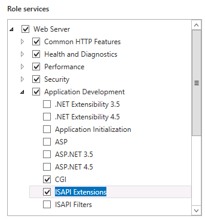
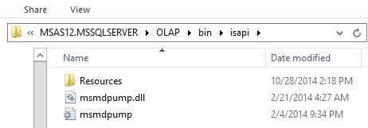
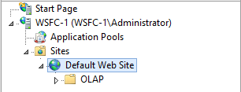
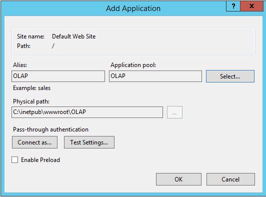
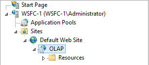
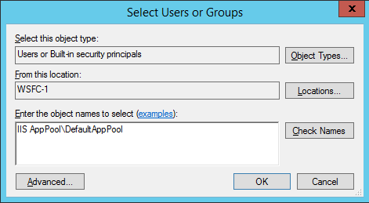

# <a name="configure-http-access-to-analysis-services-on-iis-80"></a>Configurer l’accès HTTP à Analysis Services sur IIS 8.0
  Cet article explique comment configurer un point de terminaison HTTP pour accéder à une instance Analysis Services. Vous pouvez activer l'accès HTTP en configurant MSMDPUMP.dll, une extension ISAPI qui s'exécute dans Internet Information Services (IIS) et qui pompe des données entre des applications clientes et un serveur Analysis Services. Cette approche constitue une alternative à la connexion à Analysis Services lorsque votre solution de décisionnel nécessite les capacités suivantes :  
  
-   Un accès client via une connexion Internet ou extranet, avec des restrictions au niveau des ports à activer  
  
-   Connexions clientes provenant de domaines non approuvés du même réseau.  
  
-   Une application cliente qui s'exécute dans un environnement réseau qui permet des connexions HTTP mais pas TCP/IP.  
  
-   Des applications clientes qui ne peuvent pas utiliser les bibliothèques clientes Analysis Services (par exemple, une application Java s'exécutant sur un serveur UNIX). Si vous ne pouvez pas utiliser les bibliothèques clientes Analysis Services pour accéder aux données, vous pouvez utiliser SOAP et XML/A sur une connexion HTTP directe à une instance Analysis Services.  
  
-   Des méthodes d'authentification autres que la sécurité intégrée de Windows sont requises. En particulier, vous pouvez utiliser des connexions anonymes et l'authentification de base lorsque vous configurez Analysis Services en vue de l'accès HTTP. Les authentifications Digest, ASP.NET et par formulaires ne sont pas prises en charge. L'une des principales raisons d'activer l'accès HTTP est pour répondre à une spécification de l'authentification de base. Pour en savoir plus, consultez [Authentification et délégation d'identité Microsoft BI](http://go.microsoft.com/fwlink/?LinkId=286576).  
  
 Vous pouvez configurer l'accès HTTP pour toutes les versions ou éditions prises en charge d'Analysis Services s'exécutant en mode tabulaire ou multidimensionnel. Les cubes locaux sont une exception. Vous ne pouvez pas vous connecter à un cube local via un point de terminaison HTTP.  
  
 La configuration de l'accès HTTP intervient après l'installation. Analysis Services doit être installé avant de pouvoir être configuré pour l'accès HTTP. En tant qu'administrateur Analysis Services, vous devez accorder des autorisations aux comptes Windows pour l'accès HTTP. Par ailleurs, il est recommandé de valider votre installation pour vous assurer qu'elle est complètement opérationnelle avant de continuer la configuration du serveur. Une fois l'accès HTTP configuré, vous pouvez utiliser le point de terminaison HTTP et le nom de réseau habituel du serveur sur TCP/IP. La configuration d'un accès HTTP n'empêche pas l'utilisation d'autres approches pour accéder aux données.  
  
 Pendant la configuration de MSMDPUMP, n'oubliez pas de prendre en compte les deux connexions suivantes : client à IIS, IIS à SSAS. Les instructions fournies dans cet article concerne la connexion IIS à SSAS. Votre application cliente peut nécessiter une configuration supplémentaire pour la connexion à IIS. Cet article n'aborde pas la configuration des liaisons ni ne vous aide à déterminer s'il faut utiliser le protocole SSL Pour plus d’informations sur IIS, voir [Serveur web (IIS)](http://technet.microsoft.com/library/hh831725.aspx) .  
  
 Cette rubrique comprend les sections suivantes :  
  
-   [Vue d'ensemble](#bkmk_overview)  
  
-   [Conditions préalables](#bkmk_prereq)  
  
-   [Copier le fichier MSMDPUMP.dll dans un dossier du serveur Web](#bkmk_copy)  
  
-   [Créer un pool d'applications et un répertoire virtuel dans IIS](#bkmk_appPool)  
  
-   [Configurer l'authentification IIS et ajouter l'extension](#bkmk_auth)  
  
-   [Modifier le fichier MSMDPUMP.INI pour définir le serveur cible](#bkmk_edit)  
  
-   [Tester votre configuration](#bkmk_test)  
  
##  <a name="bkmk_overview"></a> Vue d'ensemble  
 MSMDPUMP est une extension ISAPI qui se charge dans IIS et fournit une redirection vers une instance Analysis Services locale ou distante. En configurant cette extension ISAPI, vous créez un point de terminaison HTTP à une instance Analysis Services.  
  
 Vous devez créer et configurer un répertoire virtuel pour chaque point de terminaison HTTP. Chaque point de terminaison a besoin de son propre groupe de fichiers MSMDPUMP, pour chaque instance Analysis Services à laquelle vous souhaitez vous connecter. Un fichier de configuration de ce groupe de fichiers spécifie le nom de l'instance d'Analysis Services utilisée pour chaque point de terminaison HTTP.  
  
 Dans IIS, MSMDPUMP se connecte à Analysis Services à l'aide du fournisseur OLE DB Analysis Services via une connexion TCP/IP. Bien que l'origine des demandes du client puisse se trouver en dehors de l'approbation de domaine, Analysis Services et IIS doivent être dans le même domaine ou dans des domaines approuvés afin que la connexion aboutisse.  
  
 Lorsque MSMDPUMP se connecte à Analysis Services, il le fait sous une identité d'utilisateur Windows. Ce compte peut être un compte anonyme si vous avez configuré le répertoire virtuel de façon à autoriser les connexions anonymes, ou bien il peut s'agir d'un compte d'utilisateur Windows. Ce compte doit avoir des autorisations d'accès aux données nécessaires sur le serveur et la base de données Analysis Services.  
  
   
  
 Le tableau suivant comprend d'autres éléments à prendre en compte lorsque vous activez l'accès HTTP dans différents scénarios.  
  
|Scénario|Configuration|  
|--------------|-------------------|  
|IIS et Analysis Services sur le même ordinateur|Il s'agit de la configuration la plus simple car elle vous permet d'utiliser la configuration par défaut (lorsque le nom du serveur est localhost), le fournisseur OLE DB Analysis Services local et la sécurité intégrée de Windows avec NTLM. Si le client se trouve également dans le même domaine, l'authentification est transparente pour l'utilisateur et ne nécessite aucune action supplémentaire de votre part.|  
|IIS et Analysis Services sur des ordinateurs différents|Pour cette topologie, vous devez installer le fournisseur OLE DB Analysis Services sur le serveur Web. Vous devez également modifier le fichier msmdpump.ini pour qu'il spécifie l'emplacement de l'instance Analysis Services sur l'ordinateur distant.<br /><br /> Cette topologie ajoute une étape d'authentification double saut, dans laquelle les informations d'identification doivent passer du client vers le serveur Web, jusqu'au serveur principal Analysis Services. Si vous utilisez des informations d'identification Windows et NTLM, vous obtiendrez une erreur car NTLM ne permet pas la délégation d'informations d'identification client à un autre serveur. La solution habituelle consiste à utiliser l'authentification de base avec le protocole SSL. Cela nécessite, cependant, que les utilisateurs fournissent un nom d'utilisateur et un mot de passe pour accéder au répertoire virtuel MSMDPUMP. Une approche plus simple consiste à activer Kerberos et à configurer une délégation contrainte Analysis Services pour que les utilisateurs puissent accéder à Analysis Services facilement. Pour plus d'informations, consultez [Configure Analysis Services for Kerberos constrained delegation](../../analysis-services/instances/configure-analysis-services-for-kerberos-constrained-delegation.md) .<br /><br /> Réfléchissez aux ports à débloquer dans le Pare-feu Windows. Vous devrez débloquer les ports sur les deux serveurs pour permettre l'accès à l'application Web sur IIS et à Analysis Services sur un serveur distant.|  
|Les connexions client proviennent d'un domaine non approuvé ou d'une connexion extranet|Les connexions client provenant d'un domaine non approuvé nécessitent davantage de restrictions d'authentification. Par défaut, Analysis Services utilise l'authentification intégrée de Windows, qui nécessite que les utilisateurs se trouvent dans le même domaine que le serveur. Si vos utilisateurs extranet se connectent à IIS depuis un domaine extérieur, ils obtiendront une erreur de connexion si le serveur est configuré pour utiliser les paramètres par défaut.<br /><br /> L'une des solutions de contournement consiste à demander aux utilisateurs extranet de se connecter via une connexion VPN à l'aide d'informations d'identification de domaine. Cependant, une meilleure approche serait d'activer l'authentification de base et le protocole SSL sur votre site Web IIS.|  
  
##  <a name="bkmk_prereq"></a> Conditions préalables  
 Les instructions de cet article supposent qu'IIS est déjà configuré et qu'Analysis Services est déjà installé. Windows Server 2012 est fourni avec IIS 8.x comme rôle serveur activable sur le système.  
  
 **Configuration supplémentaire dans IIS 8.0**  
  
 La configuration d'IIS 8.0 par défaut ne contient pas certains composants nécessaires pour l'accès HTTP à Analysis Services. Ces composants, situés dans les zones des fonctionnalités **Sécurité** et **Développement d’applications** du rôle **Serveur web (IIS)** , sont les suivants :  
  
-   **Sécurité** | **Authentification Windows**ou **Authentification de base**, et d’autres fonctionnalités de sécurité requises pour votre scénario d’accès aux données.  
  
-   **Développement d’applications** | **CGI**  
  
-   **Développement d’applications** | **Extensions ISAPI**  
  
 Pour vérifier ou ajouter ces composants, voir **Gestionnaire de serveur** | **Gérer** | **Ajouter des rôles et fonctionnalités**. Parcourez l'Assistant jusqu'à **Rôles serveur**. Faites défiler vers le bas pour accéder à **Serveur web (IIS)**.  
  
1.  Ouvrez **Serveur Web** | **Sécurité** , puis choisissez les méthodes d’authentification.  
  
2.  Ouvrez **Serveur Web** | **Développement d’applications** , puis choisissez **CGI** et **Extensions ISAPI**.  
  
       
  
 **Quand IIS se trouve sur un serveur distant**  
  
 Une connexion à distance entre IIS et Analysis Services requiert l'installation du fournisseur OLE DB pour Analysis Services (MSOLAP) sur le serveur Windows qui exécute IIS.  
  
1.  Accédez à la page de téléchargement de [SQL Server 2014 Feature Pack](http://www.microsoft.com/download/details.aspx?id=42295)  
  
2.  Cliquez sur le bouton rouge Télécharger.  
  
3.  Faites défiler vers le bas pour trouver ENU\x64\SQL_AS_OLEDB.msi  
  
4.  Suivez les instructions de l'Assistant pour effectuer l'installation.  
  
> [!NOTE]  
>  N'oubliez pas de débloquer les ports dans le Pare-feu Windows, afin de permettre les connexions client au serveur distant Analysis Services. Pour plus d’informations, consultez [Configure the Windows Firewall to Allow Analysis Services Access](../../analysis-services/instances/configure-the-windows-firewall-to-allow-analysis-services-access.md).  
  
##  <a name="bkmk_copy"></a> Étape 1 : copier les fichiers MSMDPUMP.dll dans un dossier du serveur Web  
 Chaque point de terminaison HTTP que vous créez doit posséder son propre groupe de fichiers MSMDPUMP. Dans cette étape, vous copiez le fichier exécutable MSMDPUMP, le fichier de configuration et le dossier de ressources des dossiers de programme d'Analysis Services vers un nouveau dossier de répertoire virtuel que vous allez créer dans le système de fichiers de l'ordinateur exécutant IIS.  
  
 Le lecteur doit être formaté à l'aide du système de fichier NTFS. Le chemin d'accès au dossier que vous créez ne doit contenir aucun espace.  
  
1.  Copiez les fichiers suivants, figurant dans \<lecteur > : \Program Files\Microsoft SQL Server\\< instance\>\OLAP\bin\isapi : MSMDPUMP. DLL, MSMDPUMP. INI et un dossier de ressources.  
  
       
  
2.  Sur le serveur web, créez un nouveau dossier : \<lecteur > : \inetpub\wwwroot\\**OLAP**  
  
3.  Collez les fichiers que vous avez copiés précédemment dans ce nouveau dossier.  
  
4.  Vérifiez que le dossier \inetpub\wwwroot\OLAP présent sur votre serveur Web contient ce qui suit : un fichier MSMDPUMP.DLL, un fichier MSMDPUMP.INI et un dossier Resources. La structure des dossiers doit ressembler à ceci :  
  
    -   \<lecteur > : \inetpub\wwwroot\OLAP\MSMDPUMP.dll  
  
    -   \<lecteur > : \inetpub\wwwroot\OLAP\MSMDPUMP.ini  
  
    -   \<lecteur > : \inetpub\wwwroot\OLAP\Resources  
  
##  <a name="bkmk_appPool"></a> Étape 2 : créer un pool d'applications et un répertoire virtuel dans IIS  
 Ensuite, créez un pool d’applications et un point de terminaison pour la pompe.  
  
#### <a name="create-an-application-pool"></a>Créer un pool d'applications  
  
1.  Démarrez le Gestionnaire des services Internet.  
  
2.  Ouvrez le dossier du serveur, cliquez avec le bouton droit sur **Pools d’applications** , puis cliquez sur **Ajouter un pool d’applications**. Créez un pool d'applications nommé **OLAP**, à l'aide du .NET Framework, avec le mode de pipeline géré défini sur **Classique**.  
  
       
  
3.  Par défaut, IIS crée des pools d'applications avec l'identité de sécurité **ApplicationPoolIdentity** , qui fonctionne également pour l'accès HTTP à Analysis Services. Si vous avez des raisons particulières de modifier l’identité, cliquez avec le bouton droit sur **OLAP**, puis sélectionnez **Paramètres avancés**. Sélectionnez **ApplicationPoolIdentity**. Cliquez sur le bouton **Modifier** correspondant à cette propriété pour remplacer le compte intégré par le compte personnalisé que vous souhaitez utiliser.  
  
       
  
4.  Par défaut, sur les systèmes d’exploitation 64 bits, IIS attribue la valeur **false** à la propriété **Activer les applications 32 bits**. Si vous avez copié le fichier msmdpump.dll depuis une installation 64 bits d'Analysis Services, il s'agit du paramètre approprié pour l'extension MSMDPUMP sur un serveur IIS 64 bits. Si vous avez copié les fichiers binaires MSMDPUMP à partir d’une installation 32 bits, attribuez la valeur **true**. Vérifiez que cette propriété est définie correctement dans **Paramètres avancés** .  
  
#### <a name="create-an-application"></a>Créer une application  
  
1.  Dans le Gestionnaire IIS, ouvrez **Sites**, puis **Site Web par défaut**. Un dossier **Olap**doit s'afficher. Il s'agit d'une référence au dossier OLAP que vous avez créé sous \inetpub\wwwroot.  
  
       
  
2.  Cliquez avec le bouton droit sur le dossier, puis choisissez **Convertir en application**.  
  
3.  Dans Ajouter une application, entrez **OLAP** en tant qu'alias. Cliquez sur **Sélectionner** pour choisir le pool d'applications OLAP. Le chemin d'accès physique doit être défini sur C:\inetpub\wwwroot\OLAP  
  
       
  
4.  Cliquez sur **OK**. Actualisez le site web. Le dossier OLAP est désormais une application sous le site web par défaut. Le chemin d'accès virtuel au fichier MSMDPUMP est désormais établi.  
  
       
  
> [!NOTE]  
>  Les versions antérieures de ces instructions incluaient les étapes de création d'un répertoire virtuel. Cette étape n'est plus nécessaire.  
  
##  <a name="bkmk_auth"></a> Étape 3 : configurer l'authentification IIS et ajouter l'extension  
 Dans cette étape, vous allez plus loin dans la configuration du répertoire virtuel SSAS que vous venez de créer. Vous allez spécifier une méthode d'authentification, puis ajouter un mappage de scripts. Les méthodes d'authentification prises en charge pour Analysis Services via HTTP sont les suivantes :  
  
-   Authentification Windows (Kerberos ou NTLM)  
  
-   Authentification de base  
  
-   Authentification anonyme  
  
 L'**authentification Windows** est considérée comme la plus sécurisée ; elle exploite l'infrastructure existante pour les réseaux qui utilisent Active Directory. Pour utiliser l'authentification Windows de manière efficace, tous les navigateurs, les applications clientes et les applications serveur doivent la prendre en charge. Il s'agit du mode le plus sécurisé et recommandé, mais il requiert qu'IIS soit en mesure d'accéder à un contrôleur de domaine Windows qui peut authentifier l'identité de l'utilisateur qui demande une connexion.  
  
 Pour les topologies qui placent Analysis Services et IIS sur des ordinateurs différents, vous devez résoudre les problèmes de double saut qui surviennent lorsqu'une identité d'utilisateur doit être déléguée à un autre service sur un ordinateur distant, généralement en activant Analysis Services pour la délégation contrainte Kerberos. Pour plus d'informations, consultez [Configure Analysis Services for Kerberos constrained delegation](../../analysis-services/instances/configure-analysis-services-for-kerberos-constrained-delegation.md).  
  
 L’**authentification de base** est utilisée en présence d’identités Windows, mais les connexions d’utilisateur proviennent de domaines non approuvés, ce qui interdit l’utilisation de connexions déléguées ou empruntées. L'authentification de base vous permet de spécifier une identité d'utilisateur et un mot de passe dans la chaîne de connexion. Au lieu d'utiliser le contexte de sécurité de l'utilisateur actuel, les informations d'identification dans la chaîne de connexion sont utilisées pour la connexion à Analysis Services. Comme Analysis Services prend uniquement en charge l'authentification Windows, les informations d'identification qui lui sont transmises doivent correspondre à un utilisateur ou à un groupe Windows qui est membre du domaine dans lequel Analysis Services est hébergé.  
  
 L'**authentification anonyme** est souvent utilisée au cours du test initial car sa simplicité de configuration vous permet de valider rapidement une connectivité HTTP à Analysis Services. En seulement quelques étapes, vous pouvez affecter un compte d'utilisateur unique comme identité, accorder ces autorisations de compte dans Analysis Services, utiliser le compte pour vérifier l'accès aux données dans une application cliente, puis désactiver l'authentification anonyme lorsque le test est terminé.  
  
 Vous pouvez également utiliser l’authentification anonyme dans un environnement de production si les utilisateurs n’ont pas de comptes d’utilisateur Windows, mais il convient de respecter les meilleurs pratiques en verrouillant les autorisations sur le système hôte, comme expliqué dans [Activer l’authentification anonyme (IIS 7)](http://technet.microsoft.com/library/cc731244\(v=ws.10\).aspx). Assurez-vous que l'authentification est définie sur le répertoire virtuel, et non sur le site Web parent, afin de limiter encore davantage le niveau d'accès du compte.  
  
 Si l'authentification anonyme est activée, toute connexion utilisateur au point de terminaison HTTP est autorisée à se connecter en tant qu'utilisateur anonyme. Vous ne serez pas en mesure d'auditer les connexions utilisateur individuelles, ni d'utiliser l'identité de l'utilisateur pour sélectionner les données d'un modèle. Comme vous pouvez le voir, l'utilisation de l'option Anonyme a une incidence globale, depuis la conception du modèle jusqu'à l'actualisation des données et à leur accès. Toutefois, si les utilisateurs n'ont pas de connexion d'utilisateur Windows pour démarrer, l'utilisation du compte anonyme peut être la seule option.  
  
#### <a name="set-the-authentication-type-and-add-a-script-map"></a>Définir le type d'authentification et ajouter un mappage de scripts  
  
1.  Dans le Gestionnaire des services Internet, ouvrez **Sites**, ouvrez le **Site Web par défaut**, puis sélectionnez le répertoire virtuel **OLAP** .  
  
2.  Double-cliquez sur **Authentification** dans la section IIS de la page principale.  
  
       
  
3.  Cochez la case **Authentification Windows** si vous utilisez la sécurité intégrée de Windows.  
  
       
  
4.  Vous pouvez aussi activer la case à cocher **Authentification de base** si vos applications clientes et serveur ne se trouvent pas dans le même domaine. Ce mode requiert que l'utilisateur entre un nom d'utilisateur et un mot de passe. Le nom d'utilisateur et le mot de passe sont transmis sur la connexion HTTP à IIS. IIS essaiera d'emprunter l'identité de l'utilisateur avec les informations d'identification fournies lors de la connexion à MSMDPUMP, mais les informations d'identification ne seront pas déléguées à Analysis Services. Au lieu de cela, vous devez transmettre un nom d'utilisateur et un mot de passe valides sur une connexion, comme indiqué à l'étape 6 de ce document.  
  
    > [!IMPORTANT]  
    >  Notez qu'il est impératif de sécuriser le canal de communication lorsqu'on crée un système où les mots de passe sont transmis. IIS fournit un ensemble d'outils qui vous aident à sécuriser le canal. Pour plus d'informations, consultez [Procédure de configuration de SSL sur IIS 7](http://go.microsoft.com/fwlink/?LinkId=207562).  
  
5.  Désactivez **Authentification anonyme** si vous utilisez l'authentification de base ou Windows. Si vous activez l'authentification anonyme, IIS l'utilisera toujours en premier, même si d'autres méthodes d'authentification sont activées.  
  
     Sous Authentification anonyme, la pompe (msmdpump.dll) s'exécute en tant que compte d'utilisateur que vous avez généré pour l'utilisateur anonyme. Il n'existe aucune distinction entre l'utilisateur qui se connecte à IIS et celui qui se connecte à Analysis Services. Par défaut, IIS utilise le compte IUSR, mais vous pouvez modifier ce comportement pour qu'il utilise un compte d'utilisateur de domaine détenteur d'autorisations réseau. Vous aurez besoin de cette fonction si IIS et Analysis Services se trouvent sur des ordinateurs différents.  
  
     Pour savoir comment configurer les informations d'identification de l'authentification anonyme, consultez [Authentification anonyme](http://www.iis.net/configreference/system.webserver/security/authentication/anonymousauthentication).  
  
    > [!IMPORTANT]  
    >  L'authentification anonyme se rencontre principalement dans des environnements extrêmement contrôlés, où l'accès des utilisateurs est tantôt accordé, tantôt refusé sur la base de listes de contrôle d'accès dans le système de fichiers. Pour connaître les meilleures pratiques, voir [Activer l’authentification anonyme (IIS 7)](http://technet.microsoft.com/library/cc731244\(v=ws.10\).aspx).  
  
6.  Cliquez sur le répertoire virtuel **OLAP** pour ouvrir la page principale. Double-cliquez sur **Mappages de gestionnaires**.  
  
       
  
7.  Cliquez avec le bouton droit n’importe où dans la page, puis sélectionnez **Ajouter un mappage de scripts**. Dans la boîte de dialogue Ajouter un mappage de scripts, spécifiez **\*.dll** comme chemin d’accès à la demande, spécifiez c:\inetpub\wwwroot\OLAP\msmdpump.dll comme fichier exécutable, puis entrez **OLAP** comme nom. Gardez toutes les restrictions par défaut associées à ce mappage de scripts.  
  
       
  
8.  Une invite vous demande si vous souhaitez autoriser l'extension ISAPI, cliquez sur **Oui**.  
  
       
  
##  <a name="bkmk_edit"></a> Étape 4 : modifier le fichier MSMDPUMP.INI pour définir le serveur cible  
 Le fichier MSMDPUMP.INI spécifie l'instance Analysis Services à laquelle le fichier MSMDPUMP.DLL se connecte. Cette instance peut être locale ou distante, installée comme instance par défaut ou nommée.  
  
 Ouvrez le fichier msmdpump.ini situé dans le dossier C:\inetpub\wwwroot\OLAP et observez le contenu de ce fichier. Il devrait ressembler à ce qui suit :  
  
```  
<ConfigurationSettings>  
<ServerName>localhost</ServerName>  
<SessionTimeout>3600</SessionTimeout>  
<ConnectionPoolSize>100</ConnectionPoolSize>  
</ConfigurationSettings>  
  
```  
  
 Si l'instance Analysis Services pour laquelle vous configurez l'accès HTTP se trouve sur l'ordinateur local et si elle est installée comme instance par défaut, il n'y a aucune raison de modifier ce paramètre. Sinon, vous devez spécifier le nom du serveur (par exemple, \<NomServeur > ADWRKS-SRV01 \< /servername >). Pour un serveur qui est installé comme instance nommée, veillez à ajouter le nom d’instance (par exemple, \<NomServeur > ADWRKS-SRV01\Tabular \< /servername >).  
  
 Par défaut, Analysis Services écoute le port TCP/IP 2383. Si vous avez installé Analysis Services en tant que l’instance par défaut, vous n’avez pas besoin de spécifier de port dans \<nom_serveur >, car Analysis Services sait comment écouter le port 2383 automatiquement. Cependant, vous devrez autoriser les connexions entrantes pour ce port dans le Pare-feu Windows. Pour plus d’informations, consultez [Configure the Windows Firewall to Allow Analysis Services Access](../../analysis-services/instances/configure-the-windows-firewall-to-allow-analysis-services-access.md).  
  
 Si vous configuré un jeu nommé ou instance d’Analysis Services à l’écoute sur un port fixe par défaut, vous devez ajouter le numéro de port pour le nom du serveur (par exemple, \<NomServeur > AW-SRV01:55555 \< /servername >) et vous devez autoriser les connexions entrantes dans le pare-feu Windows à ce port.  
  
## <a name="step-5-grant-data-access-permissions"></a>Étape 5 : octroyer des autorisations d'accès aux données  
 Comme indiqué précédemment, vous devez accorder des autorisations sur l'instance Analysis Services. Chaque objet de base de données aura des rôles correspondant à un niveau spécifique d'autorisations (lecture ou lecture/écriture), et chaque rôle comportera des membres comprenant des identités d'utilisateur Windows.  
  
 Pour définir des autorisations, vous pouvez utiliser SQL Server Management Studio. Dans le dossier **Base de données** | **Rôles** , vous pouvez créer des rôles, spécifier des autorisations de base de données, affecter une appartenance à des comptes de groupe ou d’utilisateur Windows, puis accorder des autorisations en lecture ou en écriture sur des objets spécifiques. En général, les autorisations de **lecture** sur un cube sont suffisantes pour les connexions clientes qui utilisent, mais ne mettent pas à jour, les données du modèle.  
  
 L'attribution de rôle varie selon la façon dont vous avez configuré l'authentification.  
  
|||  
|-|-|  
|Anonyme|Ajoutez à la liste des membres le compte spécifié dans **Modifier les informations d'identification pour l'authentification anonyme** dans IIS. Pour plus d'informations, consultez [Authentification anonyme](http://www.iis.net/configreference/system.webserver/security/authentication/anonymousauthentication),|  
|Authentification Windows|Ajoutez à la liste des membres les comptes de groupe ou d'utilisateur Windows demandant des données Analysis Services via l'emprunt d'identité ou la délégation.<br /><br /> En supposant que la délégation contrainte Kerberos est utilisée, seuls les comptes d'utilisateur et de groupe Windows qui demandent l'accès ont besoin d'autorisations. Aucune autorisation n'est nécessaire pour l'identité du pool d'applications.|  
|Authentification de base|Ajoutez à la liste des membres les comptes de groupe ou d'utilisateur Windows qui seront transmis à la chaîne de connexion.<br /><br /> Par ailleurs, si vous transmettez les informations d'identification via **EffectiveUserName** dans la chaîne de connexion, l'identité du pool d'applications doit avoir des droits d'administrateur sur l'instance Analysis Services. Dans SSMS, cliquez sur l’instance &#124; **Propriétés** &#124; **Sécurité** &#124; **Ajouter**. Entrez l'identité du pool d'applications. Si vous avez utilisé l’identité par défaut, le compte est spécifié en tant que **IIS AppPool\DefaultAppPool**.<br /><br /> |  
  
 Pour plus d’informations sur la définition des autorisations, voir [Autorisation de l’accès à des objets et des opérations (Analysis Services)](../../analysis-services/multidimensional-models/authorizing-access-to-objects-and-operations-analysis-services.md).  
  
##  <a name="bkmk_test"></a> Étape 6 : tester votre configuration  
 La syntaxe de la chaîne de connexion de MSMDPUMP est l'URL du fichier MSMDPUMP.dll.  
  
 Si l’application web écoute un port fixe, ajoutez le numéro de port pour le nom du serveur ou l’adresse IP (par exemple, `http://my-web-srv01:8080/OLAP/msmdpump.dll` ou `http://123.456.789.012:8080/OLAP/msmdpump.dll`.  
  
 Pour tester rapidement la connexion, ouvrez une connexion à l’aide d’Internet Explorer, de Microsoft Excel ou de SQL Server Management Studio.  
  
 **Dépanner des connexions à l’aide d’Internet Explorer**  
  
 Une demande de connexion qui se termine avec cette erreur peut vous donne pas peu informatif : « une connexion ne peut pas être apportée à '\<nom du serveur > », ou Analysis Services n’est pas en cours d’exécution sur le serveur ».  
  
 Pour en savoir plus sur cette erreur, procédez comme suit :  
  
1.  Dans **Internet Explorer** > **Options Internet** > **Avancées**, désactivez la case à cocher **Afficher des messages d’erreur HTTP simplifiés**.  
  
2.  Réessayer la connexion (par exemple, `http://my-web-srv01:8080/OLAP/msmdpump.dll`)  
  
 Si vous voyez une ERREUR XML qui s’affiche dans la fenêtre du navigateur, MSMDPUMP n’en est pas la cause. Vous pouvez alors vous intéresser au certificat.  
  
 **Tester les connexions à l'aide de SQL Server Management Studio**  
  
1.  Dans la boîte de dialogue Se connecter au serveur de Management Studio, sélectionnez **Analysis Services** comme type de serveur. Dans la zone Nom du serveur, entrez l'adresse HTTP de l'extension msmdpump : `http://my-web-srv01/OLAP/msmdpump.dll`.  
  
     L'Explorateur d'objets affiche la connexion HTTP :  
  
       
  
2.  L'authentification doit correspondre à l'authentification Windows, et la personne utilisant Management Studio doit être un administrateur Analysis Services. Un administrateur peut accorder davantage d'autorisations afin d'activer l'accès pour d'autres utilisateurs.  
  
 **Tester les connexions à l'aide d'Excel**  
  
1.  Sous l'onglet Données dans Excel, dans Données externes, cliquez sur **À partir d'autres sources**, puis choisissez sur **À partir d'Analysis Services** pour démarrer l'Assistant Connexion de données.  
  
2.  Dans la zone Nom du serveur, entrez l'adresse HTTP de l'extension msmdpump : `http://my-web-srv01/OLAP/msmdpump.dll`.  
  
3.  Pour Références de connexion, choisissez **Utiliser l'authentification Windows** si vous utilisez la sécurité intégrée Windows ou l'authentification NTLM ou anonyme.  
  
     Pour l'authentification de base, choisissez **Utiliser le nom d'utilisateur et le mot de passe suivants**, puis spécifiez les informations d'identification utilisées pour la connexion. Les informations d'identification que vous fournissez sont transmises dans la chaîne de connexion à Analysis Services.  
  
 **Tester les connexions à l'aide d'AMO**  
  
 Vous pouvez tester l'accès HTTP par programme à l'aide d'AMO, en remplaçant l'URL du point de terminaison par le nom du serveur. Pour plus d’informations, voir la [question du forum (Procédure de synchronisation des bases de données SSAS 2008 R2 via HTTPS sur les limites de domaine/forêt et de pare-feu)](http://social.msdn.microsoft.com/Forums/en/sqlanalysisservices/thread/c4249d55-914d-4c81-9980-44d0b8df9c3e).  
  
 Exemple de chaîne de connexion illustrant la syntaxe de l'accès HTTP(S) à l'aide de l'authentification de base :  
  
 `Data Source=https://<servername>/olap/msmdpump.dll; Initial Catalog=AdventureWorksDW2012; Integrated Security=Basic; User ID=XXXX; Password=XXXXX;`  
  
 Pour plus d'informations sur la configuration de la connexion par programme, consultez [Establishing Secure Connections in ADOMD.NET](../../analysis-services/multidimensional-models-adomd-net-client/connections-in-adomd-net-establishing-secure-connections.md).  
  
 Dans la dernière étape, veillez à effectuer des tests plus rigoureux à l'aide d'un ordinateur client s'exécutant dans l'environnement réseau duquel proviennent les connexions.  
  
## <a name="see-also"></a>Voir aussi  
 [Publication de forum (accès http à l'aide de msmdpump et de l'authentification de base)](http://social.msdn.microsoft.com/Forums/en/sqlanalysisservices/thread/79d2f225-df35-46da-aa22-d06e98f7d658)   
 [Configurer le pare-feu Windows pour autoriser l’accès à Analysis Services](../../analysis-services/instances/configure-the-windows-firewall-to-allow-analysis-services-access.md)   
 [Autorisation de l’accès à des objets et des opérations &#40;Analysis Services&#41;](../../analysis-services/multidimensional-models/authorizing-access-to-objects-and-operations-analysis-services.md)   
 [Méthodes d’authentification IIS](http://go.microsoft.com/fwlink/?LinkdID=208461)   
 [Comment faire pour configurer SSL sur IIS 7](http://go.microsoft.com/fwlink/?LinkId=207562)  
  
  

