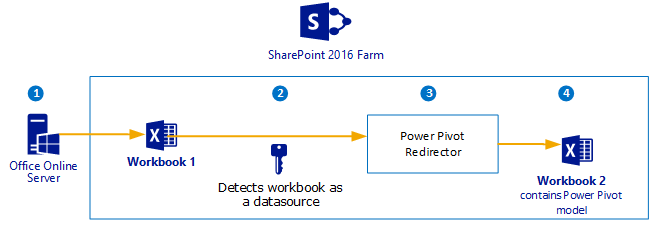
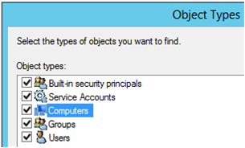
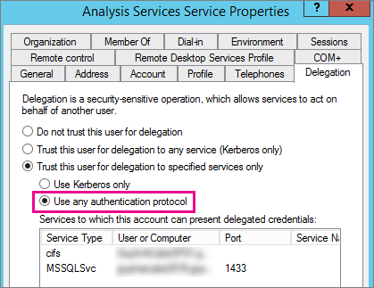

# Configurer Analysis Services et la d&#233;l&#233;gation Kerberos contrainte (KCD)
  La délégation Kerberos contrainte (KCD) est un protocole d’authentification que vous pouvez configurer avec l’authentification Windows pour déléguer les informations d’identification du client d’un service à l’autre dans votre environnement. KCD requiert une infrastructure supplémentaire, par exemple un contrôleur de domaine, et une configuration supplémentaire de votre environnement. KCD est condition nécessaire dans certains scénarios qui impliquent des données [!INCLUDE[ssASnoversion](../../../includes/ssasnoversion-md.md)] et [!INCLUDE[ssGemini](../../../includes/ssgemini-md.md)] avec SharePoint 2016. Dans SharePoint 2016, Excel Services a été déplacé de la batterie de serveurs SharePoint vers un nouveau serveur séparé nommé **Office Online Server**. Le serveur Office Online Server étant séparé, il existe un besoin accru de trouver un mode de délégation les informations d’identification du client dans les scénarios classiques de deux tronçons.  
  
||  
|-|  
|**[!INCLUDE[applies](../../../includes/applies-md.md)]**  SharePoint 2016|  
  
## Vue d'ensemble  
 KCD permet à un compte d’emprunter l’identité d’un autre afin de donner accès à des ressources. Le compte empruntant l’identité est un compte de service affecté à une application web ou le compte d’ordinateur d’un serveur web, tandis que le compte dont l’identité est empruntée est un compte d’utilisateur nécessitant un accès aux ressources. KCD opérant au niveau du service, les services sélectionnés sur un serveur peuvent se voir octroyer l’accès par le compte empruntant l’identité, alors que cet accès est refusé à d’autres services, sur le même serveur ou sur d’autres serveurs.  
  
 Les sections de cette rubrique décrivent des scénarios courants avec [!INCLUDE[ssASnoversion](../../../includes/ssasnoversion-md.md)] et [!INCLUDE[ssGemini](../../../includes/ssgemini-md.md)], où KCD est obligatoire, ainsi qu’un exemple de déploiement de serveur avec un bref résumé de ce que vous devez installer et configurer. Pour obtenir des liens vers des informations détaillées sur les technologies impliquées, telles que les contrôleurs de domaine et KCD, consultez la section [Informations supplémentaires et contenu de la communauté](#bkmk_moreinfo).  
  
## Scénario 1 : classeur en tant que source de données (WDS).  
  Office Online Server ouvre un classeur Excel et  détecte une connexion de données à un autre classeur. Office Online Server envoie une demande au Service Redirecteur [!INCLUDE[ssGemini](../../../includes/ssgemini-md.md)]  pour ouvrir le second classeur et les données .  
  
 Dans ce scénario, les informations d’identification de l’utilisateur doivent être déléguées d’Office Online Server au Service Redirecteur [!INCLUDE[ssGemini](../../../includes/ssgemini-md.md)] dans SharePoint.  
  
   
  
## Scénario 2 : un modèle tabulaire Analysis Services lie à un classeur Excel  
 Un modèle tabulaire Analysis Services  lie à un classeur Excel contenant un modèle PowerPivot. Dans ce cas, quand [!INCLUDE[ssASnoversion](../../../includes/ssasnoversion-md.md)] charge le modèle tabulaire, [!INCLUDE[ssASnoversion](../../../includes/ssasnoversion-md.md)] détecte le lien vers le classeur. Lors du traitement du modèle, [!INCLUDE[ssASnoversion](../../../includes/ssasnoversion-md.md)] envoie une requête d’interrogation à SharePoint pour charger le classeur. Dans ce scénario, les informations d’identification du client ne doivent **pas** être déléguées d’Analysis Services à SharePoint, mais une application cliente peut remplacer les informations de source de données dans une liaison hors ligne. Si la demande de liaison hors ligne spécifie d’emprunter l’identité de l’utilisateur actuel, les informations d’identification de celui-ci doivent être déléguées, ce qui nécessite une configuration de KCD entre [!INCLUDE[ssASnoversion](../../../includes/ssasnoversion-md.md)] et SharePoint.  
  
   
  
## Exemple de déploiement de KCD avec Office Online Server et Analysis Services  
 Cette section présente un exemple de déploiement utilisant quatre ordinateurs. Les sections suivantes résument les principales étapes d’installation et de configuration de chaque ordinateur. Avant de commencer les déploiements, nous vous recommandons de vous assurer que les ordinateurs ont fait l’objet d’une mise à jour corrective du système d’exploitation, et que vous connaissez leurs noms, car ceux-ci sont nécessaires à certaines étapes de la configuration.  
  
-   Contrôleur de domaine  
  
-   Moteur de base de données SQL Server et Analysis Services en mode PowerPivot. L’instance du moteur de base de données sera utilisée pour les bases de données de contenu SharePoint.  
  
-   SharePoint server 2016  
  
-   Office Online Server  
  
   
  
### Contrôleur de domaine  
 Voici un résumé des éléments à installer pour le contrôleur de domaine (DC).  
  
-   **Rôle :** services de domaine Active Directory. Pour obtenir une vue d’ensemble, consultez [Configuring Active Directory (AD DS) in Windows Server 2012](http://sharepointgeorge.com/2012/configuring-active-directory-ad-ds-in-windows-server-2012/) (Configuration d’Active Directory (AD DS) dans Windows Server 2012).  
  
-   **Rôle :** serveur DNS  
  
-   **Fonctionnalité :** composants du .NET Framework 3.5 / .NET Framework 3.5  
  
-   **Fonctionnalité :** outils d’administration de serveur distant / outils d’administration de rôles  
  
-   Configurez Active Directory pour créer une forêt et joindre les ordinateurs au domaine. Avant d’essayer d’ajouter des ordinateurs au domaine privé, vous devez configurer le DNS des ordinateurs clients sur l’adresse IP du contrôleur de domaine. Sur l’ordinateur contrôleur de domaine, exécutez `ipconfig /all` pour obtenir les adresses IPv4 et IPv6 pour l’étape suivante.  
  
-   Il est recommandé de que configurer tant les adresses IPv4 que les adresses IPv6. Vous pouvez le faire dans le Panneau de configuration Windows :  
  
    1.  Cliquez sur **Centre Réseau et partage**.  
  
    2.  Cliquez sur votre connexion Ethernet.  
  
    3.  Cliquez sur **Propriétés**.  
  
    4.  Cliquez sur **Protocole Internet version 6 (TCP/IPv6)**.  
  
    5.  Cliquez sur **Propriétés**.  
  
    6.  Cliquez sur **Utiliser l’adresse de serveur DNS suivante**.  
  
    7.  Tapez l’adresse IP à partir de la commande ipconfig.  
  
    8.  Cliquez sur le bouton **Avancé**, sur l’onglet **DNS**, puis vérifiez que les suffixes DNS sont corrects.  
  
    9. Cliquez sur **Ajouter ces suffixes DNS**.  
  
    10. Répétez les étapes pour IPv4.  
  
-   **Remarque :** Vous pouvez joindre des ordinateurs au domaine à partir du Panneau de configuration Windows, dans les Paramètres système. Pour plus d’informations, consultez [How To Join Windows Server 2012 to a Domain](http://social.technet.microsoft.com/wiki/contents/articles/20260.how-to-join-windows-server-2012-to-a-domain.aspx) (Comment joindre Windows Server 2012 à un domaine).  
  
   
  
### Moteur de Base de données SQL Server 2016 et Analysis services en mode PowerPivot  
 Voici un résumé des éléments à installer sur l’ordinateur [!INCLUDE[ssNoVersion](../../../includes/ssnoversion-md.md)].  
  
  Dans l’Assistant Installation de [!INCLUDE[ssCurrent](../../../includes/sscurrent-md.md)], [!INCLUDE[ssASnoversion](../../../includes/ssasnoversion-md.md)] en mode PowerPivot est installé dans le cadre du flux de travail de sélection de fonctionnalités.  
  
1.  Exécutez l’Assistant Installation de [!INCLUDE[ssCurrent](../../../includes/sscurrent-md.md)] puis, dans la page de sélection des composants, cliquez sur le moteur de base de données, [!INCLUDE[ssASnoversion](../../../includes/ssasnoversion-md.md)], et sur les outils de gestion. Dans une installation ultérieure, pour l’Assistant Installation, vous pouvez spécifier le mode [!INCLUDE[ssGemini](../../../includes/ssgemini-md.md)] pour [!INCLUDE[ssASnoversion](../../../includes/ssasnoversion-md.md)].  
  
2.  Pour la configuration de l’instance, configurez une instance nommée « POWERPIVOT ».  
  
3.  Dans la page Configuration d’Analysis Services, configurez le serveur Analysis Services pour le mode **PowerPivot**, puis ajoutez le **nom de l’ordinateur** Office Online Server à la liste des administrateurs de serveur Analysis Services. Pour plus d’informations, voir [Install Analysis Services in Power Pivot Mode](../../../analysis-services/instances/install-windows/install-analysis-services-in-power-pivot-mode.md).  
  
4.  Notez que, par défaut, le type d’objet « Computer » n’est pas inclus dans la recherche. Cliquez sur  pour ajouter l’objet Computers.  
  
       
  
5.  Créez les noms de principal du service (SPN) pour l’instance Analysis Services.  
  
     Voici des commandes utiles pour les SPN :  
  
    -   Afficher le SPN pour un nom de compte spécifique exécutant le service qui vous intéresse : `SetSPN -l <account-name>`  
  
    -   Définir un SPN pour un nom de compte exécutant le service qui vous intéresse : `SetSPN -a <SPN> <account-name>`  
  
    -   Supprimer un SPN d’un nom de compte spécifique exécutant le service qui vous intéresse : `SetSPN -D <SPN> <account-name>`  
  
    -   Rechercher les SPN en double : `SetSPN -X`  
  
     Le SPN pour l’instance PowerPivot présentera la forme suivante :  
  
    ```  
    MSSQLSvc.3/<Fully Qualified Domain Name (FQDN)>:POWERPIVOT  
    MSSQLSvc.3/<NetBIOS Name>:POWERPIVOT  
    ```  
  
     Où le nom de domaine complet (FQDN) et le nom NetBIOS constituent le nom de l’ordinateur sur lequel l’instance réside. Ces SPN sont placés sur le compte de domaine utilisé pour le compte de service.  Si vous utilisez Service réseau, Système Local ou l’ID de service, vous devez placer le SPN sur le compte de l’ordinateur de domaine.  Si vous utilisez un compte d’utilisateur de domaine, vous devez placer le SPN sur ce compte.  
  
6.  Créez le SPN pour le service SQL Browser sur l’ordinateur Analysis Services.  
  
     [En savoir plus](https://support.microsoft.com/en-us/kb/950599)  
  
7.  **Configurez les paramètres de délégation contrainte** sur le compte de service Analysis Services pour toute source externe à partir de laquelle vous comptez actualiser, telle que SQL Server ou des fichiers Excel. Sur le compte de service Analysis Services, il convient de s’assurer que la configuration est la suivante.  
  
     **Remarque :** Si vous ne voyez pas l’onglet Délégation pour le compte dans Utilisateurs et ordinateurs Active Directory, c’est parce qu’il n’y a aucun SPN sur ce compte.  Vous pouvez ajouter un SPN factice pour qu’il s’affiche comme `my/spn`.  
  
     **N’approuver cet utilisateur que pour la délégation aux services spécifiés** et **Utiliser tout protocole d’authentification**.  
  
     C’est ce qu’on appelle une délégation contrainte. Elle est requise parce que le jeton Windows proviendra du Service d’émission de jetons Revendications vers Windows (C2WTS) qui requiert une délégation contrainte avec transition de protocole.  
  
       
  
     Vous devez également ajouter les services auxquels vous voulez déléguer. Cela varie en fonction de votre environnement.  
  
### Office Online Server  
  
1.  Installer Office Online Server  
  
2.  **Configurez Office Online Server** pour qu’il se connecte au serveur [!INCLUDE[ssASnoversion](../../../includes/ssasnoversion-md.md)]. Notez que le compte d’ordinateur Office Online Server doit être un administrateur sur le serveur [!INCLUDE[ssASnoversion](../../../includes/ssasnoversion-md.md)]. Cela a été accompli dans une section précédente de cette rubrique traitant de l’installation du serveur [!INCLUDE[ssASnoversion](../../../includes/ssasnoversion-md.md)].  
  
    1.  Sur l’ordinateur Office Online Server, ouvrez une fenêtre PowerShell avec des privilèges d’administration, puis exécutez la commande suivante  
  
    2.  `New-OfficeWebAppsExcelBIServer –ServerId <AS instance name>`  
  
    3.  Exemple : `New-OfficeWebAppsExcelBIServer –ServerId "MTGQLSERVER-13\POWERPIVOT"`  
  
3.  **Configurez Active Directory** pour permettre au compte d’ordinateur Office Online Server d’emprunter l’identité d’utilisateurs pour le compte de service SharePoint. Par conséquent, définissez la propriété de délégation sur le principal exécutant le pool d’applications pour les services web SharePoint sur Office Online Server : les commandes PowerShell décrites dans cette section nécessitent les objets Active Directory (AD) PowerShell.  
  
    1.  Obtenir l’identité Active Directory d’Office Online Server  
  
        ```  
        $computer1 = Get-ADComputer -Identity [ComputerName]  
        ```  
  
         Pour déterminer ce nom de principal, il faut rechercher dans Gestionnaire des tâches / Détails / Nom d’utilisateur de w3wp.exe. Par exemple, « svcSharePoint ».  
  
        ```  
        Set-ADUser svcSharePoint -PrincipalsAllowedToDelegateToAccount $computer1  
  
        ```  
  
    2.  Pour vérifier que la propriété a été correctement définie  
  
    3.  ```  
        Get-ADUser svcSharePoint –Properties PrincipalsAllowedToDelegateToAccount  
        ```  
  
4.  **Configurez les paramètres de délégation contrainte** pour le compte Office Online Server sur l’instance PowerPivot d’Analysis Services. Il doit s’agir du compte de l’ordinateur sur lequel Office Online Server s’exécute. Sur le compte de service Office Online, il convient de s’assurer que la configuration est la suivante.  
  
     **Remarque :** Si vous ne voyez pas l’onglet Délégation pour le compte dans Utilisateurs et ordinateurs Active Directory, c’est parce qu’il n’y a aucun SPN sur ce compte.  Vous pouvez ajouter un SPN factice pour qu’il s’affiche comme `my/spn`.  
  
     **N’approuver cet utilisateur que pour la délégation aux services spécifiés** et **Utiliser tout protocole d’authentification**.  
  
     C’est ce qu’on appelle une délégation contrainte. Elle est requise parce que le jeton Windows proviendra du Service d’émission de jetons Revendications vers Windows (C2WTS) qui requiert une délégation contrainte avec transition de protocole.  Ensuite, vous devez autoriser la délégation aux SPN MSOLAPSvc.3 et MSOLAPDisco.3 que nous avons créés ci-dessus.  
  
5.  Configurez le Service d’émission de jetons Revendications vers Windows (C2WTS) **Ceci est nécessaire pour le scénario 1**. Pour plus d’informations, consultez [Vue d’ensemble des revendications au service d’émission de jeton Windows (c2WTS)](https://msdn.microsoft.com/en-us/library/ee517278.aspx).  
  
6.  **Configurez les paramètres de délégation contrainte** sur le compte de service C2WTS.  Les paramètres doivent correspondre à ce que vous avez fait à l’étape 4.  
  
   
  
### SharePoint Server 2016  
 Voici un résumé de l’installation de SharePoint Server.  
  
1.  Exécutez le programme d’installation des composants préalables pour SharePoint.  
  
2.  Exécutez l’installation de SharePoint et sélectionnez le rôle d’installation **Batterie de serveurs unique**.  
  
3.  Exécutez le complément PowerPivot pour SharePoint (spPowerPivot16.msi). Pour plus d’informations, consultez [Installer ou désinstaller le complément PowerPivot pour SharePoint &#40;SharePoint 2016&#41;](../../../analysis-services/instances/install-windows/install-or-uninstall-the-power-pivot-for-sharepoint-add-in-sharepoint-2016.md).  
  
4.  Exécutez l’Assistant Configuration PowerPivot. Consultez [Outils de configuration de Power Pivot](../../../analysis-services/power-pivot-sharepoint/power-pivot-configuration-tools.md).  
  
5.  Connectez SharePoint à Office Online Server.    (?? Configure_xlwac_on_SPO.ps1 ?)  
  
6.  Configurez les fournisseurs d’authentification SharePoint pour Kerberos. **Ceci est nécessaire pour le scénario 1**. Pour plus d’informations, consultez [Planifier l’authentification Kerberos dans SharePoint 2013](https://technet.microsoft.com/en-us/library/ee806870.aspx).  
  
##  <a name="bkmk_moreinfo"></a> Informations supplémentaires et contenu de la communauté  
 [Kerberos for the Busy Admin (en anglais)](http://blogs.technet.com/b/askds/archive/2008/03/06/kerberos-for-the-busy-admin.aspx)  
  
 [Understanding Kerberos Double Hop (en anglais)](http://blogs.technet.com/b/askds/archive/2008/06/13/understanding-kerberos-double-hop.aspx)  
  
 [ALL things .Net and SharePoint (en anglais)](http://sbrickey.com/Tech/Blog/Post/Kerberos_Primer)  
  
 [Resource Based Kerberos Constrained Delegation (en anglais)](http://blog.kloud.com.au/2013/07/11/kerberos-constrained-delegation/)  
  
 [KERBEROS PRIMER - vidéos (en anglais)](http://blog.martinlund.it/kerberos-primer/)  
  
 [Microsoft® Kerberos Configuration Manager for SQL Server® (en anglais)](http://www.microsoft.com/en-us/download/details.aspx?id=39046)  
  
  