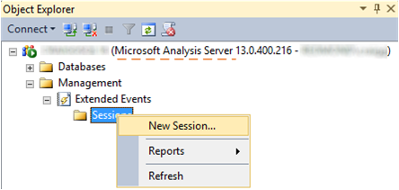

# <a name="monitor-analysis-services-with-sql-server-extended-events"></a>Surveiller Analysis Services avec des événements étendus SQL Server
[!INCLUDE[ssas-appliesto-sqlas](../../includes/ssas-appliesto-sqlas-all-aas.md)]
  Les événements étendus (*xEvents*) est un système léger de traçage et de surveillance des performances qui utilise très peu de ressources système. C’est un outil idéal pour diagnostiquer les problèmes sur les serveurs de production et de test. Il est également hautement évolutif et configurable, et plus facile à utiliser dans SQL Server 2016 grâce à la prise en charge de nouveaux outils intégrés. Dans SQL Server Management Studio, vous pouvez configurer, exécuter et surveiller sur les connexions aux instances Analysis Services un traçage en direct, d’une manière similaire à l’utilisation du SQL Server Profiler. L’ajout d’outils optimisés doit faire des xEvents un remplacement plus raisonnable du SQL Server Profiler et crée une meilleure symétrie plus dans la façon dont vous diagnostiquez des problèmes dans votre moteur de base de données et les charges de travail Analysis Services.  
  
 Outre [!INCLUDE[ssManStudioFull](../../includes/ssmanstudiofull-md.md)], vous pouvez configurer des sessions d’événements étendus  [!INCLUDE[ssASnoversion](../../includes/ssasnoversion-md.md)] à l’aide de scripts XMLA, de la même manière que dans les versions antérieures.  
  
 Tous les événements Analysis Services peuvent être capturés et ciblés sur des consommateurs spécifiques, comme défini dans [Événements étendus](../../relational-databases/extended-events/extended-events.md).  
  
> [!NOTE]  
>  Regardez cette [courte vidéo de présentation](https://www.youtube.com/watch?v=ja2mOHWRVC0&index=1&list=PLv2BtOtLblH1YvzQ5YnjfQFr_oKEvMk19) ou lisez le [billet de blog de support](http://blogs.msdn.com/b/analysisservices/archive/2015/09/22/using-extended-events-with-sql-server-analysis-services-2016-cpt-2-3.aspx) pour en savoir plus sur les événements étendus pour Analysis Services dans SQL Server 2016.  
  
  
##  <a name="bkmk_ssas_extended_events_ssms"></a> Utilisation de Management Studio pour configurer Analysis Services  
 Pour les instances tabulaires et multidimensionnelles, Management Studio fournit un nouveau dossier d’administration qui contient des sessions xEvent initiée par l’utilisateur. Vous pouvez exécuter plusieurs sessions simultanément. Toutefois, dans l’implémentation actuelle, l’interface utilisateur des événements étendus [!INCLUDE[ssASnoversion](../../includes/ssasnoversion-md.md)] ne prend pas en charge la mise à jour ou la nouvelle lecture d’une session existante.  
  
   
  
 **Choix des événements**  
  
 Si vous connaissez déjà les événements à capturer, le moyen le plus simple de les ajouter à la trace est de les rechercher. Sinon, les événements suivants sont fréquemment utilisés pour les opérations de surveillance :  
  
-   **CommandBegin** et **CommandEnd**.  
  
-   **QueryBegin**, **QueryEnd**et **QuerySubcubeVerbose** (affiche entièrement la requête MDX ou DAX envoyée au serveur), plus **ResourceUsage** pour les statistiques sur les ressources utilisées par la requête et le nombre de lignes retournées.  
  
-   **ProgressReportBegin** et **ProgressReportEnd** (pour les opérations de traitement).  
  
-   **AuditLogin** et **AuditLogout** (capture l’identité de l’utilisateur sous lequel une application cliente se connecte à Analysis Services).  
  
 **Choix du stockage de données**  
  
 Une session peut être transmise en continu en direct dans une fenêtre de Management Studio ou enregistrée dans un fichier pour une analyse ultérieure à l’aide de Power Query ou Excel.  
  
-   **event_file** stocke les données de session dans un fichier .xel.  
  
-   **event_stream** active l’option **Surveiller les données actives** dans Management Studio.  
  
-   **ring_buffer** stocke les données de session en mémoire pendant que le serveur est en cours d’exécution. Les données de session sont supprimées au redémarrage du serveur  
  
 **Ajout de champs d'événement**  
  
 Veillez à configurer la session de manière à inclure des champs d’événement afin de pouvoir facilement voir les informations qui vous intéressent.  
  
 L’option**Configurer** se trouve à l’extrémité de la boîte de dialogue.  
  
   
  
 Dans la configuration, sous l’onglet Champs d’événement, sélectionnez **TextData** pour que ce champ s’affiche en regard de l’événement en indiquant les valeurs de retour, notamment les requêtes exécutées sur le serveur.  
  
 Après avoir configuré une session pour les événements et le stockage de données souhaités, vous pouvez cliquer sur le bouton de script pour envoyer votre configuration vers l’une des destinations prises en charge, y compris un fichier, une nouvelle requête dans [!INCLUDE[ssManStudioFull](../../includes/ssmanstudiofull-md.md)]et le Presse-papiers.  
  
 **Actualisation de Sessions**  
  
 Une fois la session créée, veillez à actualiser le dossier Sessions dans Management Studio pour voir la session que vous venez de créer. Si vous avez configuré un event_stream, vous pouvez cliquer sur le nom de la session et choisir **Surveiller les données actives** pour surveiller l’activité du serveur en temps réel.  
  
##  <a name="bkmk_script_start"></a> Script XMLA pour démarrer les événements étendus dans Analysis Services  
 Le traçage d'événements étendus est activé à l'aide d'une commande de script de création d'objet XMLA semblable à celle ci-dessous :  
  
```  
<Execute …>  
   <Command>  
      <Batch …>  
         <Create …>  
            <ObjectDefinition>  
               <Trace>  
                  <ID>trace_id</ID>  
                  <Name>trace_name</Name>  
                  <ddl300_300:XEvent>  
                     <event_session …>  
                        <event package="AS" name="AS_event">  
                           <action package="PACKAGE0" …/>  
                        </event>  
                        <target package="PACKAGE0" name="asynchronous_file_target">  
                           <parameter name="filename" value="data_filename.xel"/>  
                           <parameter name="metadatafile" value="metadata_filename.xem"/>  
                        </target>  
                     </event_session>  
                  </ddl300_300:XEvent>  
               </Trace>  
            </ObjectDefinition>  
         </Create>  
      </Batch>  
   </Command>  
   <Properties></Properties>  
</Execute>  
  
```  
  
 Les éléments suivants seront définis par l'utilisateur, selon les besoins de suivi :  
  
 *trace_id*  
 Définit l'identificateur unique pour cette trace.  
  
 *trace_name*  
 Nom donné à cette trace ; habituellement une définition compréhensible de la trace. On utilise généralement la valeur *trace_id* comme nom.  
  
 *AS_event*  
 Événement Analysis Services à exposer. Consultez [Événements de trace Analysis Services](../../analysis-services/trace-events/analysis-services-trace-events.md) pour les noms des événements.  
  
 *data_filename*  
 Nom du fichier qui contient les données d'événement. Ce nom est suffixé avec un horodatage pour éviter que les données soient écrasées si la trace est envoyée plusieurs fois.  
  
 *metadata_filename*  
 Nom du fichier qui contient les métadonnées d'événement. Ce nom est suffixé avec un horodatage pour éviter que les données soient écrasées si la trace est envoyée plusieurs fois.  
  
  
##  <a name="bkmk_script_stop"></a> Script XMLA pour arrêter les événements étendus dans Analysis Services  
 Pour arrêter les événements étendus qui tracent l'objet, vous devez supprimer cet objet à l'aide d'une commande de script de suppression d'objet XMLA semblable à celle ci-dessous :  
  
```  
<Execute xmlns="urn:schemas-microsoft-com:xml-analysis">  
   <Command>  
      <Batch …>  
         <Delete …>  
            <Object>  
               <TraceID>trace_id</TraceID>  
            </Object>  
         </Delete>  
      </Batch>  
   </Command>  
   <Properties></Properties>  
</Execute>  
  
```  
  
 Les éléments suivants seront définis par l'utilisateur, selon les besoins de suivi :  
  
 *trace_id*  
 Définit l'identificateur unique pour la trace à supprimer.  
  
  
## <a name="see-also"></a>Voir aussi  
 [Événements étendus](../../relational-databases/extended-events/extended-events.md)  
  
  
