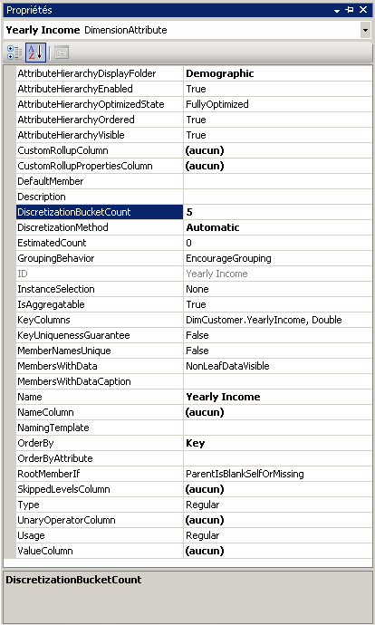
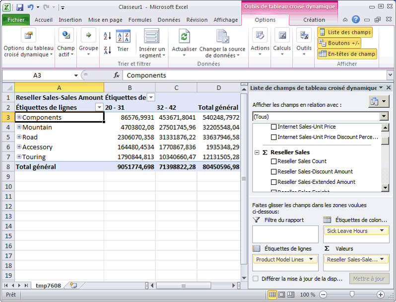

# Leçon 4-3 - automatiquement les membres d’attribut de regroupement
Lorsque vous explorez un cube, vous dimensionnez généralement les membres d'une hiérarchie d'attributs en vous basant sur les membres d'une autre hiérarchie d'attributs. Par exemple, vous pouvez souhaiter regrouper les ventes par ville, par produit acheté ou par genre. Toutefois, avec certains types d'attributs, il est utile de demander à [!INCLUDE[msCoName](../includes/msconame-md.md)] [!INCLUDE[ssASnoversion](../includes/ssasnoversion-md.md)] de créer automatiquement des regroupements de membres d'attribut basés sur la distribution des membres au sein d'une hiérarchie d'attributs. Par exemple, vous pouvez demander à [!INCLUDE[ssASnoversion](../includes/ssasnoversion-md.md)] de créer des groupes de revenus annuels pour les clients. Lorsque vous faites cela, les utilisateurs qui parcourent la hiérarchie d'attributs voient les noms et les valeurs des groupes au lieu de voir les membres eux-mêmes. Cela limite le nombre de niveaux présentés aux utilisateurs, ce qui est plus pratique pour l'analyse.  
  
La propriété **DiscretizationMethod** détermine si [!INCLUDE[ssASnoversion](../includes/ssasnoversion-md.md)] effectue le regroupement et détermine le type de regroupement effectué. Par défaut, [!INCLUDE[ssASnoversion](../includes/ssasnoversion-md.md)] n'effectue aucun regroupement. Lorsque vous activez les regroupements automatiques, vous pouvez autoriser [!INCLUDE[ssASnoversion](../includes/ssasnoversion-md.md)] à déterminer automatiquement la meilleure méthode de regroupement en se basant sur la structure de l'attribut ou bien, vous pouvez choisir l'un des algorithmes de regroupement dans la liste suivante pour spécifier la méthode de regroupement :  
  
**EqualAreas**  
[!INCLUDE[ssASnoversion](../includes/ssasnoversion-md.md)] crée des plages de groupes pour que la totalité de la population des membres de dimension soit distribuée de façon égale entre les groupes.  
  
**Clusters**  
[!INCLUDE[ssASnoversion](../includes/ssasnoversion-md.md)] crée des groupes en créant des regroupements unidimensionnels sur les valeurs d’entrée en utilisant la méthode de clustering K-Means avec des distributions gaussiennes. Cette option est valide uniquement pour les colonnes numériques.  
  
Après avoir spécifié une méthode de regroupement, vous devez spécifier le nombre de groupes, en utilisant la propriété **DiscretizationBucketCount** . Pour plus d’informations, consultez [Regrouper des membres d’un attribut &#40;Discrétisation&#41;](../analysis-services/multidimensional-models/attribute-properties-group-attribute-members.md)  
  
Au cours des tâches de cette rubrique, vous allez regrouper différents types pour les éléments suivants : les revenus annuels dans la dimension **Customer** , le nombre d'heures de congé maladie des employés dans la dimension **Employees** et enfin, le nombre d'heures de congé des employés dans la dimension **Employees** . Vous allez ensuite traiter et explorer le cube du didacticiel [!INCLUDE[ssASnoversion](../includes/ssasnoversion-md.md)] pour constater le résultat des regroupements. Enfin, vous allez modifier les propriétés des groupes de membres pour constater le résultat des modifications dans les types de regroupements.  
  
## Regroupement des membres de hiérarchies d'attributs dans la dimension Customer  
  
1.  Dans l’Explorateur de solutions, double-cliquez sur **Customer** dans le dossier **Dimensions** pour ouvrir le Concepteur de dimensions pour la dimension Customer.  
  
2.  Dans le volet **Vue de source de données** , cliquez avec le bouton droit sur la table **Customer** et cliquez sur **Explorer les données**.  
  
    Notez la plage de valeurs pour la colonne **YearlyIncome** . Ces valeurs deviendront les membres de la hiérarchie d'attributs **Yearly Income** , excepté si vous activez le regroupement de membres.  
  
3.  Fermez l'onglet **Explorer la table Customer** .  
  
4.  Dans le volet **Attributs** , sélectionnez **Yearly Income**.  
  
5.  Dans la fenêtre des propriétés, affectez à la propriété **DiscretizationMethod** la valeur **Automatic** et affectez à la propriété **DiscretizationBucketCount** la valeur **5**.  
  
    L'illustration suivante montre les propriétés modifiées pour l'attribut **Yearly Income**.  
  
      
  
## Regroupement des membres de hiérarchies d'attributs dans la dimension Employee  
  
1.  Affichez le Concepteur de dimensions pour la dimension Employee.  
  
2.  Dans le volet **Vue de source de données** , cliquez avec le bouton droit sur la table **Employee** et cliquez sur **Explorer les données**.  
  
    Notez les valeurs de la colonne **SickLeaveHours** et de la colonne **VacationHours** .  
  
3.  Fermez l'onglet **Explorer la table Employee** .  
  
4.  Dans le volet **Attributs** , sélectionnez **Sick Leave Hours**.  
  
5.  Dans la fenêtre des propriétés, affectez à la propriété **DiscretizationMethod** la valeur **Clusters** et affectez à la propriété **DiscretizationBucketCount** la valeur **5**.  
  
6.  Dans le volet **Attributs** , sélectionnez **Vacation Hours**.  
  
7.  Dans la fenêtre des propriétés, affectez à la propriété **DiscretizationMethod** la valeur **EqualAreas** et à la propriété **DiscretizationBucketCount** la valeur **5**.  
  
## Exploration des hiérarchies d'attributs modifiées  
  
1.  Dans le menu **Générer** de [!INCLUDE[ssBIDevStudioFull](../includes/ssbidevstudiofull-md.md)], cliquez sur **Déployer Analysis Services Tutorial**.  
  
2.  Une fois le déploiement terminé, affichez le Concepteur de cube pour le cube du didacticiel [!INCLUDE[ssASnoversion](../includes/ssasnoversion-md.md)] , puis cliquez sur **Reconnexion** dans l'onglet **Navigateur** .  
  
3.  Cliquez sur l'icône Excel, puis **Activer**.  
  
4.  Faites glisser la mesure **Internet Sales-Sales Amount** vers la zone Valeurs de la liste de champs de tableau croisé dynamique.  
  
5.  Dans la liste de champs, développez la dimension **Product** , puis faites glisser la hiérarchie utilisateur **Product Model Lines** vers la zone **Étiquettes de ligne** du volet de champs.  
  
6.  Développez la dimension **Customer** dans la liste de champs, développez le dossier d'affichage **Demographic** , puis faites glisser la hiérarchie d'attributs **Yearly Income** vers la zone **Étiquettes de colonne** .  
  
    Les membres de la hiérarchie d'attributs **Yearly Income** sont maintenant groupés en six compartiments, parmi lesquels un compartiment pour les ventes auprès de clients dont les revenus annuels ne sont pas connus. Certains compartiments ne sont pas affichés.  
  
7.  Supprimez la hiérarchie d’attributs **Yearly Income** de la zone Colonnes et supprimez la mesure **Internet Sales-Sales Amount** de la zone **Valeurs** .  
  
8.  Ajoutez la mesure **Reseller Sales-Sales Amount** à la zone de données.  
  
9. Dans la liste de champs, développez la dimension **Employee** , développez **Organization**, faites glisser **Sick Leave Hours** vers **Étiquettes de colonne**.  
  
    Notez que toutes les ventes par employé sont regroupées dans un des deux groupes. Notez également que les employés qui comptent entre 32 et 42 heures de congés maladie ont enregistrés beaucoup plus de ventes que les employés qui comptent entre 20 et 31 heures de congés maladie.  
  
    L'illustration suivante montre les ventes dimensionnées sur la base des heures de congé maladie par employé.  
  
      
  
10. Supprimez la hiérarchie d'attributs **Sick Leave Hours** de la zone de colonnes du volet **Données** .  
  
11. Ajoutez **Vacation Hours** à la zone de colonnes du volet **Données** .  
  
    Notez que deux groupes apparaissent et que ces regroupements sont basés sur la méthode de regroupement de zones équivalentes. Trois autres groupes sont masqués car ils ne contiennent aucune valeur.  
  
## Modification des propriétés de regroupement et vérification du résultat des modifications  
  
1.  Affichez le Concepteur de dimensions pour la dimension **Employee** , puis sélectionnez **Vacation Hours** dans le volet **Attributs** .  
  
2.  Dans la fenêtre Propriétés, changez la valeur de la propriété **DiscretizationBucketCount** en **10**.  
  
3.  Dans le menu **Générer** de [!INCLUDE[ssBIDevStudio](../includes/ssbidevstudio-md.md)], cliquez sur **Déployer Analysis Services Tutorial**.  
  
4.  Une fois le déploiement terminé, réaffichez le Concepteur de cube pour le cube du didacticiel [!INCLUDE[ssASnoversion](../includes/ssasnoversion-md.md)] .  
  
5.  Cliquez sur **Reconnexion** dans l'onglet **Navigateur** , cliquez sur l'icône Excel, puis recréez le tableau croisé dynamique afin de pouvoir observer l'impact de la modification de la méthode de regroupement :  
  
    1.  Faire glisser la mesure Reseller Sales-Sales Amount vers la zone Valeurs  
  
    2.  Faire glisser Vacation Hours (dans le dossier Employees Organization) vers Colonnes  
  
    3.  Faire glisser Product Model Lines vers Lignes  
  
    Notez que trois groupes de membres de l'attribut **Vacation Hours** contiennent maintenant des valeurs correspondant à la vente de produits. (Les 7 autres groupes contiennent des membres sans données de vente.)  
  
## Tâche suivante de la leçon  
[Masquage et désactivation des hiérarchies d'attributs](../analysis-services/lesson-4-4-hiding-and-disabling-attribute-hierarchies.md)  
  
## Voir aussi  
[Regrouper des membres d’un attribut &#40;Discrétisation&#41;](../analysis-services/multidimensional-models/attribute-properties-group-attribute-members.md)  
  
  
  
