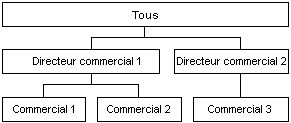

# Attributs dans des hi&#233;rarchies de type parent-enfant
  Dans [!INCLUDE[msCoName](../../includes/msconame-md.md)] [!INCLUDE[ssNoVersion](../../includes/ssnoversion-md.md)] [!INCLUDE[ssASnoversion](../../includes/ssasnoversion-md.md)], le contenu des membres d’une dimension repose habituellement sur l’hypothèse générale suivante. Les membres feuilles contiennent des données directement dérivées des sources de données sous-jacentes, et les membres non-feuilles contiennent des données dérivées d'agrégations effectuées sur les membres enfants.  
  
 Toutefois, dans une hiérarchie parent-enfant, certains membres non-feuilles peuvent contenir des données issues de sources de données sous-jacentes en plus des données d'agrégation issues des membres enfants. Pour ces membres non-feuilles de la hiérarchie parent-enfant, des membres enfants spéciaux créés par le système contiennent les données des tables de faits sous-jacentes. Appelés *membres de données*, ces membres contiennent une valeur directement associée à un membre non-feuille et indépendante de la valeur agrégée calculée à partir des descendants du membre non-feuille.  
  
 Les membres de données ne sont disponibles que dans les dimensions dotées de hiérarchies parent-enfant et ne sont visibles que si l'attribut parent le permet. Vous pouvez utiliser le Concepteur de dimensions pour contrôler la visibilité des membres de données. Pour exposer des membres de données, affectez la valeur **NonLeafDataVisible** à la propriété **MembersWithData** de l’attribut parent. Pour masquer les membres de données contenus par l’attribut parent, affectez la valeur **NonLeafDataHidden** à la propriété **MembersWithData** sur l’attribut parent.  
  
 Cette configuration ne supplante pas le fonctionnement normal de l'agrégation pour les membres non-feuilles ; le membre de données est toujours inclus comme un membre enfant pour les besoins de l'agrégation. Cependant, une formule de cumul personnalisée peut être utilisée pour remplacer le fonctionnement normal de l'agrégation. La fonction MDX (Multidimensional Expressions) [DataMember](../../mdx/datamember-mdx.md) vous permet d’accéder à la valeur du membre de données associé quelle que soit la valeur de la propriété **MembersWithData**.  
  
 La propriété **MembersWithDataCaption** de l’attribut parent fournit à [!INCLUDE[ssASnoversion](../../includes/ssasnoversion-md.md)] le modèle de nom utilisé pour générer les noms des membres de données.  
  
## Utilisation des membres de données  
 Les membres de données sont utiles lors de l'agrégation de mesures selon des dimensions d'organisation avec des hiérarchies parent-enfant. Par exemple, l'illustration suivante représente une dimension (volume brut des ventes de produits) qui comprend trois niveaux. Le premier niveau montre le volume brut des ventes, tous commerciaux confondus. Le volume brut des ventes est regroupé par directeur commercial dans le deuxième niveau et par commercial dans le troisième niveau.  
  
   
  
 Habituellement, pour le membre Directeur commercial 1, la valeur est déduite de l'agrégation des valeurs des membres Commercial 1 et Commercial 2. Cependant, comme Directeur commercial 1 a aussi l'occasion de vendre des produits, ce membre peut contenir en plus des données issues de la table des faits dans la mesure où des ventes peuvent être attribuées à Directeur commercial 1.  
  
 De plus, les commissions individuelles sont variables au sein du personnel des ventes. Dans ce cas, deux barèmes différents sont appliqués pour calculer les commissions : un pour les ventes brutes réalisées personnellement par les directeurs commerciaux, l'autre pour les ventes brutes générées par les commerciaux sous leur responsabilité. Il est donc important de pouvoir accéder aux données de la table de faits sous-jacentes pour les membres non-feuilles. Vous pouvez utiliser la fonction MDX **DataMember** pour extraire le volume des ventes brutes réalisées personnellement par le membre Directeur commercial 1 ; une expression de cumul personnalisée permet d’exclure le membre de données de la valeur d’agrégation du membre Directeur commercial 1 pour obtenir le volume des ventes réalisées par les commerciaux subordonnés à ce membre.  
  
## Voir aussi  
 [Référence des propriétés d'attribut de dimension](../../analysis-services/multidimensional-models/dimension-attribute-properties-reference.md)   
 [Dimensions parent-enfant](../../analysis-services/multidimensional-models/parent-child-dimensions.md)  
  
  