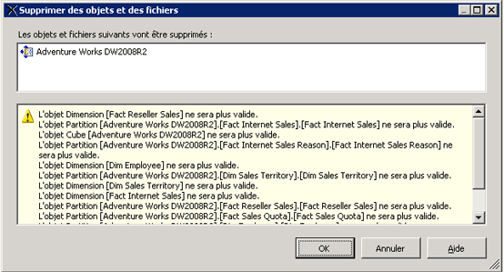

# Supprimer une vue de source de données (Analysis Services)
  Si vous n’utilisez plus de vue de source de données (DSV) dans un projet OLAP, vous pouvez la supprimer du projet dans [!INCLUDE[ssBIDevStudioFull](../../includes/ssbidevstudiofull-md.md)].  
  
 La suppression d'une vue DSV est définitive. Vous ne pouvez pas restaurer une vue DSV supprimée dans un projet ou une base de données [!INCLUDE[ssASnoversion](../../includes/ssasnoversion-md.md)] .  
  
 Les vues de source de données (DSV) dont dépendent d’autres objets ne peuvent pas être supprimées d’une base de données [!INCLUDE[ssASnoversion](../../includes/ssasnoversion-md.md)] ouverte par [!INCLUDE[ssBIDevStudioFull](../../includes/ssbidevstudiofull-md.md)] en mode en ligne. Pour supprimer une vue DSV d'un projet qui est connecté à une base de données s'exécutant sur un serveur, vous devez d'abord supprimer tous les objets de la base de données [!INCLUDE[ssASnoversion](../../includes/ssasnoversion-md.md)] qui dépendent de cette vue DSV avant de supprimer la vue DSV elle-même.  
  
 La suppression d'une vue DSV invalidera d'autres objets [!INCLUDE[ssASnoversion](../../includes/ssasnoversion-md.md)] qui dépendent d'elle ; par conséquent, avant de supprimer la vue DSV, vous verrez la liste des objets qui deviendront non valides une fois la vue DSV supprimée. Examinez cette liste avec soin pour vous assurer qu'elle n'inclut pas les objets que vous vous attendez toujours à utiliser.  
  
   
  
## Voir aussi  
 [Vues de sources de données dans les modèles multidimensionnels](../../analysis-services/multidimensional-models/data-source-views-in-multidimensional-models.md)   
 [Modifier les propriétés d’une vue de source de données &#40;Analysis Services&#41;](../../analysis-services/multidimensional-models/change-properties-in-a-data-source-view-analysis-services.md)  
  
  

