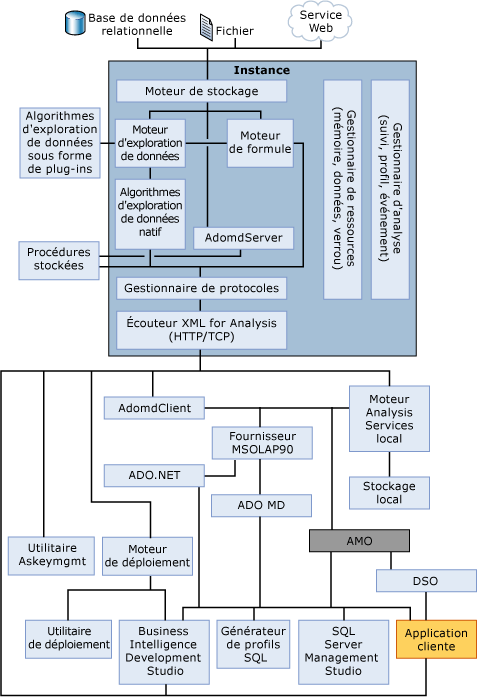

# Composants serveur du moteur OLAP
  Le composant serveur de [!INCLUDE[msCoName](../../../includes/msconame-md.md)] [!INCLUDE[ssNoVersion](../../../includes/ssnoversion-md.md)] [!INCLUDE[ssASnoversion](../../../includes/ssasnoversion-md.md)] est la **msmdsrv.exe** application, qui s’exécute comme un service Windows. Cette application intègre des composants de sécurité, un composant d'écoute XMLA (XML for Analysis), un composant processeur de requêtes et de nombreux autres composants internes qui permettent d'effectuer les actions suivantes :  
  
-   Analyser des instructions reçues des clients  
  
-   Gérer des métadonnées  
  
-   Gérer des transactions  
  
-   Effectuer des calculs  
  
-   Stocker des données de dimension et de cellule  
  
-   Créer des agrégations  
  
-   Planifier des requêtes  
  
-   Mettre des objets en cache  
  
-   Gérer des ressources du serveur  
  
## Diagramme architectural  
 Une instance [!INCLUDE[ssASnoversion](../../../includes/ssasnoversion-md.md)] s’exécute comme un service autonome et la communication avec le service s’effectue via XML for Analysis (XMLA), à l’aide de HTTP ou de TCP. AMO est une couche entre l'application utilisateur et l'instance [!INCLUDE[ssASnoversion](../../../includes/ssasnoversion-md.md)]. Cette couche donne accès aux objets d'administration [!INCLUDE[ssASnoversion](../../../includes/ssasnoversion-md.md)]. AMO est une bibliothèque de classes qui prend des commandes d’une application cliente et convertit ces commandes en messages XMLA pour l’instance [!INCLUDE[ssASnoversion](../../../includes/ssasnoversion-md.md)] . AMO présente les objets d'instance [!INCLUDE[ssASnoversion](../../../includes/ssasnoversion-md.md)] en tant que classes à l'application de l'utilisateur final, avec des membres de méthode qui exécutent des commandes et des membres de propriété qui contiennent les données des objets [!INCLUDE[ssASnoversion](../../../includes/ssasnoversion-md.md)] .  
  
 L'illustration suivante présente l'architecture des composants [!INCLUDE[ssASnoversion](../../../includes/ssasnoversion-md.md)], y compris tous les éléments majeurs s'exécutant dans l'instance [!INCLUDE[ssASnoversion](../../../includes/ssasnoversion-md.md)] et tous les composants utilisateur qui interagissent avec l'instance. L'illustration montre également que la seule façon d'accéder à l'instance est d'utiliser le composant d'écoute XMLA (XML for Analysis), à l'aide de HTTP ou TCP.  
  
   
  
## Écouteur XMLA  
 Le composant écouteur XMLA gère toutes les communications XMLA entre [!INCLUDE[ssASnoversion](../../../includes/ssasnoversion-md.md)] et ses clients. Le paramètre de configuration [!INCLUDE[ssASnoversion](../../../includes/ssasnoversion-md.md)] **d’** dans le fichier msmdsrv.ini peut être utilisé pour spécifier le port sur lequel une instance d’ [!INCLUDE[ssASnoversion](../../../includes/ssasnoversion-md.md)] écoute. La valeur 0 dans ce fichier indique qu' [!INCLUDE[ssASnoversion](../../../includes/ssasnoversion-md.md)] écoute sur le port par défaut. Sauf spécification contraire, [!INCLUDE[ssASnoversion](../../../includes/ssasnoversion-md.md)] utilise par défaut les ports TCP suivants :  
  
|d’|Description|  
|----------|-----------------|  
|2383|Instance par défaut de [!INCLUDE[ssNoVersion](../../../includes/ssnoversion-md.md)] [!INCLUDE[ssASnoversion](../../../includes/ssasnoversion-md.md)].|  
|2382|Redirecteur pour d’autres instances de [!INCLUDE[ssNoVersion](../../../includes/ssnoversion-md.md)] [!INCLUDE[ssASnoversion](../../../includes/ssasnoversion-md.md)].|  
|Affectation dynamique au démarrage du serveur|Instance nommée de [!INCLUDE[ssNoVersion](../../../includes/ssnoversion-md.md)] [!INCLUDE[ssASnoversion](../../../includes/ssasnoversion-md.md)].|  
  
 Consultez [configurer le pare-feu Windows pour autoriser l’accès à Analysis Services](../../../analysis-services/instances/configure-the-windows-firewall-to-allow-analysis-services-access.md) pour plus d’informations.  
  
## Voir aussi  
 [L’objet d’affectation de noms des règles de &#40; Analysis Services &#41;](../../../analysis-services/multidimensional-models/olap-physical/object-naming-rules-analysis-services.md)   
 [Architecture physique &#40; Analysis Services - données multidimensionnelles &#41;](../../../analysis-services/multidimensional-models/olap-physical/understanding-microsoft-olap-physical-architecture.md)   
 [Architecture logique &#40; Analysis Services - données multidimensionnelles &#41;](../../../analysis-services/multidimensional-models/olap-logical/understanding-microsoft-olap-logical-architecture.md)  
  
  

