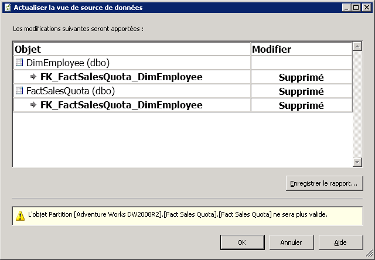

# Actualiser le schéma dans une vue de source de données (Analysis Services)
[!INCLUDE[ssas-appliesto-sqlas](../../includes/ssas-appliesto-sqlas.md)]Après avoir défini une vue de source de données (DSV) dans un [!INCLUDE[ssASnoversion](../../includes/ssasnoversion-md.md)] projet ou la base de données, le schéma dans une source de données sous-jacente peut varier. Ces modifications ne sont pas détectés ni mises à jour automatiquement dans un projet de développement. De plus, si vous avez déployé le projet sur un serveur, vous rencontrerez maintenant des erreurs de traitement si Analysis Services ne peut plus se connecter à la source de données externe.  
  
 Pour mettre à jour la vue DSV afin qu'elle corresponde à la source de données externe, vous pouvez actualiser la vue DSV dans Business Intelligence développement Studio (BIDS). L'actualisation de la vue DSV détecte les modifications apportées aux sources de données externes sur lesquelles est basée la vue et établit une liste de modifications qui énumère les ajouts ou les suppressions dans la source de données externe. Vous pouvez alors appliquer l'ensemble de modifications à la vue DSV qui l'alignera avec la source de données sous-jacente. Notez que des tâches supplémentaires sont souvent requises pour poursuivre la mise à jour des cubes et des dimensions dans le projet qui utilisent la vue DSV.  
  
 Cette rubrique comprend les sections suivantes :  
  
 [Modifications prises en charge dans l'actualisation](#bkmk_changlist)  
  
 [Actualiser une vue de source de données dans SQL Server Data Tools](#bkmk_DSVrefresh)  
  
##   Modifications prises en charge dans l'actualisation  
 L'actualisation d'une vue DSV peut inclure l'une des actions suivantes :  
  
-   Suppression de tables, de colonnes et de relations  
  
-   Ajout de colonnes et de relations, comme appliqué aux tables qui sont déjà incluses dans la vue DSV  
  
-   Ajout de nouvelles contraintes uniques. Si une table de la vue de source de données (DSV) contient une clé primaire logique et qu'une clé physique est ajoutée à la table de la source de données, la clé logique est supprimée et remplacée par la clé physique.  
  
 L'actualisation n'ajoute jamais de nouvelles tables à une vue DSV. Si vous souhaitez ajouter une nouvelle table, vous devez l'ajouter manuellement. Pour plus d’informations, consultez [Ajout ou suppression de tables ou de vues dans une vue de source de données &#40;Analysis Services&#41;](../../analysis-services/multidimensional-models/adding-or-removing-tables-or-views-in-a-data-source-view-analysis-services.md).  
  
##   Actualiser une vue de source de données dans SQL Server Data Tools  
 Pour actualiser une vue DSV, double-cliquez sur la vue DSV à partir de l’Explorateur de solutions dans [!INCLUDE[ssBIDevStudioFull](../../includes/ssbidevstudiofull-md.md)].  Cela permet de lancer le Concepteur de vue de gestion dynamique.  Puis cliquez sur le bouton Actualiser une vue de Source données dans le concepteur ou choisissez **Actualiser** dans le menu vue de Source de données.  
  
 Au cours de l'actualisation, [!INCLUDE[ssASnoversion](../../includes/ssasnoversion-md.md)] interroge les sources de données relationnelles sous-jacentes pour déterminer si des modifications ont été apportées dans les tables/vues qui sont incluses dans la vue DSV. Si les connexions peuvent être établies à toutes les sources de données sous-jacentes et si des modifications ont été apportées, elles apparaîtront dans la boîte de dialogue **Actualiser la vue de source de données** .  
  
   
  
 La boîte de dialogue répertorie les tables, colonnes, contraintes et relations qui vont être supprimées ou ajoutées dans la vue DSV. Le rapport répertorie également, le cas échéant, les requêtes ou calculs nommés qui ne peuvent pas être préparés. Les objets affectés sont répertoriés dans une arborescence dans laquelle les colonnes et les relations sont imbriquées sous les tables et le type de modification (suppression ou ajout) est indiqué pour chaque objet. Les icônes d'objet de vue de source de données standard représentent le type d'objet affecté.  
  
 L'actualisation est entièrement basée sur les noms des objets sous-jacents. Par conséquent, si un objet sous-jacent est renommé dans la source de données, le Concepteur de vue de source de données traite l'objet renommé comme deux opérations distinctes : une suppression et un ajout. Dans ce cas, vous devrez peut-être réinsérer manuellement l'objet renommé dans la vue de source de données. Il vous faudra peut-être également recréer des relations ou des clés primaires logiques.  
  
> [!IMPORTANT]  
>  Si vous savez qu’une table a été renommée dans une source de données, vous pouvez avoir intérêt à utiliser la commande **Remplacer la table** afin de remplacer la table par la table renommée avant d’actualiser la vue de source de données. Pour plus d’informations, consultez [Remplacer une table ou une requête nommée dans une vue de source de données &#40;Analysis Services&#41;](../../analysis-services/multidimensional-models/replace-a-table-or-a-named-query-in-a-data-source-view-analysis-services.md).  
  
 Après avoir consulté le rapport, vous pouvez accepter les modifications ou annuler la mise à jour pour refuser les modifications. Toutes les modifications doivent être acceptées ou rejetées ensemble. Vous ne pouvez pas choisir des éléments particuliers dans la liste. Vous pouvez également enregistrer un rapport des modifications.  
  
## Voir aussi  
 [Vues de sources de données dans les modèles multidimensionnels](../../analysis-services/multidimensional-models/data-source-views-in-multidimensional-models.md)  
  
  
