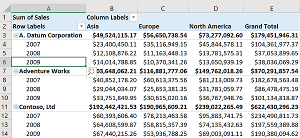
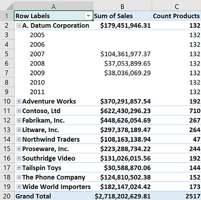
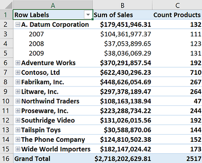

# Les filtres croisés bidirectionnels dans les modèles tabulaires
[!INCLUDE[ssas-appliesto-sqlas-aas](../../includes/ssas-appliesto-sqlas-aas.md)]
  L’une des nouveautés de SQL Server 2016 est son approche intégrée d’activation des *filtres croisés bidirectionnels* dans les modèles tabulaires. Grâce à elle, plus besoin de concevoir manuellement des solutions de contournement DAX pour propager un contexte de filtre dans les relations de table.  
  
 Décomposons les éléments constitutifs de ce concept : le *filtrage croisé* est la possibilité de définir un contexte de filtre sur une table en fonction des valeurs d’une table associée ; *bidirectionnel* renvoie au transfert d’un contexte de filtre vers une deuxième table associée située à l’autre extrémité d’une relation de table. Comme son nom l’indique, vous pouvez procéder à un découpage dans les deux directions de la relation et pas seulement dans un seul sens.  En interne, le filtrage bidirectionnel étend le contexte de filtre pour interroger un sur-ensemble de vos données.  
  
   
  
 Il existe deux types de filtre croisé : le filtrage unidirectionnel ou bidirectionnel. Le filtrage unidirectionnel est la direction de filtrage classique de type plusieurs-à-un entre tables de faits et tables dimensionnelles d’une même relation. Le filtrage bidirectionnel est un filtrage croisé qui permet d’appliquer le contexte de filtre d’une relation à une autre relation de table, les deux relations ayant une table en commun.  
  
 Quand **DimDate** et **DimProduct** sont associés à des relations de clé étrangère avec **FactOnlineSales**, un filtre croisé bidirectionnel revient à utiliser simultanément **FactOnlineSales-to-DimDate** et **FactOnlineSales-to-DimProduct** .  
  
 Les filtres croisées bidirectionnels peuvent être une solution simple et rapide au problème de conception de requêtes de type plusieurs-à-plusieurs qui ont posé des problèmes aux développeurs de modèles tabulaires et Power Pivot par le passé. Si vous avez utilisé la solution de contournement DAX pour des relations de type plusieurs-à-plusieurs dans des modèles tabulaires ou Power Pivot, vous pouvez essayer d’appliquer un filtre bidirectionnel pour voir s’il produit les effets attendus.  
  
 Au moment de créer un filtre croisé bidirectionnel, ne perdez pas de vue les points suivants :  
  
-   Réfléchissez bien aux conséquences de l’activation de filtres bidirectionnels.  
  
     Si vous activez des filtres bidirectionnels à tous les niveaux, vos données risquent d’être filtrées plus que vous ne l’espériez.  De plus, vous risquez par inadvertance d’introduire une ambiguïté en créant plusieurs chemins de requête potentiels. Pour éviter ces deux problèmes, envisagez d’utiliser une combinaison de filtres unidirectionnels et bidirectionnels.  
  
-   Effectuez des tests incrémentiels pour vérifier l’impact de chaque modification de filtre sur votre modèle. La fonctionnalité[Analyser dans Excel](../../analysis-services/tabular-models/analyze-a-tabular-model-in-excel-ssas-tabular.md) s’avère efficace pour les tests incrémentiels. Pour éviter les mauvaises surprises, il est recommandé de reproduire ces tests à intervalles réguliers en utilisant d’autres clients de génération de rapports.  
  
> [!NOTE]  
>  À partir de CTP 3.2, SSDT inclut une valeur par défaut qui détermine si les filtres croisés bidirectionnels sont testés automatiquement. Si vous activez par défaut les filtres bidirectionnels, SSDT n’active le filtrage bidirectionnel que si le modèle énonce clairement un seul chemin de requête via une chaîne de relations de table.  
  
## Définir le paramétrage par défaut  
 Par défaut, les filtres sont unidirectionnels. Vous pouvez modifier ce paramétrage pour tous les nouveaux projets créés dans le concepteur, ou sur le modèle lui-même quand le projet existe déjà.  
  
 Au niveau du projet, ce paramètre est évalué au moment où vous créez le projet. Donc, si vous optez pour un filtrage bidirectionnel par défaut, vous constaterez les effets de votre choix quand vous créerez le projet suivant.  
  
1.  Dans SSDT, sélectionnez **Outils** > **Options** > **Concepteurs tabulaires Analysis Services** > **Paramètres du nouveau projet**.  
  
2.  Définissez le paramètre **Default filter direction** (Direction du filtrage par défaut) en choisissant **Single direction** (Direction unique) ou **Both directions**(Les deux directions).  
  
 Vous pouvez aussi modifier le paramétrage par défaut sur le modèle.  
  
1.  Dans l’Explorateur de solutions, sélectionnez **Model.bim** > **Propriétés** .  
  
2.  Définissez le paramètre **Default filter direction** (Direction du filtrage par défaut) en choisissant **Single direction** (Direction unique) ou **Both directions**(Les deux directions).  
  
## Procédure pas à pas appliquée à un exemple  
 Le meilleur moyen de comprendre l’intérêt du filtrage croisé bidirectionnel est d’utiliser un exemple. Pour les besoins de cet exemple, nous utiliserons le jeu de données suivant tiré de [ContosoRetailDW](http://www.microsoft.com/en-us/download/details.aspx?id=18279), dont la cardinalité et les filtres croisés sont ceux créés par défaut.  
  
   
  
> [!NOTE]  
>  Par défaut, pendant l’importation des données, des relations de table sont créées automatiquement dans des configurations de type plusieurs-à-un. Celles-ci dérivent des relations de clé étrangère et de clé primaire entre la table de faits et les tables de dimension associées.  
  
 À noter que la direction du filtrage va des tables de dimension vers la table de faits (promotions, products, dates, customer geography sont tous des filtres valides qui parviennent à produire une mesure agrégée, la valeur réelle variant en fonction des dimensions utilisées).  
  
   
  
 Pour ce schéma en étoile simple, un test dans Excel confirme que les données sont parfaitement découpées quand le filtrage part des tables de dimension au niveau des lignes et des colonnes vers les données agrégées fournies par une mesure **Sum of Sales** (Total des ventes) située dans le tableau central **FactOnlineSales** .  
  
   
  
 Du moment où les mesures sont extraites de la table de faits et que le contexte de filtre se limite à la table de faits, les agrégations sont correctement filtrées pour ce modèle. Mais que se passe-t-il si vous voulez créer des mesures à un autre endroit, par exemple un comptage distinct dans la table products ou customer ou une remise moyenne dans la table promotion, et que vous voulez étendre un contexte de filtre existant à cette mesure.  
  
 Tentons l’expérience en ajoutant un comptage distinct de **DimProducts** vers le tableau croisé dynamique. Comme vous pouvez le constater, la colonne **Count Products**contient des valeurs qui se répètent. À première vue, on pourrait penser qu’il manque une relation de table, mais dans notre modèle, nous pouvons voir que toutes les relations sont entièrement définies et actives. Dans ce cas, les valeurs se répètent en raison de l’absence de filtre de date sur les lignes de la table product.  
  
   
  
 Après avoir ajouté un filtre croisé bidirectionnel entre **FactOnlineSales** et **DimProduct**, les lignes de la table product sont maintenant correctement filtrées par fabricant et date.  
  
   
  
## Obtenir des informations étape par étape  
 Vous pouvez tester le filtrage croisé bidirectionnel en parcourant cette procédure pas à pas. Pour ce faire, voici ce dont vous avez besoin :  
  
-   Instance de SQL Server 2016 Analysis Services, mode tabulaire, dernière version de CTP  
  
-   [SQL Server Data Tools pour Visual Studio 2015 (SSDT)](http://go.microsoft.com/fwlink/p/?LinkID=627574), lancé conjointement avec la dernière version de CTP  
  
-   [ContosoRetailDW](http://www.microsoft.com/en-us/download/details.aspx?id=18279)  
  
-   Autorisations de lecture sur ces données  
  
-   Excel (pour une utilisation avec la fonctionnalité Analyser dans Excel)  
  
### Créer un projet  
  
1.  Démarrez SQL Server Data Tools pour Visual Studio 2015.  
  
2.  Cliquez sur **Fichier** > **Nouveau** > **Projet** > **Modèle tabulaire Analysis Services**.  
  
3.  Dans le Concepteur de modèle tabulaire, définissez la base de données d’espace de travail en tant qu’instance de SQL Server 2016 Preview Analysis Services en mode serveur tabulaire.  
  
4.  Vérifier le niveau de compatibilité de modèle est défini sur **SQL Server 2016 RTM (1200)** ou une version ultérieure.  
  
     Cliquez sur **OK** pour créer le projet.  
  
### Ajouter des données  
  
1.  Cliquez sur **Modèle** > **Importer à partir de la source de données** > **Microsoft SQL Server**.  
  
2.  Spécifiez le serveur, la base de données et la méthode d’authentification.  
  
3.  Choisissez la base de données ContosoRetailDW.  
  
4.  Cliquez sur **Suivant**.  
  
5.  Dans Sélection de la table, enfoncez la touche Ctrl et sélectionnez les tables suivantes :  
  
    -   FactOnlineSales  
  
    -   DimCustomer  
  
    -   DimDate  
  
    -   DimGeography  
  
    -   DimPromotion  
  
     Vous pouvez modifier les noms à ce stade si vous souhaitez les rendre plus explicites dans le modèle.  
  
       
  
6.  Importez les données.  
  
 Si vous obtenez des erreurs, vérifiez que le compte utilisé pour se connecter à la base de données dispose d’une connexion SQL Server avec des autorisations de lecture sur l’entrepôt de données Contoso. Sur une connexion à distance, vous pouvez aussi être amené à vérifier la configuration de port du pare-feu pour SQL Server.  
  
### Examiner les relations de table par défaut  
 Basculez vers la vue de diagramme : **Modèle** > **Vue du modèle** > **Vue de diagramme**. La cardinalité et les relations actives sont indiquées visuellement. Les relations entre deux tables associées sont toutes de type un-à-plusieurs.  
  
   
  
 Vous pouvez aussi cliquer sur **Table** > **Gérer les relations** pour afficher les mêmes informations dans une disposition de table.  
  
   
  
### Créer des mesures  
 Vous aurez besoin d’une agrégation pour faire la somme des montants de ventes selon les différentes facettes des données dimensionnelles. Dans **DimProduct,** vous pouvez créer une mesure qui calcule le nombre de produits. Vous pouvez ensuite utiliser cette mesure dans une analyse de merchandising produit qui indique le nombre de produits ayant contribué aux ventes pour une année, une région ou un type de client donnés.  
  
1.  Cliquez sur **Modèle** > **Vue du modèle** > **Vue de diagramme**.  
  
2.  Cliquez sur **FactOnlineSales**.  
  
3.  Sélectionnez la colonne **SalesAmount** .  
  
4.  Cliquez sur **Colonne** > **Somme automatique** > **Somme** pour créer une mesure pour les ventes.  
  
5.  Cliquez sur **DimProduct**.  
  
6.  Sélectionnez **ProductKeycolumn**.  
  
7.  Cliquez sur **Colonne** > **Somme automatique** > **DistinctCount** pour créer une mesure pour les produits uniques.  
  
### Analyser dans Excel  
  
1.  Cliquez sur **Modèle** > **Analyser dans Excel** pour rassembler toutes les données dans un tableau croisé dynamique.  
  
2.  Sélectionnez les deux mesures que vous venez de créer dans la liste des champs.  
  
3.  Sélectionnez **Produits** > **Fabricant**.  
  
4.  Sélectionnez **Date** > **Année civile**.  
  
 Notez que les ventes sont ventilées par année et par fabricant, comme prévu. Cela est dû au fait que le contexte de filtre par défaut entre **FactOnlineSales**, **DimProduct**et **DimDate** fonctionne correctement pour les mesures du côté « plusieurs » de la relation.  
  
 Dans le même temps, vous pouvez constater que le nombre de produits ne perçoit pas le même contexte de filtre que les ventes. Si les nombres de produits sont correctement filtrés par fabricant (le fabricant et les nombres de produits se trouvent dans la même table), le filtre de date ne se propage pas au nombre de produits.  
  
### Modifier le filtrage croisé  
  
1.  De retour dans le modèle, sélectionnez **Table** > **Gérer les relations**.  
  
2.  Modifiez la relation entre **FactOnlineSales** et **DimProduct**.  
  
     Modifiez la direction du filtrage en l’orientant vers les deux tables.  
  
3.  Enregistrez les paramètres.  
  
4.  Dans le classeur, cliquez sur **Actualiser** pour relire le modèle.  
  
 À présent, les nombres de produits et les ventes doivent en principe être filtrés par le même contexte de filtre, qui inclut non seulement les fabricants de **DimProducts** , mais aussi l’année civile de **DimDate**.  
  
## Étapes suivantes  
 Le meilleur moyen de savoir s’il est opportun d’utiliser un filtre croisé directionnel, c’est de l’essayer pour voir s’il fonctionne dans votre scénario. Parfois, vous jugerez les comportements intégrés insuffisants et devrez recourir aux calculs DAX pour mener à bien vos tâches. Dans la section **Voir aussi** , vous trouverez plusieurs liens donnant accès à des ressources supplémentaires sur la question.  
  
 En pratique, le filtrage croisé autorise des formes d’exploration de données qui sont généralement l’apanage d’une construction de type plusieurs-à-plusieurs. Cela étant dit, il est important de reconnaître que le filtrage croisé bidirectionnel n’est pas une construction de type plusieurs-à-plusieurs.  Une configuration de table de plusieurs-à-plusieurs réelle n’est toujours pas prise en charge dans le Concepteur pour les modèles tabulaires de cette version.  
  
## Voir aussi  
 [Créer et gérer des relations dans Power BI Desktop](https://support.powerbi.com/knowledgebase/articles/464155-create-and-manage-relationships-in-power-bi-desktop)   
 [Un exemple pratique de la gestion des relations plusieurs-à-plusieurs simples dans Power Pivot et les modèles tabulaires](http://social.technet.microsoft.com/wiki/contents/articles/22202.a-practical-example-of-how-to-handle-simple-many-to-many-relationships-in-power-pivotssas-tabular-models.aspx)   
 [Résolution des relations plusieurs-à-plusieurs exploitant DAX entre le filtrage de table](http://blog.gbrueckl.at/2012/05/resolving-many-to-many-relationships-leveraging-dax-cross-table-filtering/)   
 [Révolution (blog SQLBI)](http://www.sqlbi.com/articles/many2many/)  
  
  
