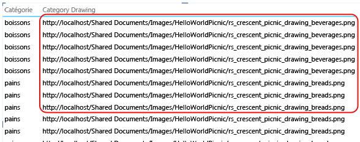
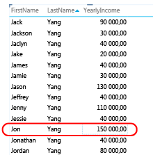
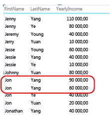
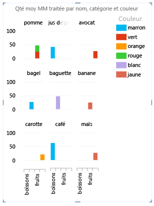
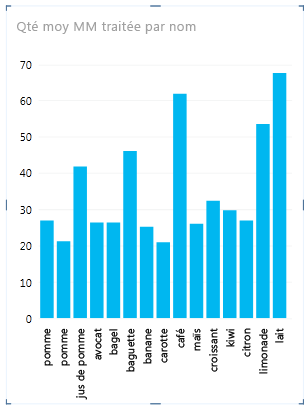

# Power View - configurer les propriétés de comportement de Table pour les rapports
  Si vous utilisez un modèle tabulaire comme modèle de données pour [!INCLUDE[ssCrescent](../../includes/sscrescent-md.md)], vous pouvez définir les propriétés de comportement de table qui exposent les lignes de détails à un niveau plus granulaire. La définition des propriétés de comportement de table modifie le comportement de regroupement des lignes de détail et produit un meilleur placement par défaut des informations d'identification (tels que les noms, les cartes d'identité avec photo ou les images de logo) dans les mises en page de mosaïque, de carte et de graphique.  
  
 [!INCLUDE[ssCrescent](../../includes/sscrescent-md.md)] diffère des autres applications de création de rapports en ceci qu'il groupe automatiquement les éléments lors de la conception de rapports en évaluant les colonnes que vous avez placées dans la liste des champs du rapport en fonction du format de présentation que vous utilisez. Dans la plupart des cas, le regroupement par défaut produit un résultat optimal. Mais pour certaines tables, en particulier celles qui contiennent des données de détail, le comportement de regroupement par défaut regroupe parfois des lignes qui ne devraient pas l'être. Pour ces tables, vous pouvez définir des propriétés qui modifient la manière dont les groupes sont évalués.  
  
 La définition des propriétés de comportement de table est recommandée pour les tables dans lesquelles les lignes individuelles sont particulièrement importantes, notamment les enregistrements d'employés ou de clients. Par opposition, parmi les tables qui ne profitent pas de ces propriétés, figurent celles qui agissent comme table de recherche (par exemple, une table de date, une table de catégorie de produit ou une table de service, où la table consiste en un nombre relativement réduit de lignes et de colonnes) ou les tables de synthèse contenant des lignes qui sont uniquement intéressantes une fois résumées (par exemple, les données de recensement regroupées par sexe, par âge ou par situation géographique). Pour les tables de recherche et de synthèse, le comportement de regroupement par défaut produit un résultat optimal.  
  
> [!NOTE]  
>  Les propriétés de comportement de table affectent uniquement les modèles tabulaires utilisés comme modèles de données dans [!INCLUDE[ssCrescent](../../includes/sscrescent-md.md)]. Les propriétés de comportement de table ne sont pas prises en charge dans les rapports de tableau croisé dynamique Excel.  
  
 Les propriétés de comportement de table sont les suivantes :  
  
-   **Identificateur de ligne** : spécifie une colonne qui contient seulement des valeurs uniques et permet l'utilisation de cette colonne comme clé de regroupement interne.  
  
-   **Conserver les lignes uniques** : spécifie les colonnes qui fournissent des valeurs qui doivent être traitées comme uniques même en cas de doublons (par exemple, prénom et nom de l’employé, dans le cas où deux employés ou plus portent le même nom).  
  
-   **Étiquette par défaut** : spécifie la colonne qui fournit un nom d’affichage pour représenter les données de ligne (par exemple, nom de l’employé dans un enregistrement d’employé).  
  
-   **Image par défaut** : spécifie la colonne qui fournit une image représentant les données de ligne (par exemple, une pièce d’identité avec photo dans un enregistrement d’employé).  
  
> [!NOTE]  
>  Consultez la section suivante pour considérer les optimisations de mise en page du point de vue d’un format de présentation particulier :  [Optimisation pour les dispositions spécifiques](#bkmk_optimizeforlayout).  
  
## Ouverture de la boîte de dialogue Comportement de la table  
  
1.  Dans [!INCLUDE[ssBIDevStudioFull](../../includes/ssbidevstudiofull-md.md)], cliquez sur la table (l’onglet) pour laquelle vous configurez une liste de champs par défaut.  
  
2.  Dans la fenêtre **Propriétés** , dans la propriété **Comportement de la table** , cliquez sur **Cliquer pour modifier**.  
  
3.  Dans la boîte de dialogue **Comportement de la table** , définissez **Identificateur de ligne**, puis spécifiez d'autres propriétés dans cette boîte de dialogue.  
  
## Définition de la propriété Identificateur de ligne  
 Dans la table, l'identificateur de ligne spécifie une colonne unique qui contient seulement des valeurs uniques et aucune valeur vide. La propriété Identificateur de ligne est utilisée pour modifier le regroupement de sorte qu'un groupe ne soit pas basé sur la composition de champ d'une ligne, mais plutôt sur une colonne fixe qui est toujours utilisée pour identifier une ligne de manière unique, indépendamment des champs utilisés dans une mise en page de rapport donnée.  
  
 La définition de cette propriété modifie le comportement de regroupement par défaut, qui passe d'un regroupement dynamique basé sur les colonnes présentes dans la zone de dessin à un comportement de regroupement fixe qui effectue la synthèse en fonction de l'identificateur de ligne. Modifier le comportement de regroupement par défaut est approprié pour les mises en page de rapport, telles qu'une matrice qui, autrement, regrouperaient les données (ou afficherait les sous-totaux) pour chaque colonne dans la ligne.  
  
 Dans [!INCLUDE[ssCrescent](../../includes/sscrescent-md.md)], la définition d'un identificateur de ligne active les propriétés supplémentaires suivantes : propriété **Conserver les lignes uniques** , propriété **Étiquette par défaut** et propriété **Image par défaut** .  
  
 Vous pouvez également utiliser **Identificateur de ligne** seul, en tant que propriété autonome, pour activer ce qui suit :  
  
-   Utilisation d'images binaires dans un rapport. En supprimant l'ambiguïté autour de l'unicité de ligne, [!INCLUDE[ssCrescent](../../includes/sscrescent-md.md)] peut déterminer la procédure d'affectation des images par défaut et des étiquettes par défaut pour une ligne donnée.  
  
-   Suppression des sous-totaux inutiles d'un rapport de matrice. Le regroupement par défaut au niveau du champ crée un sous-total pour chaque champ. Si vous souhaitez qu'un seul sous-total soit calculé au niveau de la ligne, la définition de l'identificateur de ligne produit ce résultat.  
  
 Vous ne pouvez pas définir d'identificateur de ligne pour les tables marquées comme tables de date. Pour les tables de date, l'identificateur de ligne est spécifié quand vous marquez la table. Pour plus d’informations, consultez [Boîte de dialogue Marquer en tant que table de dates &#40;SSAS&#41;](http://msdn.microsoft.com/library/698b5ef1-b79b-4d76-9847-39669b4f5bb9).  
  
## Définition de la propriété Conserver les lignes uniques  
 Cette propriété permet de spécifier les colonnes qui transmettent les informations d'identité (telles qu'un nom d'employé ou un code de produit) de manière à distinguer les lignes les unes des autres. Dans les cas où des lignes semblent identiques (par exemple, deux clients portant le même nom), les colonnes que vous spécifiez pour cette propriété sont répétées dans la table du rapport.  
  
 En fonction des colonnes que vous ajoutez à un rapport, vous pouvez trouver des lignes qui sont traitées comme des lignes identiques car les valeurs dans chaque ligne semblent être identiques (par exemple, deux clients nommés Jon Yang). Cela peut se produire si la zone de dessin du rapport ne comporte pas d'autres colonnes qui assurent la différentiation (par exemple, un deuxième prénom, une adresse ou une date de naissance). Dans ce scénario, le comportement par défaut consiste à regrouper les lignes apparemment identiques dans une ligne unique qui synthétise toutes les valeurs calculées en un seul résultat plus global à partir des lignes associées.  
  
 En définissant la propriété **Conserver les lignes uniques** , vous pouvez indiquer une ou plusieurs colonnes qui doivent toujours être répétées, même s'il existe des instances en double, chaque fois que vous ajoutez cette colonne à la zone de dessin du rapport. Les valeurs calculées associées à la ligne sont ainsi allouées en fonction de chaque ligne individuelle plutôt que regroupées en une seule ligne. Lorsque vous choisissez des colonnes pour la propriété  **Conserver les lignes uniques** , choisissez celles contenant des valeurs uniques ou quasiment uniques.  
  
> [!NOTE]  
>  Étant donné que les colonnes sélectionnées par l'utilisateur final peuvent affecter le regroupement, ce qui modifie le contexte de filtre pour les calculs d'expression, les concepteurs de modèles doivent veiller à créer des mesures qui retournent des résultats corrects. Pour plus d'informations, consultez [Questions fréquentes sur Power View](http://go.microsoft.com/fwlink/?LinkId=220674).  
  
## Définition d'une étiquette par défaut  
 Cette propriété spécifie une étiquette qui apparaît dans la bande de navigation d'un rapport en mosaïque. En cas d'utilisation avec une image par défaut, l'étiquette par défaut apparaît sous l'image. En l'absence d'image, l'étiquette par défaut apparaît seule. Lorsque vous choisissez une étiquette par défaut, sélectionnez la colonne qui fournit le plus d'informations sur la ligne (par exemple, un nom).  
  
 Dans une disposition en mosaïque, l'étiquette par défaut s'affiche dans la zone de titre sous une image, comme le définit la propriété Image par défaut. Par exemple, si vous avez une liste d'employés, vous pouvez afficher en mosaïque les informations des employés, en utilisant leur pièce d'identité avec photo comme image par défaut et leur nom d'employé comme étiquette par défaut. Dans une mosaïque, l'étiquette par défaut apparaît sous l'image par défaut. Ces colonnes apparaissent toujours dans la mosaïque, même si vous ne les sélectionnez pas explicitement dans la liste des champs du rapport.  
  
## Définition d'une image par défaut  
 Cette propriété spécifie une image qui s'affiche dans la bande de navigation d'un rapport en mosaïque, ou au recto d'une carte. Dans le rapport, lorsque vous sélectionnez la colonne qui contient l'image par défaut, cette dernière apparaît dans la bande de navigation d'une mise en page de rapport en mosaïque, ou au recto d'une carte. Une image par défaut doit être un contenu visuel. Il peut s'agir, par exemple, d'une pièce d'identité avec photo dans la table des employés, d'un logo client dans une table de clients, ou d'une carte du pays dans une table géographique.  
  
> [!NOTE]  
>  Les images peuvent provenir d'adresses URL pointant vers un fichier image sur un serveur Web, ou de données binaires incorporées dans le classeur. Si l'image est basée sur une URL, veillez à définir également la colonne comme type d'image afin que [!INCLUDE[ssCrescent](../../includes/sscrescent-md.md)] récupère l'image au lieu d'afficher l'URL comme données texte dans le rapport.  
  
##   Optimisation pour les dispositions spécifiques  
 Cette section décrit l'impact de la définition des propriétés de comportement de table du point de vue d'un format de présentation particulier, ainsi que les caractéristiques des données. Si vous essayez d'améliorer la présentation d'un rapport de matrice, vous pouvez par exemple utiliser ces informations pour apprendre à améliorer une présentation de matrice à l'aide des propriétés de comportement de table du modèle.  
  
### Des images sont manquantes  
 Les propriétés que vous définissez dans le modèle déterminent si les images sont visualisées dans un rapport, ou représentées comme des valeurs texte dans le rapport.  
  
   
  
 Par défaut, le texte dans le modèle est interprété comme du texte dans le rapport. Si une colonne de texte est une adresse URL pointant vers une image de rapport, n'oubliez pas de définir la propriété **URL de l'image** afin que [!INCLUDE[ssCrescent](../../includes/sscrescent-md.md)] récupère le fichier image. Pour les images binaires, n'oubliez pas de définir la propriété **Identificateur de ligne** .  
  
### Il manque une ou plusieurs lignes dans les tables  
 Parfois, le comportement de regroupement par défaut génère des résultats à l'opposé de ce que vous attendiez ; plus particulièrement, les lignes de détails présentes dans le modèle n'apparaissent pas dans le rapport. Par défaut, [!INCLUDE[ssCrescent](../../includes/sscrescent-md.md)] procède au regroupement sur les colonnes que vous ajoutez à la zone de dessin. Si vous ajoutez le **Nom du pays** au rapport, chaque pays apparaît une fois dans la zone de dessin, même si la table sous-jacente peut contenir des milliers de lignes qui incluent de nombreuses instances de chaque nom de pays. Dans ce cas, le comportement de regroupement par défaut produit le résultat correct.  
  
 Toutefois, par exemple, vous pouvez souhaiter afficher plusieurs instances d'une ligne parce que les lignes sous-jacentes contiennent en réalité des données relatives à des entités différentes. Dans cet exemple, supposons que deux de vos clients s’appellent **Jon Yang**. Avec le comportement de regroupement par défaut, une seule instance de **Jon Yang** s’affiche dans le rapport. De plus, étant donné qu’une seule instance s’affiche dans la liste, la mesure **Résultat annuel** est la somme de cette valeur pour les deux clients.  
  
   
  
 Pour modifier le comportement de regroupement par défaut, définissez les propriétés **Identificateur de ligne** et **Conserver les lignes uniques** . Dans **Conserver les lignes uniques**, choisissez la colonne Nom de sorte que cette valeur soit répétée pour une ligne, même si elle figure déjà dans une autre ligne. Après avoir modifié les propriétés et republié le classeur, vous pouvez créer le même rapport, seulement cette fois-ci, vous verrez les deux clients nommés **Jon Yang**, avec un **Résultat annuel** correctement affecté à chacun.  
  
   
  
### La disposition de la matrice est surchargée  
 Lorsque vous présentez une table de détail sous forme de matrice, le regroupement par défaut fournit une valeur de synthèse pour chaque colonne. En fonction de vos objectifs, le niveau de synthèse peut être supérieur à ce que vous souhaitez. Pour modifier ce comportement, vous pouvez définir l' **Identificateur de ligne**. Aucune propriété supplémentaire ne doit être définie ; il vous suffit de définir l'identificateur de ligne pour modifier le regroupement de sorte que les synthèses soient calculées pour chaque ligne en fonction de son identificateur de ligne unique.  
  
 Comparez les images avant et après suivantes qui illustrent l'incidence de la définition de cette propriété sur une présentation en matrice.  
  
 **Avant : regroupement par défaut en fonction des champs dans la matrice**  
  
   
  
 **Après : regroupement en fonction de l'identificateur de ligne**  
  
   
  
### Graphique affichant trop d'éléments et de niveaux sur l'axe  
 Les rapports de graphique qui affichent des données de détail doivent utiliser l'identificateur de ligne comme axe. Sans identificateur de ligne, l'axe est indéterminé, ce qui se solde par une mise en page aléatoire qui n'est pas forcément pertinente. Pour modifier ce comportement, vous pouvez définir l' **Identificateur de ligne**. Aucune propriété supplémentaire ne doit être définie ; il vous suffit de définir l'identificateur de ligne pour modifier le regroupement de sorte que les synthèses soient calculées pour chaque ligne en fonction de son identificateur de ligne unique.  
  
 Comparez les images avant et après suivantes qui illustrent l'incidence de la définition de cette propriété sur une présentation en graphique. Il s'agit du même rapport, avec des champs et une présentation identiques. La seule différence est que l'image du bas affiche un rapport après définition de l' **Identificateur de ligne** sur la table Éléments.  
  
 **Avant : regroupement par défaut en fonction des champs dans le graphique**  
  
   
  
 **Après : regroupement en fonction de l'identificateur de ligne (l'identificateur de ligne devient l'axe)**  
  
   
  
## Étapes suivantes  
 Après avoir évalué les tables dans votre modèle et défini les propriétés de comportement de table sur celles contenant les lignes de détails qui doivent toujours apparaître comme des éléments individuels, vous pouvez optimiser le modèle à l'aide de propriétés ou de paramètres supplémentaires.  
  
  
