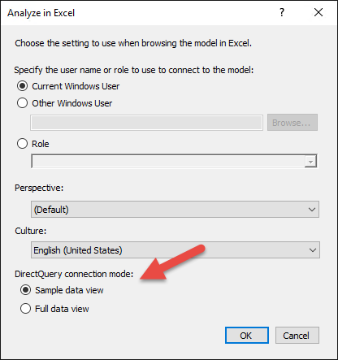

# Tester un modèle en mode DirectQuery
[!INCLUDE[ssas-appliesto-sqlas-aas](../../includes/ssas-appliesto-sqlas-aas.md)]Passez en revue les possibilités de test d’un modèle tabulaire en mode DirectQuery à chaque étape du développement, en commençant par la conception.  
  
## Test dans Excel 
  
 Quand vous concevez votre modèle dans SSDT, vous pouvez utiliser la fonctionnalité **Analyser dans Excel** pour tester vos décisions de modélisation sur un exemple de dataset en mémoire ou sur la base de données relationnelle.  Quand vous cliquez sur Analyser dans Excel, une boîte de dialogue s’ouvre pour vous permettre de spécifier des options.
 
 
 
 Si le mode DirectQuery de votre modèle est activé, vous pouvez spécifier le mode de connexion DirectQuery, qui propose deux options :
 - **Exemple de vue de données** : avec cette option, toutes les requêtes à partir d’Excel sont dirigées vers des exemples de partitions contenant un exemple de dataset en mémoire. Cette option est utile pour garantir que toutes les formules DAX présentes dans des mesures, des colonnes calculées ou la sécurité au niveau de la ligne fonctionnent correctement.
 
 - **Vue complète des données** : avec cette option, toutes les requêtes à partir d’Excel sont envoyées à Analysis Services, puis à la base de données relationnelle. Cette option est, en fait, entièrement fonctionnelle en mode DirecQuery.
 
 ### Autres clients
 Quand vous utilisez Analyser dans Excel, un fichier de connexion .odc est créé. Vous pouvez utiliser les informations de chaîne de connexion contenue dans ce fichier pour vous connecter à votre modèle à partir d’autres applications clientes. Un paramètre supplémentaire, DataView=Sample, est ajouté pour spécifier que le client doit se connecter à des exemples de partitions de données.  
  
## Surveiller l’exécution des requêtes sur les systèmes principaux à l’aide de SQL Server Profiler ou d’événements xEvent 
 Démarrez une trace de session connectée à la base de données relationnelle SQL Server pour surveiller les connexions en provenance du modèle tabulaire :  
  
-   [Surveiller Analysis Services avec des événements étendus SQL Server](../../analysis-services/instances/monitor-analysis-services-with-sql-server-extended-events.md)  
  
-   [Utiliser SQL Server Profiler pour contrôler Analysis Services](../../analysis-services/instances/use-sql-server-profiler-to-monitor-analysis-services.md)  
  
 Si vous utilisez Oracle ou Teradata, utilisez les outils de surveillance de traces destinés à ces systèmes.  
  
  
