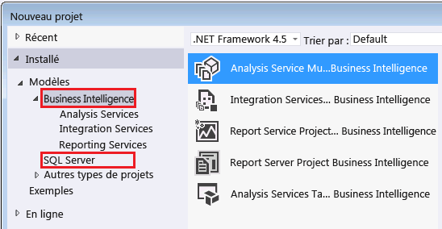

# Outils et applications utilis&#233;s dans Analysis Services
  Trouvez les outils et les applications dont vous avez besoin pour créer des modèles Analysis Services, ainsi que pour gérer les bases de données associées sur une instance Analysis Services.  
  
## Concepteurs de modèles Analysis Services  
 Les modèles tabulaires et multidimensionnels sont créés à partir de modèles de projet dans une solution générée au sein d’un interpréteur de commandes Visual Studio. Le modèle de projet permet aux concepteurs de créer les tables, les relations, les cubes, les dimensions et les rôles qui constituent une solution Analysis Services. L’interpréteur de commandes fournit l’espace de travail visuel, les pages de propriétés et l’infrastructure de commandes dans lequel le projet est créé. Le générateur de modèles qui fournit l’interpréteur de commandes et les modèles peut être téléchargé gratuitement sur Internet.  
  
 Les modèles présentent un paramètre de niveau de compatibilité qui détermine les fonctionnalités disponibles et la version d’Analysis Services exécutant le modèle.  La possibilité de spécifier un niveau de compatibilité donné est déterminée en partie par le générateur de modèles.  
  
 Les modèles tabulaires qui utilisent les dernières fonctionnalités de SQL Server 2016, tels que les fichiers BIM en format JSON tabulaire et le filtrage croisé bidirectionnel, doivent être créés au niveau de compatibilité 1200 dans la version de SQL Server Data Tools pour Visual Studio 2015 fournie avec SQL Server 2016 (le lien de téléchargement est disponible plus bas).  
  
 Si vous avez besoin d’un niveau de compatibilité inférieur, par exemple pour déployer un modèle sur une version antérieure d’Analysis Services, vous pouvez tout de même utiliser le générateur de modèles de SSDT pour Visual Studio 2015. Les versions plus récentes de cet outil prennent en charge la création de n’importe quel type de modèle (tabulaire ou multidimensionnel), au niveau de compatibilité dont vous avez besoin. Il est inutile de conserver des versions précédentes de l’outil pour générer ou modifier un modèle antérieur.  
  
### Télécharger le générateur de modèles  
 [!INCLUDE[ssBIDevStudio](../includes/ssbidevstudio-md.md)]précédemment appelé SQL Server Data Tools pour Business Intelligence (SSDT-BI), et avant cela Business Intelligence Development Studio (BIDS), permet de créer des modèles Analysis Services.  
  
||  
|-|  
|**[Télécharger SSDT pour Visual Studio 2015](https://msdn.microsoft.com/mt429383)**|  
  
 Il est recommandé d’utiliser SQL Server Data Tools pour Visual Studio 2015 plutôt que les versions précédentes du générateur. Il contient des modèles de projet pour tous les types de contenu SQL Server, notamment les bases de données relationnelles, les modèles Analysis Services, les rapports Reporting Services et les packages Integration Services.  
  
 SSDT exécute l’interpréteur de commandes Visual Studio 2015. Si vous disposez déjà de Visual Studio 2015, le programme d’installation de SSDT ajoute simplement les modèles de projet. Si vous ne disposez pas de Visual Studio 2015, l’interpréteur de commandes et les modèles sont installés.  
  
 Si vous avez installé une version antérieure de SSDT-BI ou BIDS sur votre ordinateur, la version plus récente est installée côte à côte à la version antérieure.  
  
 Une fois SSDT installé, vous devriez voir les modèles Business Intelligence dans la boîte de dialogue Nouveau projet.  
  
   
  
## Outils d'administration  
  
### Télécharger SQL Server Management Studio  
 Management Studio est l'outil d'administration principal de toutes les fonctionnalités SQL Server, y compris Analysis Services. Il est à présent disponible en téléchargement séparé.  
  
||  
|-|  
|**[Télécharger SQL Server Management Studio](https://msdn.microsoft.com/library/mt238290.aspx)**|  
  
 Dans SQL Server 2016, Management Studio inclut les événements étendus (xEvents) pour Analysis Services, fournissant une solution de remplacement légère aux traces de SQL Server Profiler utilisées pour l’analyse de l’activité et le diagnostic des problèmes de serveur. Pour en savoir plus, consultez [Monitor Analysis Services with SQL Server Extended Events](../analysis-services/instances/monitor-analysis-services-with-sql-server-extended-events.md) .  
  
### SQL Server Profiler  
 Bien qu’il soit officiellement conseillé d’utiliser les événements xEvents à la place, SQL Server Profiler offre une méthode familière pour surveiller les connexions, l’exécution des requêtes MDX et les autres opérations de serveur. SQL Server Profiler est installé par défaut. Vous le trouverez parmi les applications SQL Server dans la page Applications de Windows Server 2012.  
  
### PowerShell  
 Vous pouvez utiliser des commandes PowerShell pour effectuer de nombreuses tâches d'administration. Pour plus d’informations, consultez [Scripts PowerShell dans Analysis Services](../analysis-services/instances/powershell-scripting-in-analysis-services.md).  
  
### Communauté et outils tiers  
 Consultez la [page CodePlex consacrée à Analysis Services](http://sqlsrvanalysissrvcs.codeplex.com/) pour accéder à des exemples de code fournis par la Communauté. Les [forums](http://social.msdn.microsoft.com/Forums/sqlserver/home?forum=sqlanalysisservices) peuvent être utiles pour trouver des recommandations sur les outils tiers qui prennent en charge Analysis Services.  
  
## Voir aussi  
 [Niveau de compatibilité d’une base de données multidimensionnelle &#40;Analysis Services&#41;](../analysis-services/multidimensional-models/compatibility-level-of-a-multidimensional-database-analysis-services.md)   
 [Niveau de compatibilité pour les modèles tabulaires dans Analysis Services](../analysis-services/tabular-models/compatibility-level-for-tabular-models-in-analysis-services.md)  
  
  