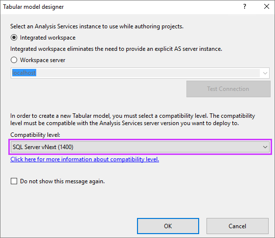
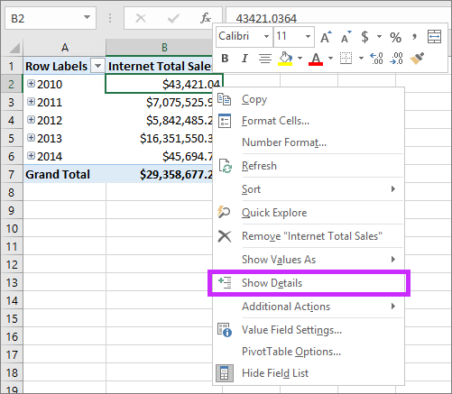

# Nouveaut&#233;s dans SQL Server Analysis Services vNext
[!INCLUDE[tsql-appliesto-ssvNxt-xxxx-xxxx-xxx](../includes/tsql-appliesto-ssvnxt-xxxx-xxxx-xxx.md)]

## <a name="sql-server-analysis-services-on-windows-ctp-12"></a>SQL Server Analysis Services sur Windows CTP 1.2

Cette version ne comporte aucune nouvelle fonctionnalité. Les améliorations incluent les correctifs de bogues et concernent les performances.

La dernière version préliminaire de SQL Server Data Tools (SSDT), qui coïncide avec SQL Server vNext CTP 1.2, améliore encore la nouvelle expérience moderne Get Data introduite dans CTP 1.1 avec un nouveau menu d’éditeur de requête et des fonctionnalités d’accès rapide. 

## <a name="sql-server-analysis-services-on-windows-ctp-11"></a>SQL Server Analysis Services sur Windows CTP 1.1 

Cette version introduit des améliorations pour les modèles tabulaires. 

### <a name="1400-compatibility-level-for-tabular-models"></a>Niveau de compatibilité&1400; pour les modèles tabulaires
  Pour tirer parti des fonctionnalités décrites dans cet article, les modèles tabulaires nouveaux ou existants doivent être définis sur le niveau de compatibilité 1400. Les modèles au niveau de compatibilité 1400 ne peuvent pas être déployés vers SQL Server 2016 SP1 ou version antérieure, ni passés à une version antérieure pour réduire les niveaux de compatibilité.
  
  Pour créer ou mettre à niveau des projets de modèles tabulaires existants vers le niveau de compatibilité 1400, téléchargez et installez une **version préliminaire** de [SQL Server Data Tools (SSDT) 17.0 RC2](https://go.microsoft.com/fwlink?LinkId=837939). 
  
Dans SSDT, vous pouvez sélectionner le nouveau niveau de compatibilité 1400 lors de la création de projets de modèles tabulaires. 



>[!NOTE] L’espace de travail intégré dans la version de décembre de SQL Server Data Tools (SSDT) prend en charge le niveau de compatibilité 1400. Si vous créez des projets de modèles tabulaires sur une instance de serveur d’espace de travail, cette instance ou toute instance que vous déployez doit être [!INCLUDE[ssSQLv14_md](../includes/sssqlv14-md.md)] CTP 1.1. 

Pour mettre à niveau un modèle tabulaire existant dans SSDT, dans l’Explorateur de solutions, cliquez avec le bouton droit sur **Model.bim**, puis dans **Propriétés**, définissez la propriété **Niveau de compatibilité** sur **SQL Server vNext (1400)**. 


### <a name="modern-get-data-experience"></a>Expérience moderne d’obtention des données
La dernière version préliminaire de SQL Server Data Tools (SSDT), qui coïncide avec la version [!INCLUDE[ssSQLv14_md](../includes/sssqlv14-md.md)] CTP 1.1, introduit une expérience moderne **d’obtention des données** pour les modèles tabulaires au niveau de compatibilité 1400. Cette nouvelle fonctionnalité est basée sur des fonctionnalités similaires de Power BI Desktop et de Microsoft Excel 2016.


>[!NOTE] Pour cette version, un nombre limité de sources de données est pris en charge. Les mises à jour ultérieures prendront en charge des sources de données et des fonctionnalités supplémentaires.

Pour en savoir plus sur l’expérience moderne d’obtention des données, consultez le [Blog de l’équipe Analysis Services](https://blogs.msdn.microsoft.com/analysisservices/2016/12/16/introducing-a-modern-get-data-experience-for-sql-server-vnext-on-windows-ctp-1-1-for-analysis-services/).

## <a name="ragged-hierarchies"></a>Hiérarchies déséquilibrées
Dans les modèles tabulaires, vous pouvez modéliser les hiérarchies parent-enfant. Les hiérarchies avec différents nombres de niveaux sont souvent appelées hiérarchies déséquilibrées. Par défaut, les hiérarchies déséquilibrées sont affichées avec des vides pour les niveaux en dessous de l’enfant le plus bas. Voici un exemple de hiérarchie déséquilibrée dans un organigramme :


Cette version introduit la propriété **Masquer les membres**. Vous pouvez définir la propriété **Masquer les membres** pour une hiérarchie sur **Masquer les membres vides**.


 >[!NOTE] Dans le modèle, les membres vides sont représentés par une valeur vide DAX, et non par une chaîne vide.

Lorsque la propriété **Masquer les membres vides** est définie, et lorsque le modèle est déployé, une version plus lisible de la hiérarchie est affichée dans les clients de gestion de rapports comme Excel.


### <a name="detail-rows"></a>Lignes de détails
Vous pouvez maintenant définir un ensemble de lignes personnalisées contribuant à une valeur de mesure. Les lignes de détails sont similaires à l’action d’extraction par défaut dans les modèles multidimensionnels. Cela permet aux utilisateurs finaux d’afficher des informations de manière plus détaillée que le niveau agrégé. 

Le tableau croisé dynamique suivant montre le total des ventes sur Internet par an de l’exemple de modèle tabulaire Adventure Works. Cliquez avec le bouton droit sur une cellule avec une valeur agrégée de la mesure, puis cliquez sur **Afficher les détails** pour afficher les lignes de détails.



Par défaut, les données associées à la table des ventes sur Internet s’affiche. Ce comportement limité n’est généralement pas significatif pour l’utilisateur car la table ne dispose peut-être pas des colonnes nécessaires pour afficher des informations utiles telles que le nom du client et les informations de commande. Avec les lignes de détails, vous pouvez spécifier une propriété **Expression de lignes de détails** pour les mesures.

#### <a name="detail-rows-expression-property-for-measures"></a>Propriété Expression de lignes de détails pour les mesures
La propriété **Expression de lignes de détails** pour les mesures permet aux créateurs de modèles de personnaliser les colonnes et les lignes renvoyées à l’utilisateur final.


La fonction DAX [SELECTCOLUMNS](https://msdn.microsoft.com/library/mt761759.aspx) est couramment utilisée dans une Expression de lignes de détails. L’exemple suivant définit les colonnes à renvoyer pour les lignes dans la table des ventes sur Internet, dans l’exemple de modèle tabulaire Adventure Works :

```
SELECTCOLUMNS(
    'Internet Sales',
    "Customer First Name", RELATED( Customer[Last Name]),
    "Customer Last Name", RELATED( Customer[First Name]),
    "Order Date", 'Internet Sales'[Order Date],
    "Internet Total Sales", [Internet Total Sales]
)
```

Lorsque la propriété est définie et lorsque le modèle est déployé, un ensemble de lignes personnalisé est renvoyé quand l’utilisateur sélectionne **Afficher les détails**. Il respecte automatiquement le contexte de filtre de la cellule sélectionnée. Dans cet exemple, seules les lignes pour la valeur 2010 sont affichées :


#### <a name="default-detail-rows-expression-property-for-tables"></a>Propriété Expression de lignes de détails par défaut pour les tables
Outre les mesures, les tables possèdent également une propriété pour définir une expression de lignes de détails. La propriété **Expression de lignes de détails par défaut** agit comme valeur par défaut pour toutes les mesures de la table. Les mesures qui n’ont pas leur propre expression définie héritent de l’expression de la table et affichent l’ensemble de lignes défini pour la table. Ceci permet de réutiliser des expressions, et les nouvelles mesures ajoutées à la table ultérieurement héritent automatiquement de l’expression.


 
#### <a name="detailrows-dax-function"></a>Fonction DETAILROWS DAX
Cette version comprend une nouvelle fonction DAX `DETAILROWS` qui renvoie l’ensemble de lignes défini par l’expression de lignes de détails. Elle fonctionne de façon similaire à l’instruction `DRILLTHROUGH` dans MDX, qui est également compatible avec les expressions de lignes de détails définies dans les modèles tabulaires.

La requête DAX suivante retourne l’ensemble de lignes défini par l’expression de lignes de détails pour la mesure ou pour sa table. Si aucune expression n’est définie, les données pour la table des ventes sur Internet sont renvoyées, car c’est la table qui contient la mesure.

```
EVALUATE DETAILROWS([Internet Total Sales])
```

## <a name="dax-enhancements"></a>Améliorations DAX
Cette version inclut un opérateur `IN` pour les expressions DAX. Elle est similaire à l’opérateur [`TSQL IN`](https://msdn.microsoft.com/library/ms177682.aspx) couramment utilisé pour spécifier plusieurs valeurs dans une clause `WHERE`.

Auparavant, il était courant de spécifier des filtres à valeurs multiples à l’aide de l’opérateur `OR` logique comme dans l’expression de mesure suivante :

```
Filtered Sales:=CALCULATE (
        [Internet Total Sales],
                 'Product'[Color] = "Red"
            || 'Product'[Color] = "Blue"
            || 'Product'[Color] = "Black"
    )
```

Ce processus est simplifié à l’aide de l’opérateur `IN` :
```
Filtered Sales:=CALCULATE (
        [Internet Total Sales], 'Product'[Color] IN { "Red", "Blue", "Black" }
    )
```

Dans ce cas, l’opérateur `IN` fait référence à une table d’une seule colonne avec 3 lignes ; une pour chacune des couleurs spécifiées. Notez que la syntaxe du constructeur de table utilise des accolades.

L’opérateur `IN` équivaut d’un point de vue fonctionnel à la fonction `CONTAINSROW` :
```
Filtered Sales:=CALCULATE (
        [Internet Total Sales], CONTAINSROW({ "Red", "Blue", "Black" }, 'Product'[Color])
    )
```

L’opérateur `IN` peut également être utilisé efficacement avec les constructeurs de table. Par exemple, la mesure suivante filtre par combinaisons de couleurs et de catégories de produits :
```
Filtered Sales:=CALCULATE (
        [Internet Total Sales],
        FILTER( ALL('Product'),
              ( 'Product'[Color] = "Red"   && Product[Product Category Name] = "Accessories" )
         || ( 'Product'[Color] = "Blue"  && Product[Product Category Name] = "Bikes" )
         || ( 'Product'[Color] = "Black" && Product[Product Category Name] = "Clothing" )
        )
    )
```

Avec le nouvel opérateur `IN`, l’expression de mesure ci-dessus est maintenant équivalente à celle qui suit :
```
Filtered Sales:=CALCULATE (
        [Internet Total Sales],
        FILTER( ALL('Product'),
            ('Product'[Color], Product[Product Category Name]) IN
            { ( "Red", "Accessories" ), ( "Blue", "Bikes" ), ( "Black", "Clothing" ) }
        )
    )
```


## <a name="table-level-security"></a>Sécurité au niveau des tables
Cette version introduit la sécurité au niveau des tables. Outre la restriction d’accès aux données des tables, les noms de tables sensibles peuvent être sécurisés. Cela permet d’empêcher qu’un utilisateur malveillant découvre l’existence de cette table.

La sécurité au niveau des tables doit être définie en utilisant les métadonnées basées sur JSON, le langage TMSL (Tabular Model Scripting Language) ou le modèle d’objet tabulaire (TOM). 

Par exemple, le code suivant permet de sécuriser la table Produit dans l’exemple de modèle tabulaire Adventure Works en définissant la propriété **MetadataPermission** de la classe **TablePermission** sur **Aucun**.

```
//Find the Users role in Adventure Works and secure the Product table
ModelRole role = db.Model.Roles.Find("Users");
Table productTable = db.Model.Tables.Find("Product");
if (role != null && productTable != null)
{
    TablePermission tablePermission;
    if (role.TablePermissions.Contains(productTable.Name))
    {
        tablePermission = role.TablePermissions[productTable.Name];
    }
    else
    {
        tablePermission = new TablePermission();
        role.TablePermissions.Add(tablePermission);
        tablePermission.Table = productTable;
    }
    tablePermission.MetadataPermission = MetadataPermission.None;
}
db.Update(UpdateOptions.ExpandFull);
```
## <a name="future-updates"></a>Mises à jour ultérieures
Des améliorations supplémentaires seront incluses dans une version ultérieure. Cet article sera mis à jour avec des annonces significatives sur les nouvelles fonctionnalités dans SQL Server vNext.
