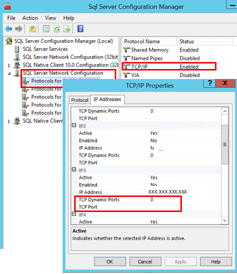

# Configurer un serveur pour l’écoute sur un port TCP spécifique
[!INCLUDE[tsql-appliesto-ss2008-xxxx-xxxx-xxx_md](../../includes/tsql-appliesto-ss2008-xxxx-xxxx-xxx-md.md)]

  Cette rubrique explique comment configurer une instance du [!INCLUDE[ssDEnoversion](../../includes/ssdenoversion-md.md)] pour l'écoute sur un port fixe spécifique à l'aide du Gestionnaire de configuration SQL Server. Si elle est activée, l’instance par défaut du [!INCLUDE[ssDEnoversion](../../includes/ssdenoversion-md.md)] écoute le port TCP 1433. Les instances nommées du [!INCLUDE[ssDE](../../includes/ssde-md.md)] et de [!INCLUDE[ssEW](../../includes/ssew-md.md)] sont configurées pour des [ports dynamiques](https://msdn.microsoft.com/library/dd981060). Cela signifie qu'elles sélectionnent un port disponible lorsque le service [!INCLUDE[ssNoVersion](../../includes/ssnoversion-md.md)] est démarré. Lorsque vous vous connectez à une instance nommée par l'intermédiaire d'un pare-feu, configurez le [!INCLUDE[ssDE](../../includes/ssde-md.md)] pour écouter un port spécifique, de façon à pouvoir ouvrir le port approprié dans le pare-feu.  

Comme le port 1433 est la norme connue pour [!INCLUDE[ssNoVersion](../../includes/ssnoversion-md.md)], certaines organisations spécifient que le numéro de port de [!INCLUDE[ssNoVersion](../../includes/ssnoversion-md.md)] doit être changé pour des raisons de sécurité. Ceci peut être utile dans certains environnements. Cependant, l’architecture TCP/IP permet à un [scanneur de port](https://wikipedia.org/wiki/Port_scanner) d’interroger les ports ouverts : par conséquent, le changement du numéro de port n’est pas considéré comme une mesure de sécurité robuste.

 Pour plus d’informations sur les paramètres par défaut du Pare-feu Windows et pour obtenir une description des ports TCP qui affectent le moteur de base de données, Analysis Services, Reporting Services et Integration Services, consultez [Configurer le Pare-feu Windows pour autoriser l’accès à SQL Server](../../sql-server/install/configure-the-windows-firewall-to-allow-sql-server-access.md).  
  
> [!TIP]  
>  Lors de la sélection du numéro de port, consultez [http://www.iana.org/assignments/port-numbers](http://www.iana.org/assignments/port-numbers) pour obtenir la liste des numéros de ports attribués aux applications spécifiques. sélectionnez un numéro de port non assigné. Pour plus d’informations, consultez [La plage de port dynamique par défaut pour le protocole TCP/IP a changé dans Windows Vista et dans Windows Server 2008](http://support.microsoft.com/kb/929851).  
  
> [!WARNING]  
>  Le moteur de base de données commence l'écoute sur un nouveau port une fois redémarré. Toutefois le service [!INCLUDE[ssNoVersion](../../includes/ssnoversion-md.md)] Browser surveille le Registre et signale le nouveau numéro de port dès que la configuration est modifiée, même si le moteur de base de données ne l'utilise pas. Redémarrez le moteur de base de données pour assurer la cohérence et éviter les échecs de connexion.  
  
  
##   Utilisation du Gestionnaire de configuration SQL Server  
  
#### Pour affecter un numéro de port TCP/IP au moteur de base de données SQL Server  
  
1.  Dans le Gestionnaire de configuration SQL Server, dans le volet de la console, développez **Configuration du réseau SQL Server**, **Protocoles pour \<nom_instance>** puis double-cliquez sur **TCP/IP**.  
  
    > [!NOTE]  
    >  Si vous avez des difficultés à ouvrir le Gestionnaire de configuration [!INCLUDE[ssNoVersion](../../includes/ssnoversion-md.md)] , consultez [Gestionnaire de configuration SQL Server](../../relational-databases/sql-server-configuration-manager.md).  
  
2.  Dans la boîte de dialogue **Propriétés TCP/IP** , sous l’onglet **Adresses IP** , plusieurs adresses IP apparaissent au format **IP1**, **IP2**, jusqu’à **IPAll**. Une de ces adresses correspond à l'adresse IP de la carte de bouclage, 127.0.0.1. D'autres adresses sont affichées pour chaque adresse IP sur l'ordinateur. (Vous verrez probablement l’adresse IP version 4 et l’adresse IP version 6.) Cliquez avec le bouton droit sur chaque adresse, puis cliquez sur **Propriétés** pour identifier l’adresse IP que vous voulez configurer.  
  
3.  Si la boîte de dialogue **Ports TCP dynamiques** contient **0**pour indiquer que [!INCLUDE[ssDE](../../includes/ssde-md.md)] écoute les ports dynamiques, supprimez le 0.  
  
       
  
4.  Dans la boîte de dialogue **Port TCP***n* **Propriétés** IP **n** , tapez le numéro du port sur lequel vous voulez que cette adresse IP écoute, puis cliquez sur **OK**.  
  
5.  Dans le volet de la console, cliquez sur **Services SQL Server**.  
  
6.  Dans le volet Détails, cliquez avec le bouton droit sur **SQL Server (**\<nom_instance>**)** puis cliquez sur **Redémarrer** pour arrêter et redémarrer [!INCLUDE[ssNoVersion](../../includes/ssnoversion-md.md)].  
  
## Connecting  
Après avoir configuré [!INCLUDE[ssNoVersion](../../includes/ssnoversion-md.md)] pour écouter un port spécifique, il existe trois manières de vous connecter à un port spécifique avec une application cliente :  
  
-   Exécutez le service Explorateur [!INCLUDE[ssNoVersion](../../includes/ssnoversion-md.md)] sur le serveur à connecter à l'instance [!INCLUDE[ssDE](../../includes/ssde-md.md)] par le nom.  
-   Créez un alias sur le client, en spécifiant le numéro du port.  
-   Programmer le client pour une connexion à l'aide d'une chaîne de connexion personnalisée.  
  
## Voir aussi  
 [Créer ou modifier un alias de serveur devant être utilisé par un client &#40;Gestionnaire de configuration SQL Server&#41;](../../database-engine/configure-windows/create-or-delete-a-server-alias-for-use-by-a-client.md)   
 [Service SQL Server Browser](../../tools/configuration-manager/sql-server-browser-service.md)  
  
  
