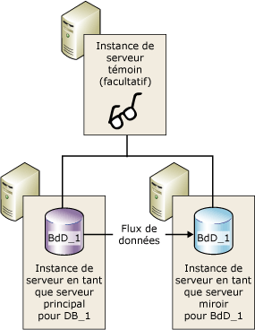
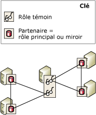

# Témoin de mise en miroir de base de données
  Pour permettre la prise en charge du basculement automatique, une session de mise en miroir de bases de données doit être configurée en mode haute sécurité et disposer d’une troisième instance de serveur, appelée *témoin*. Le témoin correspond à une instance facultative de [!INCLUDE[ssNoVersion](../../includes/ssnoversion-md.md)] qui active le serveur miroir dans une session en mode haute sécurité pour déterminer s'il est nécessaire d'initier un basculement automatique. Contrairement aux deux autres, le témoin ne dessert pas la base de données. La prise en charge du basculement automatique est le seul rôle rempli par le témoin.  
  
> [!NOTE]  
>  En mode haute sécurité, le témoin peut avoir une influence négative sur la disponibilité. Si un témoin est configuré pour une session de mise en miroir de base de données, le serveur principal doit être connecté à au moins une des autres instances de serveur, le serveur miroir ou le témoin, ou les deux. Sinon, la base de données n'est plus disponible et forcer le service (perte de données possible) est impossible. Par conséquent, en mode haute performance, il est fortement recommandé de toujours conserver le témoin défini sur OFF. Pour plus d’informations sur l’incidence d’un témoin sur le mode hautes performances, consultez [Modes de fonctionnement de la mise en miroir de bases de données](../../database-engine/database-mirroring/database-mirroring-operating-modes.md).  
  
 La figure ci-dessous présente une session en mode haute sécurité avec témoin.  
  
   
  
 **Dans cette rubrique :**  
  
-   [Utilisation d'un témoin dans plusieurs sessions](#InMultipleSessions)  
  
-   [Recommandations logicielles et matérielles](#SwHwRecommendations)  
  
-   [Rôle du témoin en basculement automatique](#InAutoFo)  
  
-   [Pour ajouter ou supprimer un témoin](#AddRemoveWitness)  
  
##   Utilisation d'un témoin dans plusieurs sessions  
 Une instance du serveur spécifique peut servir de témoin dans des sessions de mise en miroir de base de données simultanées, à raison d'une session par base de données différente. Différentes sessions ont lieu avec différents partenaires. L'illustration suivante montre une instance de serveur témoin qui participe à deux sessions de mise en miroir de base de données avec différents partenaires.  
  
   
  
 Une même instance de serveur peut également fonctionner simultanément en tant que témoin au sein de certaines sessions et en tant que partenaire au sein d'autres sessions. En pratique, cependant, une instance de serveur fonctionne typiquement soit en tant que témoin, soit en tant que partenaire. La raison en est que les serveurs partenaires nécessitent des ordinateurs sophistiqués disposant d'un niveau de matériel suffisant pour prendre en charge une base de données de production, alors que le serveur témoin peut s'exécuter sur tout système Windows disponible prenant en charge [!INCLUDE[ssCurrent](../../includes/sscurrent-md.md)].  
  
##   Recommandations logicielles et matérielles  
 Nous vous recommandons vivement de placer le témoin sur un ordinateur distinct de celui des partenaires. Les serveurs partenaires de mise en miroir de bases de données sont pris en charge uniquement par l'édition [!INCLUDE[ssNoVersion](../../includes/ssnoversion-md.md)] Standard et l'édition [!INCLUDE[ssNoVersion](../../includes/ssnoversion-md.md)] Enterprise. Les témoins, en revanche, sont également pris en charge dans l'édition [!INCLUDE[ssNoVersion](../../includes/ssnoversion-md.md)] Workgroup et l'édition [!INCLUDE[ssNoVersion](../../includes/ssnoversion-md.md)] Express. À l'exception d'une mise à niveau depuis une version antérieure de [!INCLUDE[ssNoVersion](../../includes/ssnoversion-md.md)], les instances de serveur dans une session de mise en miroir doivent toutes exécuter la même version de [!INCLUDE[ssNoVersion](../../includes/ssnoversion-md.md)]. Par exemple, un témoin [!INCLUDE[ssKatmai](../../includes/sskatmai-md.md)] est pris en charge lorsque vous effectuez une mise à niveau depuis une configuration de mise en miroir [!INCLUDE[ssKatmai](../../includes/sskatmai-md.md)] , mais ne peut pas être ajouté à une configuration de mise en miroir [!INCLUDE[ssKilimanjaro](../../includes/sskilimanjaro-md.md)] ou ultérieure.  
  
 Un témoin peut s'exécuter sur tout système informatique fiable prenant en charge ces éditions de [!INCLUDE[ssNoVersion](../../includes/ssnoversion-md.md)]. Cependant, nous recommandons que chaque instance de serveur utilisée en tant que témoin soit conforme à la configuration minimale requise pour la version de [!INCLUDE[ssNoVersion](../../includes/ssnoversion-md.md)] Standard que vous exécutez. Pour plus d’informations sur ces configurations requises, consultez [Configurations matérielle et logicielle requises pour l’installation de SQL Server 2016](../../sql-server/install/hardware-and-software-requirements-for-installing-sql-server.md).  
  
##   Rôle du témoin en basculement automatique  
 Pendant tout le déroulement d'une session de mise en miroir d'une base de données, toutes les instances de serveur surveillent l'état de leur connexion. Si les partenaires se déconnectent, ils s'en remettent au témoin pour vérifier qu'un seul d'entre eux sert actuellement la base de données. Si un serveur miroir synchronisé perd sa connexion au serveur principal, mais reste connecté au témoin, le serveur miroir contacte le témoin pour déterminer si le témoin a perdu sa connexion au serveur principal :  
  
-   Si le serveur principal est toujours connecté au témoin, le basculement automatique n'a pas lieu. Le serveur principal continue en fait à servir la base de données tout en accumulant les enregistrements du journal à envoyer au serveur miroir lorsque les partenaires se reconnectent.  
  
-   Si le témoin est aussi déconnecté du serveur principal, le serveur miroir détecte que cette base de données principale n'est plus disponible. Dans ce cas, le serveur miroir initie immédiatement un basculement automatique.  
  
-   Si le serveur miroir est déconnecté du témoin ainsi que du serveur principal, le basculement automatique n'est pas possible, indépendamment de l'état du serveur principal.  
  
 La condition selon laquelle au moins deux instances de serveur doivent être connectées s’appelle *quorum*. Le quorum garantit que la base de données ne peut être servie que par un seul partenaire à la fois. Pour plus d’informations sur le fonctionnement du quorum et son impact sur une session, consultez [Quorum : effets d’un témoin sur la disponibilité de la base de données &#40;Mise en miroir de bases de données&#41;](../../database-engine/database-mirroring/quorum-how-a-witness-affects-database-availability-database-mirroring.md).  
  
##   Pour ajouter ou supprimer un témoin  
 **Pour ajouter un témoin**  
  
-   [Ajouter ou remplacer un témoin de mise en miroir de bases de données &#40;SQL Server Management Studio&#41;](../../database-engine/database-mirroring/add-or-replace-a-database-mirroring-witness-sql-server-management-studio.md)  
  
-   [Ajouter un témoin de mise en miroir de bases de données à l’aide de l’authentification Windows &#40;Transact-SQL&#41;](../../database-engine/database-mirroring/add-a-database-mirroring-witness-using-windows-authentication-transact-sql.md)  
  
 **Pour supprimer le témoin**  
  
-   [Supprimer le témoin d’une session de mise en miroir de bases de données &#40;SQL Server&#41;](../../database-engine/database-mirroring/remove-the-witness-from-a-database-mirroring-session-sql-server.md)  
  
## Voir aussi  
 [Basculement de rôle durant une session de mise en miroir de bases de données &#40;SQL Server&#41;](../../database-engine/database-mirroring/role-switching-during-a-database-mirroring-session-sql-server.md)   
 [Modes de fonctionnement de la mise en miroir de bases de données](../../database-engine/database-mirroring/database-mirroring-operating-modes.md)   
 [Quorum : effets d’un témoin sur la disponibilité de la base de données &#40;Mise en miroir de bases de données&#41;](../../database-engine/database-mirroring/quorum-how-a-witness-affects-database-availability-database-mirroring.md)   
 [Défaillances possibles pendant la mise en miroir d’une base de données](../../database-engine/database-mirroring/possible-failures-during-database-mirroring.md)   
 [États de la mise en miroir &#40;SQL Server&#41;](../../database-engine/database-mirroring/mirroring-states-sql-server.md)  
  
  
