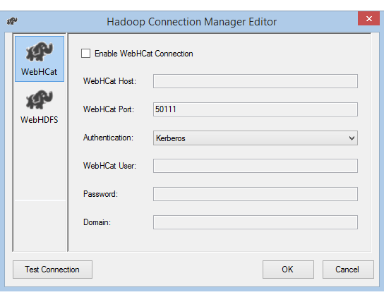

# Gestionnaire de connexions Hadoop
  Le Gestionnaire de connexions Hadoop permet à un package SSIS de se connecter à un cluster Hadoop en utilisant les valeurs que vous spécifiez pour les propriétés.  
  
## Configurer le Gestionnaire de connexions Hadoop  
  
1.  Dans la boîte de dialogue **Ajout d’un gestionnaire de connexions SSIS** , sélectionnez **Hadoop**, puis cliquez sur **Ajouter**. La boîte de dialogue **Éditeur du Gestionnaire de connexions Hadoop** s’affiche.  
  
2.  Dans le volet gauche , choisissez l’onglet **WebHCat** ou **WebHDFS** pour configurer les informations de cluster Hadoop associées.  
  
3.  Si vous activez l’option **WebHCat** pour appeler un travail Hive ou Pig sur Hadoop, procédez comme suit.  
  
    1.  Dans la zone **Hôte WebHCat**, entrez le serveur qui héberge le service WebHCat.  
  
    2.  Dans la zone **Port WebHCat**, entrez le port du service WebHCat, défini par défaut sur 50111.  
  
    3.  Dans la zone **Authentification** , sélectionnez la méthode d’authentification pour l’accès au service WebHCat. Les valeurs disponibles sont **De base** et **Kerberos**.  
  
           
  
           
  
    4.  Dans la zone **Utilisateur WebHCat**, entrez l’ **Utilisateur** autorisé à accéder à WebHCat.  
  
    5.  Si vous sélectionnez l’authentification **Kerberos** , entrez le **Mot de passe** et le **Domaine**de l’utilisateur.  
  
4.  Si vous activez l’option **WebHDFS** pour copier des données à partir ou en direction de HDFS, procédez comme suit.  
  
    1.  Dans la zone **Hôte WebHDFS**, entrez le serveur qui héberge le service WebHDFS.  
  
    2.  Dans la zone **Port WebHDFS**, entrez le port du service WebHDFS, défini par défaut sur 50070.  
  
    3.  Dans la zone **Authentification** , sélectionnez la méthode d’authentification pour l’accès au service WebHDFS. Les valeurs disponibles sont **De base** et **Kerberos**.  
  
    4.  Dans la zone **Utilisateur WebHDFS**, entrez l’utilisateur autorisé à accéder à HDFS.  
  
    5.  Si vous sélectionnez l’authentification **Kerberos** , entrez le **Mot de passe** et le **Domaine**de l’utilisateur.  
  
5.  Cliquez sur **Tester la connexion** pour tester la connexion. (Le test ne porte que sur la connexion que vous avez activée.)  
  
6.  Cliquez sur **OK** pour fermer la boîte de dialogue.  
  
## Voir aussi  
 [Tâche Hive Hadoop](../../integration-services/control-flow/hadoop-hive-task.md)   
 [Hadoop Pig, tâche](../../integration-services/control-flow/hadoop-pig-task.md)   
 [Tâche du système de fichiers Hadoop](../../integration-services/control-flow/hadoop-file-system-task.md)  
  
  
