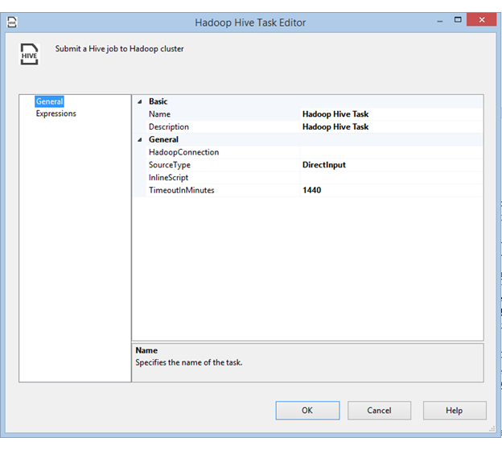

# Tâche Hive Hadoop
  Utilisez la tâche Hive Hadoop pour exécuter le script Hive sur un cluster Hadoop.  
  
 Pour ajouter une tâche Hive Hadoop, sélectionnez-la et faites-la glisser vers le concepteur. Double-cliquez ensuite sur la tâche, ou cliquez avec le bouton droit et sélectionnez **Modifier**pour ouvrir la boîte de dialogue **Éditeur de tâches Hive Hadoop** .  
  
   
  
## Options  
 Configurez les options suivantes dans la boîte de dialogue **Éditeur de tâches Hive Hadoop** .  
  
|Champ|Description|  
|-----------|-----------------|  
|**Connexion Hadoop**|Spécifiez un gestionnaire de connexions Hadoop existant ou créez-en un. Ce gestionnaire de connexions indique où se trouve le service WebHCat.|  
|**SourceType**|Spécifiez le type de source de la requête. Les valeurs disponibles sont **ScriptFile** et **DirectInput**.|  
|**InlineScript**|Lorsque la valeur de **SourceType** est **DirectInput**, spécifiez le script Hive.|  
|**HadoopScriptFilePath**|Lorsque **SourceType** présente la valeur **ScriptFile**, spécifiez le chemin d’accès au fichier de script sur Hadoop.|  
|**TimeoutInMinutes**|Spécifiez une valeur de délai d’expiration en minutes. Le travail Hadoop s’arrête s’il ne s’est pas terminé avant la fin du délai d’expiration. Spécifiez 0 pour planifier une exécution asynchrone du travail Hadoop.|  
  
## Voir aussi  
 [Gestionnaire de connexions Hadoop](../../integration-services/connection-manager/hadoop-connection-manager.md)  
  
  

