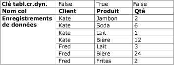

# Transformation Unpivot
  La transformation Unpivot convertit un dataset non normalisé en version plus normalisée en étendant les valeurs de plusieurs colonnes d'un enregistrement dans plusieurs enregistrements avec les mêmes valeurs dans une colonne unique. Par exemple, un dataset qui répertorie des noms de clients possède une ligne pour chaque client, avec les produits et la quantité achetée mentionnés dans les colonnes sur la ligne. Après que la transformation Unpivot a normalisé le dataset, celui-ci contient une ligne différente pour chaque produit que le client a acheté.  
  
 Le schéma suivant illustre un dataset avant que les données n'aient été transformées dans la colonne Product.  
  
   
  
 Le schéma suivant illustre un dataset après transformation de la colonne Product.  
  
   
  
 Dans certaines circonstances, les résultats de la suppression du tableau croisé dynamique peuvent contenir des lignes aux valeurs inattendues. Par exemple, si les exemples de données du diagramme qui doivent être supprimées du tableau croisé dynamique possèdent des valeurs Null dans toutes les colonnes Qty pour Fred, la sortie ne comprend qu'une ligne pour Fred, au lieu de cinq. La colonne Qty contient Null ou zéro, suivant le type de données de la colonne.  
  
## Configuration de la transformation Unpivot  
 La transformation Unpivot inclut la propriété personnalisée **PivotKeyValue**. La propriété peut être mise à jour par une expression de propriété lors du chargement du package. Pour plus d’informations, consultez [Expressions Integration Services &#40;SSIS&#41; ](../../../integration-services/expressions/integration-services-ssis-expressions.md), [Expressions de propriété dans des packages](../../../integration-services/expressions/use-property-expressions-in-packages.md) et [Propriétés personnalisées des transformations](../../../integration-services/data-flow/transformations/transformation-custom-properties.md).  
  
 Cette transformation a une entrée et une sortie. Elle ne possède aucune sortie d'erreur.  
  
 Vous pouvez définir des propriétés au moyen du concepteur [!INCLUDE[ssIS](../../../includes/ssis-md.md)] ou par programmation.  
  
 Pour plus d’informations sur les propriétés définissables dans la boîte de dialogue **Éditeur de transformation UnPivot**, cliquez sur l’une des rubriques suivantes :  
  
-   [Éditeur de transformation UnPivot](../../../integration-services/data-flow/transformations/unpivot-transformation-editor.md)  
  
 Pour plus d'informations sur les propriétés définissables dans la boîte de dialogue **Éditeur avancé** ou par programmation, cliquez sur l'une des rubriques suivantes :  
  
-   [Propriétés communes](../Topic/Common%20Properties.md)  
  
-   [Propriétés personnalisées des transformations](../../../integration-services/data-flow/transformations/transformation-custom-properties.md)  
  
 Pour plus d’informations sur la façon de définir des propriétés, consultez [Définir les propriétés d’un composant de flux de données](../../../integration-services/data-flow/set-the-properties-of-a-data-flow-component.md).  
  
  