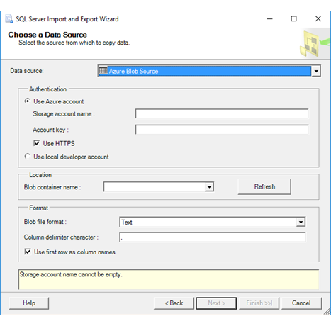

# Se connecter à Stockage Blob Azure (Assistant Importation et Exportation SQL Server)
Cette rubrique vous montre comment se connecter à une source de données **Stockage Blob Azure** à partir de la page **Choisir une source de données** ou **Choisir une destination** de l’Assistant Importation et Exportation SQL Server.

>   [!NOTE]
> Pour utiliser la source ou la destination des objets blob Azure, vous devez installer le Feature Pack Azure pour SQL Server Integration Services.
> - Pour télécharger le Feature Pack, consultez [Microsoft SQL Server 2016 Integration Services Feature Pack pour Azure](https://www.microsoft.com/download/details.aspx?id=49492).
>
> - Pour plus d’informations, consultez [Feature Pack Azure pour Integration Services &#40;SSIS&#41;](../../integration-services/azure-feature-pack-for-integration-services-ssis.md).

La capture d’écran suivante présente les options de configuration d’une connexion à Stockage Blob Azure.

## Options à spécifier

> [!NOTE]
> Les options de connexion de ce fournisseur de données sont les mêmes, que Stockage Blob Azure soit la source ou la destination. Autrement dit, les options que vous voyez sont identiques dans les pages **Choisir une source de données** et **Choisir une destination** de l’Assistant.

 **Utiliser un compte Azure**  
 Indiquez si vous souhaitez utiliser un compte en ligne.
  
 **Nom du compte de stockage**  
 Entrez le nom du compte de stockage Azure.  
  
**Clé de compte**  
Entrez la clé du compte de stockage Azure.  
  
 **Utiliser HTTPS**  
 Indiquez si vous souhaitez vous connecter au compte de stockage avec HTTP ou HTTPS.  
  
 **Utiliser un compte de développeur local**  
 Spécifiez s’il convient d’utiliser l’émulateur de stockage sur l’ordinateur local.  
  
 **Nom du conteneur d’objets blob**  
 Sélectionnez un nom dans la liste des conteneurs de stockage disponibles dans le compte de stockage spécifié.  
  
 **Format du fichier d’objets blob**  
 Sélectionnez le format de fichier Texte ou Avro.  
  
 **Caractère séparateur de colonnes**  
 Si vous avez sélectionné le format Texte, entrez le caractère délimiteur de colonne.  
  
 **Utiliser la première ligne comme noms de colonne**  
 Spécifiez si la première ligne de données contient des noms de colonne.  

## Voir aussi
[Choisir une source de données](../../integration-services/import-export-data/choose-a-data-source-sql-server-import-and-export-wizard.md)  
[Choisir une destination](../../integration-services/import-export-data/choose-a-destination-sql-server-import-and-export-wizard.md)

