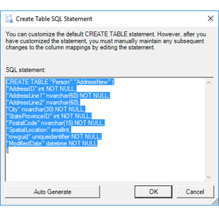

# Instruction SQL de création de table (Assistant Importation et Exportation SQL Server)
Dans la boîte de dialogue **Mappage de colonnes** , si vous sélectionnez **Créer la table de destination** , puis **Modifier SQL** , l’Assistant Importation et Exportation [!INCLUDE[ssNoVersion](../../includes/ssnoversion-md.md)] affiche la boîte de dialogue **Instruction SQL de création de table** . Dans cette page, vous passez en revue et éventuellement personnalisez les options de la commande **CREATE TABLE** que l’Assistant doit exécuter pour créer la nouvelle table de destination.
  
> [!NOTE]
> Si vous recherchez des informations sur l’instruction CREATE TABLE [!INCLUDE[tsql](../../includes/tsql-md.md)] et non sur la boîte de dialogue **Instruction SQL de création de table** de l’Assistant Importation et Exportation [!INCLUDE[ssNoVersion](../../includes/ssnoversion-md.md)], consultez [CREATE TABLE &#40;Transact-SQL&#41;](../../t-sql/statements/create-table-transact-sql.md). 
  
## Capture d’écran de la page Instruction SQL de création de table  
 La capture d’écran suivante montre la boîte de dialogue **Instruction SQL de création de table** de l’Assistant.
 
Dans cet exemple, le champ **Instruction SQL** contient la valeur par défaut de l’instruction **CREATE TABLE** générée par l’Assistant. Cette instruction crée une nouvelle table de destination nommée **Person.AddressNew** qui est une copie de la **Person.Address** table source. 
  
   
  
## Vérifier ou régénérer l’instruction CREATE TABLE  
 **Instruction SQL**  
Affiche l’instruction SQL générée automatiquement et vous permet de la personnaliser.
 
Si vous modifiez la commande CREATE TABLE par défaut, vous devrez peut-être également apporter des modifications aux mappages de colonne associée lorsque vous revenez à la **mappages de colonnes** boîte de dialogue.  
  
Si vous voulez inclure un retour chariot dans le texte de l’instruction SQL, appuyez sur CTRL+ENTRÉE. Si vous appuyez seulement sur ENTRÉE, la boîte de dialogue se ferme.  
  
Pour plus d’informations sur l’instruction CREATE TABLE et sa syntaxe, consultez [CREATE TABLE &#40;Transact-SQL&#41;](../../t-sql/statements/create-table-transact-sql.md).   
  
 **Créer automatiquement**  
 Restauration de l’instruction SQL par défaut, si vous avez modifié, en cliquant sur **générer automatiquement**.  
  
## Créer une table qui inclut une colonne FILESTREAM  
 L’Assistant Importation et Exportation [!INCLUDE[ssNoVersion](../../includes/ssnoversion-md.md)] génère une instruction CREATE TABLE par défaut, basée sur la source de données connectée. Cette instruction CREATE TABLE par défaut n’inclut pas l’attribut FILESTREAM, même si la table source comprend une colonne FILESTREAM.
 1.  Pour copier la colonne FILESTREAM à l’aide de l’Assistant, implémentez d’abord le stockage FILESTREAM dans la base de données de destination.
 2.  Ensuite, ajoutez manuellement l’attribut FILESTREAM à l’instruction CREATE TABLE dans la boîte de dialogue **Instruction SQL de création de table** .  

Pour plus d’informations sur la syntaxe, consultez [CREATE TABLE &#40; Transact-SQL &#41; ](../../t-sql/statements/create-table-transact-sql.md). Pour plus d’informations sur FILESTREAM, consultez [Objets binaires volumineux &#40;Objet BLOB&#41; Données &#40;SQL Server&#41;](../../relational-databases/blob/binary-large-object-blob-data-sql-server.md).  
  
## Étape suivante  
 Une fois que vous avez passé en revue et personnalisé les options de la commande CREATE TABLE, cliquez sur **OK**. La boîte de dialogue **Instruction SQL de création de table** vous renvoie alors à la boîte de dialogue **Mappages de colonnes** . Pour plus d’informations, consultez [Mappages de colonnes](../../integration-services/import-export-data/column-mappings-sql-server-import-and-export-wizard.md).
 
 ## Voir aussi
[Bien démarrer avec cet exemple simple de l’Assistant Importation et Exportation](../../integration-services/import-export-data/get-started-with-this-simple-example-of-the-import-and-export-wizard.md)

