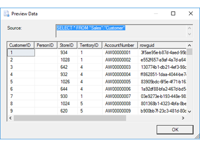

# Boîte de dialogue Aperçu des données (Assistant Importation et Exportation SQL Server)
  Après avoir spécifié les données à copier, vous pouvez éventuellement cliquer sur **Aperçu** pour ouvrir la boîte de dialogue **Aperçu des données** . Dans cette page, vous pouvez afficher jusqu’à 200 lignes d’exemples de données de votre source de données. Cela confirme que l’Assistant va copier les données que vous souhaitez copier.
  
## Capture d’écran de la page Aperçu des données 
 La capture d’écran suivante montre la boîte de dialogue **Aperçu des données** de l’Assistant.  
 
  
  
## Aperçu des exemples de données  
 **Source**  
Affiche la requête que l’Assistant utilise pour charger des données à partir de la source de données.

Si vous avez sélectionné une table à copier, le **Source** champ affiche une `SELECT * FROM <table>` requête au lieu du nom de table. 
  
 **Exemple de grille de données**  
 Affiche jusqu’à 200 lignes d’exemples de données retournées par la requête à partir de la source de données.  

## Qui n’est pas bon, que je souhaite modifier quelque chose
Après avoir affiché un aperçu des données, vous souhaiterez peut-être modifier les options que vous avez sélectionnées dans les pages précédentes de l’Assistant. Pour apporter ces modifications, cliquez sur **OK** pour revenir à la **sélectionner des Tables Source et vues** page, puis cliquez sur **retour** pour retourner aux pages précédentes où vous pouvez modifier vos sélections.

## Étape suivante  
 Une fois que vous avez affiché un aperçu des données à copier et cliqué sur **OK**, la boîte de dialogue **Aperçu des données** vous renvoie à la page **Sélectionner les tables et les vues sources** ou **Configurer la destination du fichier plat** . Pour plus d’informations, consultez [Sélectionner les tables et les vues sources](../../integration-services/import-export-data/select-source-tables-and-views-sql-server-import-and-export-wizard.md) ou [Configurer la destination du fichier plat](../../integration-services/import-export-data/configure-flat-file-destination-sql-server-import-and-export-wizard.md).  
 
 ## Voir aussi
[Bien démarrer avec cet exemple simple de l’Assistant Importation et Exportation](../../integration-services/import-export-data/get-started-with-this-simple-example-of-the-import-and-export-wizard.md)

