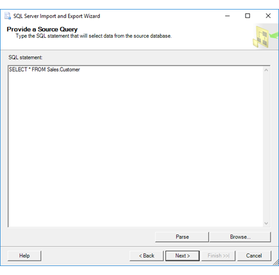

# <a name="provide-a-source-query-sql-server-import-and-export-wizard"></a>Fournir une requête source (Assistant Importation et Exportation SQL Server)
Si vous avez indiqué que vous souhaitez fournir une requête pour sélectionner les données à copier, l’Assistant Importation et Exportation [!INCLUDE[ssNoVersion](../../includes/ssnoversion-md.md)] affiche **Fournir une requête source**. Dans cette page, vous écrivez et testez la requête SQL qui sélectionne les données à copier de la source de données vers la destination. Vous pouvez également coller le texte d’une requête enregistrée, ou de charger le texte de requête à partir d’un fichier.

## <a name="screen-shot-of-the-source-query-page"></a>Capture d’écran de la page Requête source  
La capture d’écran suivante montre la page **Fournir une requête source** de l’Assistant.
 
Dans cet exemple simple, l’utilisateur a entré la requête `SELECT * FROM Sales.Customer` pour copier toutes les lignes et toutes les colonnes de la **Sales.Customer** table dans la base de données source.
-   `SELECT *`moyen de copie toutes les colonnes.
-   L’absence d’un `WHERE` clause signifie copier toutes les lignes.
  
   

## <a name="provide-the-query-and-check-its-syntax"></a>Fournir la requête et vérifier sa syntaxe
**Instruction SQL**  
 Tapez une requête SELECT pour extraire des lignes et colonnes de données spécifiques à partir de la base de données source. Vous pouvez également coller le texte d’une requête enregistrée, ou charger la requête à partir d’un fichier en cliquant sur **Parcourir**. 
  
 Par exemple, la requête suivante récupère les **SalesPersonID**, **SalesQuota**, et **SalesYTD** à partir de la base de données AdventureWorks pour les commerciaux dont le pourcentage des commissions est supérieur à 1,5 %.  
  
```sql
SELECT SalesPersonID, SalesQuota, SalesYTD  
FROM Sales.SalesPerson  
WHERE CommissionPct > 0.015  
```  

Pour plus d’exemples de requêtes SELECT, consultez [Exemples SELECT &#40;Transact-SQL&#41;](../../t-sql/queries/select-examples-transact-sql.md) ou effectuez des recherches en ligne.  

Si votre source de données est Excel, consultez [Fournir une requête source pour Excel](#excelQueries) plus loin dans cette rubrique pour savoir comment spécifier des plages et des feuilles de calcul Excel dans une requête.
  
 **Analyser**  
 Vérifiez la syntaxe de l’instruction SQL que vous avez entrée dans la zone de texte **Instruction SQL** .  
  
> [!NOTE]
> Si le temps requis pour vérifier la syntaxe de l’instruction dépasse la valeur du délai d’attente de 30 secondes, l’analyse s’arrête et génère une erreur. Vous ne pouvez avancer dans l’Assistant tant que l’analyse n’a pas réussi. Pour éviter l’expiration du délai, d’attente une solution consiste à créer une vue de base de données basée sur la requête à utiliser, puis à interroger la vue à partir de l’Assistant au lieu d’entrer directement le texte de requête.  
  
 **Parcourir**  
 Sélectionnez un fichier qui contient le texte d’une requête SQL à l’aide de la **ouvrir** boîte de dialogue. La sélection d’un fichier copie le texte du fichier dans la zone de texte **Instruction SQL** .  
 
## <a name="excelQueries"></a> Fournir une requête source pour Excel
### <a name="specify-excel-objects-in-queries"></a>Spécifier les objets Excel dans des requêtes
Il existe trois types d’objets Excel que vous pouvez interroger.
-   **Feuille de calcul.** Pour interroger une feuille de calcul, ajoutez le caractère $ à la fin du nom de la feuille et ajoutez des délimiteurs autour de la chaîne, par exemple, **[Sheet1$]**.

    ```sql
    SELECT * FROM [Sheet1$]
    ```

-   **Plage nommée.** Pour interroger une plage nommée, utilisez simplement le nom de la plage. Par exemple, **MyDataRange**.
    
    ```sql
    SELECT * FROM MyDataRange
    ```

-   **Plage sans nom.** Pour spécifier une plage de cellules que vous n’avez pas nommée, ajoutez le caractère $ à la fin du nom de la feuille, ajoutez la spécification de plage ainsi que des délimiteurs autour de la chaîne. Par exemple, **[Sheet1$A1:B4]**.

    ```sql
    SELECT * FROM [Sheet1$A1:B4]
    ```

### <a name="prepare-the-excel-source-data"></a>Préparer les données de source Excel
Que vous spécifiez une feuille de calcul ou une plage comme table source, le pilote lit le bloc de cellules *contigu* à partir de la première cellule non vide en haut à gauche de la feuille de calcul ou de la plage. Par conséquent, vous ne pouvez pas avoir de ligne vide dans les données sources. Par exemple, vous ne pouvez pas avoir de ligne vide entre les en-têtes de colonne et les lignes de données. Si un titre est suivi de lignes vides en haut de la feuille de calcul au-dessus de vos données, vous ne pouvez pas interroger la feuille de calcul. Dans Excel, vous devez attribuer un nom à la plage de données et interroger la plage nommée au lieu de la feuille de calcul.

## <a name="whats-next"></a>Étape suivante  
 Une fois que vous avez écrit et testé la requête SQL qui sélectionne les données à copier, la page suivante dépend de la destination de vos données.  
  
-   Pour la plupart des destinations, la page suivante est **Sélectionner les tables et les vues sources**, dans laquelle vous passez en revue la requête fournie. Vous pouvez éventuellement choisir les colonnes à copier et afficher un aperçu des exemples de données. Pour plus d’informations, consultez [Sélectionner les tables et les vues sources](../../integration-services/import-export-data/select-source-tables-and-views-sql-server-import-and-export-wizard.md).  
  
-   Si votre destination est un fichier plat, la page suivante est **Configurer la destination du fichier plat**. Dans cette page, vous spécifiez les options de mise en forme du fichier plat de destination. (Une fois le fichier plat configuré, la page suivante est **Sélectionner les tables et les vues sources**.) Pour plus d’informations, consultez [Configurer la destination du fichier plat](../../integration-services/import-export-data/configure-flat-file-destination-sql-server-import-and-export-wizard.md).  


