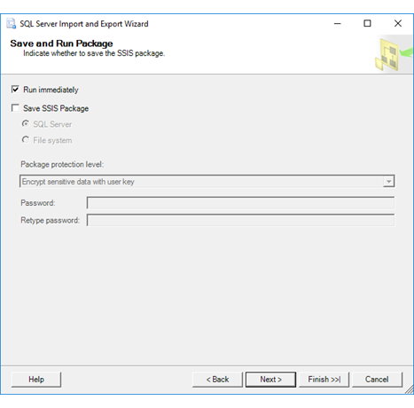

# Enregistrer et exécuter le package (Assistant Importation et exportation SQL Server)
  Une fois que vous avez spécifié et configuré la source et la destination des données, l’Assistant Importation et exportation [!INCLUDE[ssNoVersion](../../includes/ssnoversion-md.md)] affiche la page **Enregistrer et exécuter le package**. Dans cette page, vous spécifiez si vous souhaitez exécuter l’opération de copie immédiatement. Selon votre configuration, vous devez également pouvoir enregistrer vos paramètres sous la forme d’un package [!INCLUDE[ssNoVersion](../../includes/ssnoversion-md.md)] [!INCLUDE[ssISnoversion](../../includes/ssisnoversion-md.md)] (SSIS) pour ensuite le personnaliser et le réutiliser.
  
**Qu’est-ce qu’un package ?** L’Assistant utilise SQL Server Integration Services (SSIS) pour copier les données. Dans SSIS, l’unité de base est le package. L’Assistant crée un package SSIS en mémoire à mesure que vous parcourez les pages de l’Assistant et spécifiez les options.
  
## Capture d’écran de la page Enregistrer et exécuter le package  
La capture d’écran suivante montre la page **Enregistrer et exécuter le package** de l’Assistant. 
   
 
  
## Exécuter et enregistrer le package 
 Pour continuer, vous devez sélectionner au moins une des deux options suivantes.  
  
 **Run immediately**  
 Sélectionnez cette option pour importer et exporter les données immédiatement. Cette case à cocher est activée par défaut, et l’opération s’exécute instantanément.
  
 **Enregistrer le package SSIS**  
 Enregistrez vos paramètres dans un package SSIS. Si vous le souhaitez, vous pourrez ultérieurement personnaliser le package et le réexécuter. Si vous choisissez d’enregistrer le package, des options supplémentaires vous sont proposées dans la page suivante, **Enregistrer le package SSIS**.
 
L’option d’enregistrement du package est disponible uniquement si vous avez installé [!INCLUDE[ssNoVersion](../../includes/ssnoversion-md.md)] Standard Edition ou une édition supérieure.   
  
> [!NOTE]
> Si vous terminez l’Assistant, effectuez l’opération, mais arrêtez-la avant la fin de son exécution, ainsi le package n’est pas enregistré même si vous avez coché la case **Enregistrer le package SSIS**.  

### Si vous avez démarré l’Assistant à partir de Visual Studio
Si vous avez démarré l’Assistant à partir d’un projet Integration Services dans Visual Studio avec SQL Server Data Tools (SSDT) :
-   Vous pouvez **exécuter** le package uniquement après avoir quitté l’Assistant. Vous pouvez ensuite exécuter ce package à partir de Visual Studio.
-   L’Assistant **enregistre** le package dans le projet Integration Services à partir duquel vous avez démarré l’Assistant.

## Spécifier des options pour l’enregistrement du package
**SQL Server**  
 Sélectionnez cette option pour enregistrer le package dans SQL Server, dans la base de données **msdb** de la table **sysssispackages**.
 
> [!IMPORTANT]
> Cette option n’enregistre pas le package dans la base de données du catalogue SSIS (SSISDB).  

 Vous sélectionnez le serveur cible et entrez les informations d’identification pour vous connecter au serveur dans la page suivante, **Enregistrer le package SSIS**. Pour plus d’informations, consultez [Enregistrer le package SSIS](../../integration-services/import-export-data/save-ssis-package-sql-server-import-and-export-wizard.md).  
  
 **Système de fichiers**  
 Sélectionnez cette option pour enregistrer le package en tant que fichier doté de l’extension **.dtsx**.  
  
 Vous sélectionnez le dossier cible et le nom de fichier pour le package dans la page suivante, **Enregistrer le package SSIS**. Pour plus d’informations, consultez [Enregistrer le package SSIS](../../integration-services/import-export-data/save-ssis-package-sql-server-import-and-export-wizard.md).  
 
 ## Spécifier le niveau de protection du package
 **Niveau de protection du package**  
 Sélectionnez un niveau de protection dans la liste pour mieux protéger les données dans le package.  
  
 Le niveau de protection détermine la méthode de protection (par mot de passe ou par clé utilisateur) et l'étendue de la protection du package. La protection peut inclure toutes les données ou uniquement les données sensibles. Pour plus d’informations sur les options disponibles, consultez [Contrôle d’accès pour les données sensibles présentes dans les packages](../../integration-services/security/access-control-for-sensitive-data-in-packages.md).  
  
 **Mot de passe**  
 Tapez un mot de passe.  
  
 **Retapez le mot de passe**  
 Entrez à nouveau le mot de passe.  
  
> [!NOTE]
> Les options de mot de passe sont disponibles uniquement si vous spécifiez un **Niveau de protection du package** qui nécessite un mot de passe, autrement dit si vous spécifiez **Chiffrer les données sensibles avec un mot de passe** ou **Chiffrer toutes les données avec un mot de passe**.  

## Présentation des deux pages d’options pour l’enregistrement du package  
 La page **Enregistrer et exécuter le package** est l’une des deux pages dans lesquelles vous sélectionnez les options d’enregistrement du package SSIS.  
  
-   Dans la page active, vous indiquez s’il faut enregistrer le package dans SQL Server ou dans un fichier. Vous pouvez également choisir des paramètres de sécurité pour le package enregistré.  
  
-   Ensuite, dans la page **Enregistrer le package SSIS** , vous entrez un nom pour le package, ainsi que d’autres informations sur l’emplacement où enregistrer le package. Pour plus d’informations, consultez [Enregistrer le package SSIS](../../integration-services/import-export-data/save-ssis-package-sql-server-import-and-export-wizard.md).  
  
 Ces options sont disponibles uniquement si vous sélectionnez l’option **Enregistrer le package SSIS** dans cette page.  
  
## Quelle est l’étape suivante ?  
 La page suivante qui s’affiche varie selon que vous avez choisi d’exécuter l’opération de copie immédiatement ou d’enregistrer le package.  
  
-   Si vous avez sélectionné l’option pour exécuter le package immédiatement, mais sans l’enregistrer, la page suivante est **Terminer l’Assistant**. Cette page vous permet de vérifier les choix effectués dans l’Assistant et de démarrer l’opération de copie. Pour plus d’informations, consultez [Terminer l’Assistant](../../integration-services/import-export-data/complete-the-wizard-sql-server-import-and-export-wizard.md).  
  
-   Si vous avez sélectionné l’option pour enregistrer le package, la page suivante est **Enregistrer le package SSIS**. Cette page vous permet de spécifier d’autres options pour l’enregistrement du package. (Après avoir enregistré le package, la page suivante est **Terminer l’Assistant**.) Pour plus d’informations, consultez [Enregistrer le package SSIS](../../integration-services/import-export-data/save-ssis-package-sql-server-import-and-export-wizard.md).  
  
## Voir aussi  
[Enregistrer des packages](../../integration-services/save-packages.md)  
[Exécuter des packages Integration Services (SSIS)](../../integration-services/packages/run-integration-services-ssis-packages.md)  
[SQL Server Integration Services](../../integration-services/sql-server-integration-services.md)  
[Bien démarrer avec cet exemple simple de l’Assistant Importation et Exportation](../../integration-services/import-export-data/get-started-with-this-simple-example-of-the-import-and-export-wizard.md)

  

