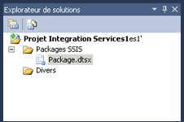

# Projets et solutions Integration Services (SSIS)
  [!INCLUDE[ssNoVersion](../includes/ssnoversion-md.md)] fournit [!INCLUDE[ssBIDevStudioFull](../includes/ssbidevstudiofull-md.md)] pour le développement de packages [!INCLUDE[ssISnoversion](../includes/ssisnoversion-md.md)] .  
  
 Lorsque vous déployez des packages sur une base de données [!INCLUDE[msCoName](../includes/msconame-md.md)] [!INCLUDE[ssNoVersion](../includes/ssnoversion-md.md)] ou le Magasin de packages [!INCLUDE[ssIS](../includes/ssis-md.md)] , utilisez le service [!INCLUDE[ssISnoversion](../includes/ssisnoversion-md.md)] pour gérer les packages. Le service [!INCLUDE[ssISnoversion](../includes/ssisnoversion-md.md)] n'est disponible que dans [!INCLUDE[ssManStudioFull](../includes/ssmanstudiofull-md.md)]. Pour plus d’informations sur le service, consultez [Service Integration Services &#40;Service SSIS&#41;](../integration-services/service/integration-services-service-ssis-service.md). Pour plus d’informations sur le déploiement de package, consultez [Déploiement de packages hérités &#40;SSIS&#41;](../integration-services/packages/legacy-package-deployment-ssis.md).  
  
 Lorsque vous déployez des projets [!INCLUDE[ssISnoversion](../includes/ssisnoversion-md.md)] sur le serveur [!INCLUDE[ssISnoversion](../includes/ssisnoversion-md.md)], vous utilisez des procédures stockées et des vues Transact-SQL dans [!INCLUDE[ssManStudioFull](../includes/ssmanstudiofull-md.md)] pour gérer les projets. Pour plus d'informations sur le déploiement de projets, consultez [Deployment of Projects and Packages](https://msdn.microsoft.com/library/hh213290.aspx). Pour plus d’informations sur le serveur [!INCLUDE[ssISnoversion](../includes/ssisnoversion-md.md)], consultez [Serveur Integration Services &#40;SSIS&#41;](https://msdn.microsoft.com/library/ms137731.aspx).  
  
 Pour obtenir une vue d’ensemble de [!INCLUDE[ssBIDevStudioFull](../includes/ssbidevstudiofull-md.md)] et [!INCLUDE[ssManStudioFull](../includes/ssmanstudiofull-md.md)], consultez la page [Outils de gestion et le développement Integration Services (SSIS)](https://msdn.microsoft.com/library/ms140028.aspx)%20and%20Studio%20Environments.md).  
  
## Les projets Integration Services contiennent des packages  
 Un projet est un conteneur dans lequel vous développez des packages [!INCLUDE[ssISnoversion](../includes/ssisnoversion-md.md)] .  
  
 Dans [!INCLUDE[ssBIDevStudioFull](../includes/ssbidevstudiofull-md.md)], un projet [!INCLUDE[ssISnoversion](../includes/ssisnoversion-md.md)] stocke et groupe les fichiers associés au package. Par exemple, un projet inclut les fichiers requis pour créer une solution d'extraction, de transfert et de chargement (ETL) spécifique.  
  
 Avant de créer un projet [!INCLUDE[ssISnoversion](../includes/ssisnoversion-md.md)] , vous devez vous familiariser avec le contenu de base de ce type de projet. Une fois que vous connaissez le contenu d'un projet, vous pouvez commencer à créer et à utiliser un projet [!INCLUDE[ssISnoversion](../includes/ssisnoversion-md.md)] .  
  
## Dossiers des projets Integration Services  
 Le diagramme qui suit montre les dossiers d'un projet [!INCLUDE[ssISnoversion](../includes/ssisnoversion-md.md)] dans [!INCLUDE[ssBIDevStudioFull](../includes/ssbidevstudiofull-md.md)].  
  
   
  
 Le tableau suivant décrit les dossiers d'un projet [!INCLUDE[ssISnoversion](../includes/ssisnoversion-md.md)] .  
  
|Dossier|Description|  
|------------|-----------------|  
|[!INCLUDE[ssIS](../includes/ssis-md.md)] .|Contient les packages. Pour plus d’informations, consultez [Integration Services &#40;SSIS&#41;, packages](../integration-services/integration-services-ssis-packages.md).|  
|Divers|Contient d'autres fichiers que les fichiers de package.|  
  
## Fichiers des projets Integration Services  
 Lorsque vous ajoutez un nouveau projet [!INCLUDE[ssISnoversion](../includes/ssisnoversion-md.md)] ou un projet existant à une solution, [!INCLUDE[ssBIDevStudioFull](../includes/ssbidevstudiofull-md.md)] crée des fichiers projet portant les extensions .dtproj, .dtproj.user et .database.  
  
-   Le fichier *.dtproj contient des informations sur les configurations du projet et sur d'autres éléments tels que les packages.  
  
-   Le fichier *.dtproj.user contient des informations sur vos préférences de travail avec le projet.  
  
-   Le fichier *.database contient des informations requises par [!INCLUDE[ssBIDevStudioFull](../includes/ssbidevstudiofull-md.md)] pour ouvrir le projet [!INCLUDE[ssISnoversion](../includes/ssisnoversion-md.md)].  
  
## Ciblage de version dans des projets Integration Services  
 Dans [!INCLUDE[ssBIDevStudioFull](../includes/ssbidevstudiofull-md.md)], vous pouvez créer, gérer et exécuter des packages qui ciblent SQL Server 2016, SQL Server 2014 ou SQL Server 2012.  
  
 Dans l’Explorateur de solutions, cliquez avec le bouton droit sur un projet Integration Services, puis sélectionnez **Propriétés** pour ouvrir les pages de propriétés du projet. Sous l’onglet **Général** de **Propriétés de configuration**, sélectionnez la propriété **TargetServerVersion** , puis choisissez SQL Server 2016, SQL Server 2014 ou SQL Server 2012.  
  
   
  
## Les solutions contiennent des projets  
 Une solution est un conteneur qui regroupe et gère les projets que vous utilisez lorsque vous développez des solutions d'entreprise de bout en bout. Une solution vous permet de gérer plusieurs projets en une même unité et de regrouper plusieurs projets qui contribuent à une solution d'entreprise.  
  
 Une solution peut contenir des projets de différents types. Si vous souhaitez utiliser le concepteur [!INCLUDE[ssIS](../includes/ssis-md.md)] pour créer un package [!INCLUDE[ssISnoversion](../includes/ssisnoversion-md.md)] , vous travaillez dans un projet [!INCLUDE[ssISnoversion](../includes/ssisnoversion-md.md)] dans une solution fournie par [!INCLUDE[ssBIDevStudioFull](../includes/ssbidevstudiofull-md.md)].  
  
 Lorsque vous créez une nouvelle solution, [!INCLUDE[ssBIDevStudioFull](../includes/ssbidevstudiofull-md.md)] ajoute un dossier Solution à l'Explorateur de solutions et crée des fichiers portant les extensions .sln et .suo :  
  
-   Le fichier *.sln contient des informations sur la configuration de la solution et répertorie les projets de la solution.  
  
-   Le fichier *.suo contient des informations sur vos préférences concernant l'utilisation de la solution.  
  
 [!INCLUDE[ssBIDevStudioFull](../includes/ssbidevstudiofull-md.md)] crée automatiquement une solution lorsque vous créez un projet, mais vous pouvez aussi créer une solution vierge et lui ajouter ultérieurement des projets.  
  
> **REMARQUE :** Par défaut, lorsque vous créez un projet [!INCLUDE[ssISnoversion](../includes/ssisnoversion-md.md)] dans [!INCLUDE[ssBIDevStudioFull](../includes/ssbidevstudiofull-md.md)], la solution n’est pas affichée dans le volet **Explorateur de projets**. Pour modifier ce comportement par défaut, dans le menu **Outils** , cliquez sur **Options**. Dans la boîte de dialogue **Options** , développez **Projets et solutions**, puis cliquez sur **Général**. Dans la page **Général** , sélectionnez **Toujours afficher la solution**.  
  
## Tâches associées  
 [Ajouter ou supprimer un projet Integration Services dans une solution](../Topic/Add%20or%20Remove%20an%20Integration%20Services%20Project%20in%20a%20Solution.md)  
  
 [Créer un projet Integration Services](../Topic/Create%20a%20New%20Integration%20Services%20Project.md)  
  
 [Ajouter un élément à un projet Integration Services](../Topic/Add%20an%20Item%20to%20an%20Integration%20Services%20Project.md)  
  
 [Copier des éléments de projet](../Topic/Copy%20Project%20Items.md)  
  
## Contenu connexe  
 [Développement d'un projet Integration Services](../Topic/Development%20of%20an%20Integration%20Services%20Project.md)  
  
  