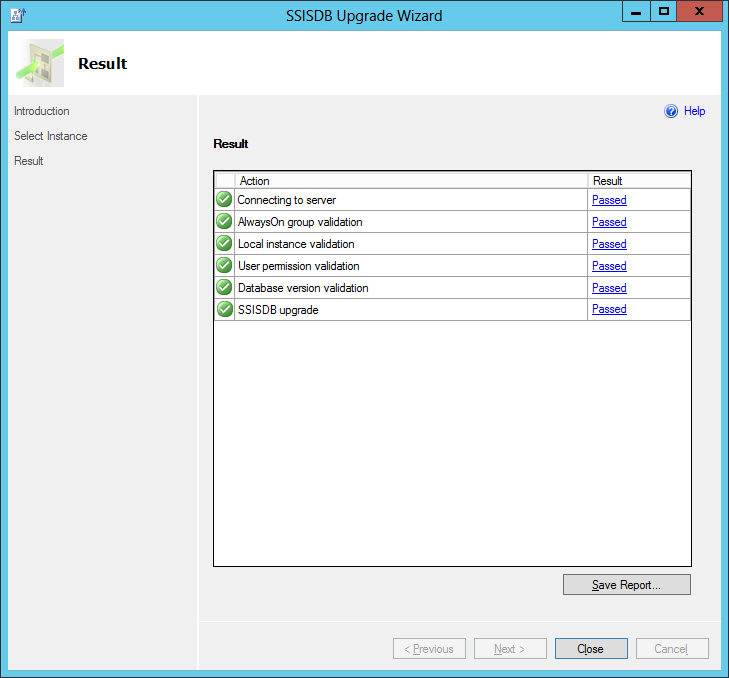

# Mettre &#224; niveau le catalogue SSIS (SSISDB)
  Exécutez l’Assistant Mise à niveau de SSISDB pour mettre à niveau la base de données du catalogue SSIS, SSISDB, quand celle-ci est plus ancienne que la version actuelle de l’instance SQL Server. Cela se produit quand l’une des conditions suivantes est remplie.  
  
-   Vous avez restauré la base de données à partir d’une ancienne version de SQL Server.  
  
-   Vous n’avez pas supprimé la base de données d’un groupe de disponibilité Always On avant la mise à niveau de l’instance SQL Server. Cela empêche la mise à niveau automatique de la base de données. Pour plus d'informations, consultez [Upgrading SSISDB in an availability group](../../integration-services/service/always-on-for-ssis-catalog-ssisdb.md#Upgrade).  
  
 L’assistant peut uniquement mettre à niveau la base de données sur une instance de serveur local.  
  
## Mettre à niveau le catalogue SSIS (SSISDB) en exécutant l’Assistant Mise à niveau de SSISDB  
  
1.  Sauvegardez la base de données du catalogue SSIS, SSISDB.  
  
2.  Dans [!INCLUDE[ssManStudioFull](../../includes/ssmanstudiofull-md.md)], développez le serveur local puis développez **Catalogues Integration Services**.  
  
3.  Cliquez avec le bouton droit sur **SSISDB**, puis sélectionnez **Mise à niveau de base de données** pour lancer l’Assistant Mise à niveau de SSISDB.  
  
       
  
4.  Sur la page **Sélectionner une instance** , sélectionnez une instance de SQL Server sur le serveur local.  
  
    > [!IMPORTANT]  
    >  L’assistant peut uniquement mettre à niveau la base de données sur une instance de serveur local.  
  
     Sélectionnez la case à cocher pour indiquer que vous avez sauvegardé la base de données SSISDB avant d’exécuter l’assistant.  
  
       
  
5.  Sélectionnez **Mettre à niveau** pour mettre à niveau la base de données du catalogue SSIS.  
  
6.  Sur la page **Résultat** , passez en revue les résultats.  
  
       
  
  