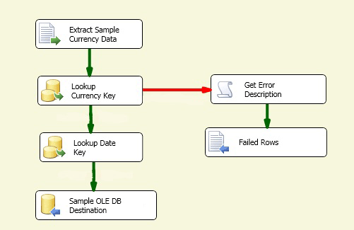

# &#201;tape 5 : Test de la le&#231;on 4 du Package du didacticiel
Au moment de l'exécution, le fichier corrompu, Currency_BAD.txt, ne parvient pas à générer une correspondance avec la transformation de recherche Currency Key. Du fait que la sortie d'erreur de la transformation de recherche Currency Key a été configurée en vue de réacheminer les lignes qui ont échoué vers une nouvelle destination de lignes échouées, le composant n'échoue pas et le package s'exécute correctement. Toutes les lignes qui ont échoué sont enregistrées dans le fichier ErrorOutput.txt.  
  
Au cours de cette tâche, vous allez tester la configuration de sortie d'erreur révisée en exécutant le package. Une fois le package exécuté, vous visualiserez le contenu du fichier ErrorOutput.txt.  
  
> [!NOTE]  
> Pour éviter l'accumulation de lignes d'erreur dans le fichier ErrorOutput.txt, vous devez manuellement supprimer le contenu du fichier entre chaque exécution du package.  
  
## Vérification de la disposition du package  
Avant de tester le package, vous devez vérifier que le flux de contrôle et le flux de données dans le package de la leçon 4 contiennent les objets affichés dans les diagrammes suivants. Le flux de contrôle doit être identique au flux de contrôle des leçons 2 à 4.  
  
**Flux de contrôle**  
  
  
  
**Flux de données**  
  
  
  
### Pour exécuter le package du didacticiel Lesson 4  
  
1.  Dans le menu **Déboguer** , cliquez sur **Démarrer le débogage**.  
  
2.  Une fois l'exécution du package terminée, dans le menu **Déboguer** , cliquez sur **Arrêter le débogage**.  
  
### Pour vérifier le contenu du fichier ErrorOutput.txt  
  
-   Dans le Bloc-notes ou un autre éditeur de texte, ouvrez le fichier ErrorOutput.txt. L'ordre par défaut des colonnes est le suivant : AverageRate, CurrencyID, CurrencyDate, EndOfDateRate, ErrorCode, ErrorColumn, ErrorDescription.  
  
    Notez que toutes les lignes du fichier contiennent la valeur CurrencyID non appariée définie à BAD, la valeur ErrorCode définie à -1071607778, la valeur ErrorColumn définie à 0 et la valeur ErrorDescription dévoilant le message « Aucune correspondance de ligne trouvée au cours de la recherche ». La valeur de ErrorColumn est définie à 0 puisque l'erreur n'est pas liée à une colonne. C'est l'opération de recherche qui a échoué. .  
  
  
  
