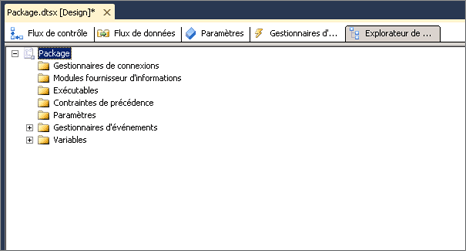

# Afficher des objets de packages
  Dans le concepteur [!INCLUDE[ssIS](../includes/ssis-md.md)] , l'onglet **Explorateur de package** fournit un aperçu du package. Cet affichage reflète la hiérarchie de conteneur de l'architecture [!INCLUDE[ssISnoversion](../includes/ssisnoversion-md.md)] . Le conteneur de packages est situé en haut de la hiérarchie et vous pouvez développer le package pour afficher les connexions, les exécutables, les gestionnaires d'événements, les fournisseurs d'informations, les contraintes de précédence et les variables du package.  
  
 Les exécutables, qui sont les conteneurs et les tâches du package, peuvent inclure des gestionnaires d'événements, des contraintes de précédence et des variables. [!INCLUDE[ssISnoversion](../includes/ssisnoversion-md.md)] prend en charge une hiérarchie imbriquée de conteneurs, et les conteneurs de boucles For, de boucles Foreach et de séquences peuvent inclure d'autres exécutables.  
  
 Si un package contient un flux de données, l' **Explorateur de package** répertorie la tâche de flux de données et inclut un dossier **Composants** qui répertorie les composants du flux de données.  
  
 À partir de l'onglet **Explorateur de package** , vous pouvez supprimer des objets d'un package et accéder à la fenêtre **Propriétés** afin d'afficher les propriétés des objets.  
  
 Le schéma suivant illustre l'arborescence d'un package simple.  
  
   
  
### Pour afficher le contenu d'un package  
  
-   [Afficher les objets de package dans l'Explorateur de package](../Topic/View%20Package%20Objects%20in%20Package%20Explorer.md)  
  
## Voir aussi  
 [Tâches Integration Services](../integration-services/control-flow/integration-services-tasks.md)   
 [Conteneurs Integration Services](../integration-services/control-flow/integration-services-containers.md)   
 [Contraintes de précédence](../integration-services/control-flow/precedence-constraints.md)   
 [Variables Integration Services &#40;SSIS&#41;](../integration-services/integration-services-ssis-variables.md)   
 [Gestionnaires d’événements Integration Services &#40;SSIS&#41;](../integration-services/integration-services-ssis-event-handlers.md)   
 [Journalisation Integration Services &#40;SSIS&#41;](../integration-services/performance/integration-services-ssis-logging.md)  
  
  