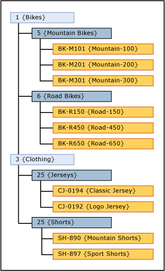

# Hiérarchies dérivées (services de données de référence)
  Une hiérarchie dérivée [!INCLUDE[ssMDSshort](../includes/ssmdsshort-md.md)] est dérivée des relations d'attributs basés sur un domaine qui existent déjà entre des entités dans un modèle.  
  
 Vous pouvez créer une hiérarchie dérivée pour mettre en évidence une des relations d'attributs basés sur un domaine existantes dans le modèle.  
  
## Les membres feuille regroupent d'autres membres feuille  
 Dans une hiérarchie dérivée, les membres feuille d'une entité sont utilisés pour regrouper les membres feuille d'une autre entité. Une hiérarchie dérivée est basée sur la relation entre ces entités. Une hiérarchie explicite, par opposition, est basée sur les membres d'une seule entité et vous êtes libre de la structurer selon vos besoins.  
  
 Vous pouvez modifier la structure d'une hiérarchie dérivée sans affecter les données sous-jacentes. Tant que les relations continuent d'exister dans le modèle, la suppression d'une hiérarchie dérivée n'a aucun effet sur vos données de référence.  
  
## Hiérarchies explicites et hiérarchies dérivées  
 Le tableau suivant répertorie certaines différences entre les hiérarchies explicites et dérivées.  
  
> [!NOTE]  
>  Les hiérarchies explicites sont déconseillées dans cette version de [!INCLUDE[ssMDSshort](../includes/ssmdsshort-md.md)].  
  
|Hiérarchies explicites|Hiérarchies dérivées|  
|--------------------------|-------------------------|  
|La structure est définie par l'utilisateur|La structure est dérivée des relations entre les attributs basés sur un domaine|  
|Contient les membres d'une seule entité|Contient les membres de plusieurs entités|  
|Utilise les membres consolidés pour regrouper d'autres membres|Utilise des membres feuille d'une entité pour regrouper des membres feuille d'une autre entité|  
  
## Créer une hiérarchie à profondeur variable  
 Il existe deux méthodes recommandées pour créer une hiérarchie à profondeur variable :  
  
-   Si vous avez besoin que tous les niveaux aient les mêmes attributs, créez une entité unique, puis créez une hiérarchie récursive sur cette entité, avec un attribut basé sur un domaine, basé sur l'entité.  
  
-   Si vous avez besoin d'un ensemble d'attributs pour les membres feuille et d'un ensemble d'attributs différent dans les niveaux supérieurs, créez deux entités pour une hiérarchie dérivée. Pour l'entité de niveau feuille, utilisez un attribut basé sur un domaine qui est basé sur l'entité parente. Pour l'entité parente, utilisez un attribut basé sur un domaine qui est basé sur lui-même.  
  
## Exemple de hiérarchie dérivée  
 Dans l'exemple suivant, les membres feuille de l'entité Product sont regroupés par membres feuille de l'entité Subcategory, qui, à leur tour, sont regroupés par membres feuille de l'entité Category. Cette hiérarchie est possible parce que l'entité Product a un attribut basé sur un domaine nommé Subcategory, et que l'entité Subcategory a un attribut basé sur un domaine nommé Category.  
  
 La structure de hiérarchie montre comment les membres sont regroupés. L'entité qui compte le plus de membres se situe au niveau le plus bas.  
  
   
  
 Dans une hiérarchie dérivée, vous pouvez mettre en évidence la relation entre Product et Subcategory, puis entre Subcategory et Category. Lorsque vous affichez les membres dans cette hiérarchie, chaque niveau de l'arborescence contient des membres de la même entité.  
  
   
  
 Ce type de hiérarchie vous empêche de déplacer un membre vers un niveau qui n'est pas valide. Par exemple, vous pouvez déplacer le vélo Road-650 d'une sous-catégorie, Road Bikes, vers une autre, Mountain Bikes. Vous ne pouvez pas déplacer directement Road-650 sous une catégorie, comme 1 {Bikes}. Chaque fois que vous déplacez un membre dans l'arborescence hiérarchique, la valeur d'attribut basé sur un domaine du membre change pour refléter le déplacement.  
  
## Remarques  
 Tous les membres d'une arborescence hiérarchique dérivée sont triés par code. Vous ne pouvez pas modifier l'ordre de tri.  
  
 Si l'attribut basé sur un domaine d'un membre est vide et que l'attribut est utilisé pour une hiérarchie dérivée, le membre n'est pas affiché dans la hiérarchie. Créez des règles d'entreprise pour requérir le remplissage des attributs. Pour plus d’informations, consultez [Requérir des valeurs d’attribut &#40;Master Data Services&#41;](../master-data-services/require-attribute-values-master-data-services.md).  
  
## Tâches associées  
  
|Description de la tâche|Rubrique|  
|----------------------|-----------|  
|Créer une hiérarchie dérivée.|[Créer une hiérarchie dérivée &#40;Master Data Services&#41;](../master-data-services/create-a-derived-hierarchy-master-data-services.md)|  
|Masquer ou supprimer des niveaux dans une hiérarchie dérivée existante.|[Masquer ou supprimer des niveaux dans une hiérarchie dérivée &#40;Master Data Services&#41;](../master-data-services/hide-or-delete-levels-in-a-derived-hierarchy-master-data-services.md)|  
|Modifier le nom d'une hiérarchie dérivée existante.|[Modifier le nom d’une hiérarchie dérivée &#40;Master Data Services&#41;](../master-data-services/change-a-derived-hierarchy-name-master-data-services.md)|  
|Supprimer une hiérarchie dérivée existante.|[Supprimer une hiérarchie dérivée &#40;Master Data Services&#41;](../master-data-services/delete-a-derived-hierarchy-master-data-services.md)|  
  
## Contenu connexe  
  
-   [Attributs basés sur un domaine &#40;Master Data Services&#41;](../master-data-services/domain-based-attributes-master-data-services.md)  
  
-   [Hiérarchies explicites &#40;Master Data Services&#41;](../master-data-services/explicit-hierarchies-master-data-services.md)  
  
-   [Hiérarchies récursives &#40;Master Data Services&#41;](../master-data-services/recursive-hierarchies-master-data-services.md)  
  
-   [Hiérarchies dérivées avec un niveau supérieur composé d’une hiérarchie explicite &#40;Master Data Services&#41;](../master-data-services/derived-hierarchies-with-explicit-caps-master-data-services.md)  
  
-   [Afficher les relations plusieurs à plusieurs dans des hiérarchies dérivées &#40;Master Data Services&#41;](../master-data-services/show-many-to-many-relationships-in-derived-hierarchies-master-data-services.md)  
  
-   [Collections &#40;Master Data Services&#41;](../master-data-services/collections-master-data-services.md)  
  
  

