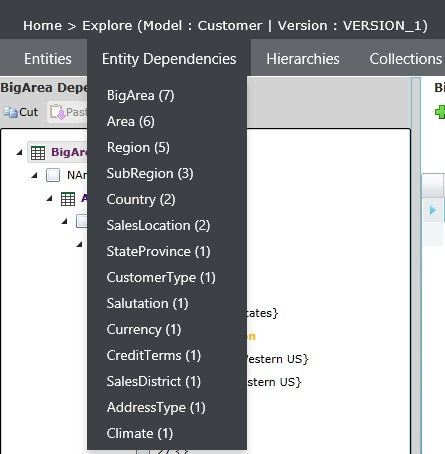
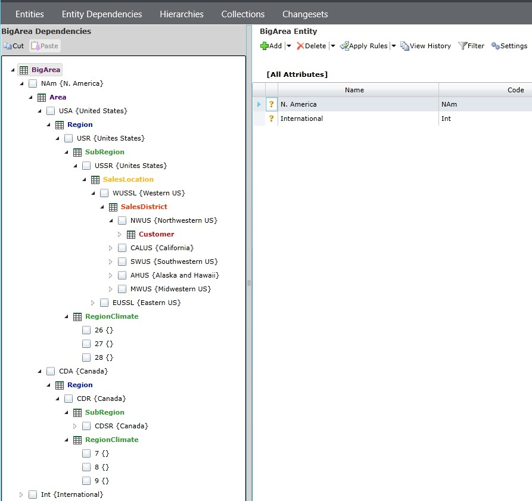

# Explorateur Dépendances d’entité

[!INCLUDE[appliesto-ss-xxxx-xxxx-xxx-md-winonly](../includes/appliesto-ss-xxxx-xxxx-xxx-md-winonly.md)]

  
[!INCLUDE[ssMDSshort_md](../includes/ssmdsshort-md.md)] 2016 contient un nouvel explorateur, appelé Dépendances d’entité, qui permet de visualiser les relations entre les membres d’une entité dans un modèle, spécifiés par la valeur de leurs attributs basés sur un domaine (DBA), mais sans avoir à définir préalablement une hiérarchie dérivée.   
  
Il vous aide à répondre à la question « qui utilise mon entité et comment ? ». La vue est similaire à la page de l’explorateur Hiérarchie dérivée, mais elle est plus inclusive. Elle montre toutes les relations DBA, pas seulement celles définies dans le cadre d’une hiérarchie particulière. Aucune définition de la hiérarchie n’est nécessaire, car la structure hiérarchique affichée est simplement déduite des attributs DBA existants.  
  
Dans le menu de la page Explorateur, l’option Dépendances d’entité répertorie toutes les entités du modèle dont dépend au moins une entité (par exemple, au moins une entité a un DBA qui fait référence à l’entité répertoriée). Le nombre de dépendances (directes et indirectes) est indiqué en regard du nom de l’entité, et la liste est triée en fonction de ce nombre, les entités les plus référencées apparaissant en premier. La capture d’écran ci-dessous, prises à partir du modèle Client des [données exemples](https://msdn.microsoft.com/library/master-data-services-sample.aspx), indique que l’entité BigArea est référencée (directement ou indirectement) par 7 entités :  
  
  
    
En cliquant sur cette option, vous ouvrez la nouvelle page de l’explorateur Dépendances d’entité correspondant à l’entité BigArea, qui indique comment les membres de l’entité sont consommés. Cette page affiche une vue hiérarchique avec les membres de BigArea en haut de l’arborescence et les membres de ses 7 entités consommatrices imbriquées au-dessous :  
  
  
    
Une entité peut être consommée directement par plusieurs entités. Dans l’exemple ci-dessus, les entités SubRegion et RegionClimate consomment (ont des références DBA à) l’entité Region. Les membres de chaque entité consommatrice sont regroupés sous un nœud parent qui porte le nom de l’entité :   
  
  
  
Ces nœuds de l’arborescence de conteneurs ont une icône de grille à gauche du nom d’entité, et la couleur du texte correspond au niveau dans la hiérarchie. L’exemple ci-dessus montre que l’entité SubRegion « CDSR {Canada} » a une référence DBA à l’entité Region « CDR {Canada} » qui fait référence à l’entité Area « CDA {Canada} », laquelle fait référence à l’entité BigArea « NAm {N. America} ».  
  
Cette vue est totalement modifiable, comme dans la page Explorateur de hiérarchies. Les relations parent-enfant sont modifiables dans l’arborescence par couper-coller ou glisser-déplacer de membres enfants d’un parent à un autre. Les autres valeurs d’attribut de membre peuvent être modifiées dans le panneau de détails à droite de l’arborescence.   
  
  
  
  

