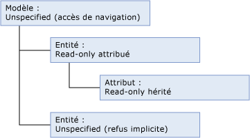

# Accès de navigation (Master Data Services)

[!INCLUDE[appliesto-ss-xxxx-xxxx-xxx-md-winonly](../includes/appliesto-ss-xxxx-xxxx-xxx-md-winonly.md)]

  L’accès de navigation s’applique à la sécurité de l’objet modèle, affectée sous l’onglet **Modèles**.  
  
 L'accès de navigation désigne l'accès aux niveaux supérieurs par rapport à ceux auxquels vous avez affecté une sécurité.  
  
 Dans cet exemple, les autorisations sont affectées à une entité, et donc l'accès de navigation est accordé au niveau du modèle.  
  
   
  
 **Entités**  
  
 Lorsque vous affectez une autorisation à une entité, ses membres feuilles ou ses membres consolidés, l'accès de navigation signifie que vous pouvez lire ou mettre à jour le nom et le code de tous les membres. Vous pouvez également lire le nom du modèle.  
  
 **Attributs**  
  
 Lorsque vous affectez une autorisation à un attribut, l'accès de navigation signifie que vous pouvez lire ou mettre à jour le nom et le code de tous les membres dans l'entité. Vous pouvez également lire le nom du modèle.  
  
 **Collections**  
  
 Lorsque vous affectez des autorisations aux collections, vous pouvez lire ou mettre à jour le nom, le code, la description et l'ID de propriétaire. Vous pouvez également lire le nom du modèle.  
  
##  Voir aussi  
 [Mode de détermination des autorisations &#40;Master Data Services&#41;](../master-data-services/how-permissions-are-determined-master-data-services.md)  
  
  
