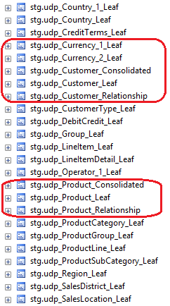

# Présentation : Importation de données à partir de tables (Master Data Services)
  Une fois que vous avez créé un modèle pour vos données dans [!INCLUDE[ssMDSshort](../includes/ssmdsshort-md.md)], vous pouvez commencer à ajouter des données et à les modifier.   Vous utilisez les tables de mise en lots [!INCLUDE[ssMDSshort](../includes/ssmdsshort-md.md)] , les procédures stockées et Master Data Manager.  
  
 Pour obtenir des instructions sur la manière d’ajouter et de modifier des données, consultez [Importer des données à partir de tables &#40;Master Data Services&#41;](../master-data-services/import-data-from-tables-master-data-services.md).  
  
> [!NOTE]  
>  Vous pouvez également utiliser le [!INCLUDE[ssNoVersion](../includes/ssnoversion-md.md)][!INCLUDE[ssMDSshort](../includes/ssmdsshort-md.md)][!INCLUDE[ssMDSXLS](../includes/ssmdsxls-md.md)]pour ajouter des données au référentiel MDS (base de données[!INCLUDE[ssMDSshort](../includes/ssmdsshort-md.md)] ) à partir d’Excel. Pour plus d’informations, consultez [Vue d’ensemble : importation de données à partir d’Excel &#40;Complément MDS pour Excel&#41;](../master-data-services/microsoft-excel-add-in/overview-importing-data-from-excel-mds-add-in-for-excel.md).  
  
 Lorsque vous ajoutez et modifiez des données, procédez comme suit.  
  
-   Charger et mettre à jour les membres, puis mettre à jour les valeurs d'attribut  
  
-   Désactiver et supprimer les membres  
  
-   Déplacer les membres d’une hiérarchie explicite  
  
 L’ajout et la mise à jour des données incluent les tâches principales suivantes.  
  
1.  Chargez les données dans des tables de mise en lots dans la base de données [!INCLUDE[ssMDSshort](../includes/ssmdsshort-md.md)] .  
  
2.  Chargez les données des tables de mise en lots vers les tables [!INCLUDE[ssMDSshort](../includes/ssmdsshort-md.md)] appropriées.  
  
     Vous utilisez des procédures stockées intermédiaires ou [!INCLUDE[ssMDSmdm](../includes/ssmdsmdm-md.md)] pour charger les données.  
  
> [!NOTE]  
>  Dans [!INCLUDE[ssSQL15](../includes/sssql15-md.md)], la prise en charge des processus de mise en lots [!INCLUDE[ssKilimanjaro](../includes/sskilimanjaro-md.md)] est déconseillée.  
  
## Désactivation et suppression de membres (MDS)  
 La désactivation signifie que le membre peut être réactivé. La réactivation d'un membre permet de restaurer ses attributs et son appartenance aux hiérarchies et collections. Toutes les transactions précédentes sont intactes. Les transactions de désactivation sont visibles par les administrateurs dans la zone fonctionnelle **Gestion des versions** de Master Data Manager.  
  
 La suppression signifie retirer définitivement le membre du système. Toutes les transactions du membre, toutes les relations et tous les attributs sont supprimés définitivement.  
  
> [!NOTE]  
>  Vous ne pouvez pas utiliser la mise en lots pour réactiver des membres. Vous devez le faire manuellement dans Master Data Manager. Pour plus d’informations, consultez [Réactiver un membre ou une collection &#40;Master Data Services&#41;](../master-data-services/reactivate-a-member-or-collection-master-data-services.md).  
>   
>  Vous ne pouvez pas utiliser la mise en lots pour supprimer ou désactiver des collections. Pour plus d’informations sur la désactivation manuelle des collections, consultez [Supprimer un membre ou une collection &#40;Master Data Services&#41;](../master-data-services/delete-a-member-or-collection-master-data-services.md).  
  
## Déplacement des membres d’une hiérarchie explicite (MDS)  
 Lorsque vous déplacez en bloc des membres des hiérarchies explicites, vous pouvez désigner les membres comme suit.  
  
-   Un membre consolidé comme un parent d'un membre consolidé.  
  
-   Un membre consolidé comme un parent d'un membre feuille.  
  
-   Un membre feuille comme un frère d'une feuille ou un membre consolidé.  
  
-   Un membre consolidé comme un frère d'une feuille ou un membre consolidé.  
  
## Tables de mise en lots et procédures stockées (MDS)  
 La base de données [!INCLUDE[ssMDSshort](../includes/ssmdsshort-md.md)] inclut les types suivants de tables de mise en lots que vous pouvez remplir avec vos données.  
  
-   [Table de mise en lots des membres feuille &#40;Master Data Services&#41;](../master-data-services/leaf-member-staging-table-master-data-services.md)  
  
-   [Table de mise en lots des membres consolidés &#40;Master Data Services&#41;](../master-data-services/consolidated-member-staging-table-master-data-services.md)  
  
-   [Table de mise en lots des relations &#40;Master Data Services&#41;](../master-data-services/relationship-staging-table-master-data-services.md)  
  
 Pour chaque entité du modèle, il existe une table de mise en lots. Le nom de la table indique l'entité correspondante et le type d'entité comme membre feuille. L'illustration suivante montre les tables de mise en lots pour les entités Devise, Client et Produit.  
  
   
  
 Le nom de la table est spécifié lors de la création d'une entité et ne peut pas être modifié. Si le nom de la table de mise en lots contient un _1 ou tout autre nombre, une autre table de ce nom existait déjà lorsque l'entité a été créée.  
  
 [!INCLUDE[ssMDSshort](../includes/ssmdsshort-md.md)] inclut les types suivants de procédures stockées de mise en lots.  
  
-   stg.udp_\<nom>_Leaf  
  
-   stg.udp_\<nom>_Consolidated  
  
-   stg.udp_\<nom>_Relationship  
  
 Pour chaque entité du modèle, il existe trois procédures stockées qui correspondent à un membre feuille, un membre consolidé et les tables de mise en lots de relations.  L'illustration suivante montre les procédures stockées de mise en lots pour les entités Devise, Client et Produit.  
  
   
  
 Pour plus d’informations sur les procédures stockées, consultez [Procédure stockée de mise en lots &#40;Master Data Services&#41;](../master-data-services/staging-stored-procedure-master-data-services.md).  
  
## Journalisation des transactions (MDS)  
 Toutes les transactions qui se produisent lors de l'importation ou de la mise à jour des données ou des relations peuvent être enregistrées dans un journal. Une option dans la procédure stockée permet cette journalisation. Si vous initialisez le processus de site à l’aide de [!INCLUDE[ssMDSmdm](../includes/ssmdsmdm-md.md)], aucune journalisation n'a lieu.  
  
 Dans le [!INCLUDE[ssMDScfgmgr](../includes/ssmdscfgmgr-md.md)], le paramètre **Journaliser toutes les transactions intermédiaires** ne s'applique pas à cette méthode de mise en lot des données.  
  
## Contenu associé  
  
-   [Validation &#40;Master Data Services&#41;](../master-data-services/validation-master-data-services.md)  
  
-   [Business Rules &#40;Master Data Services&#41;](../master-data-services/business-rules-master-data-services.md)  
  
  
