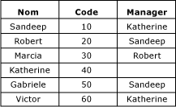

# Hiérarchies récursives (Master Data Services)

[!INCLUDE[appliesto-ss-xxxx-xxxx-xxx-md-winonly](../includes/appliesto-ss-xxxx-xxxx-xxx-md-winonly.md)]

  Dans [!INCLUDE[ssMDSshort](../includes/ssmdsshort-md.md)], une hiérarchie récursive est une hiérarchie dérivée qui comporte une relation récursive. Une relation récursive existe lorsqu'une entité a un attribut basé sur un domaine et sur l'entité elle-même.  
  
## Exemple de hiérarchie récursive  
 Un exemple de hiérarchie récursive est une structure d'organisation. Dans [!INCLUDE[ssMDSshort](../includes/ssmdsshort-md.md)], vous devriez effectuer cette opération en créant une entité Employee avec un attribut basé sur un domaine appelé Manager. L'attribut Manager est rempli à partir de la liste des employés. Dans cet exemple d'organisation, tous les employés peuvent être des responsables.  
  
   
  
 Vous pouvez créer une hiérarchie dérivée qui met en évidence la relation entre l'entité Employee et l'attribut basé sur un domaine Manager.  
  
   
  
 Pour inclure chaque membre dans la hiérarchie une seule fois, vous pouvez ancrer des relations Null. Lorsque vous procédez ainsi, les membres avec des valeurs d'attribut basé sur un domaine vides sont affichés au niveau supérieur de la hiérarchie.  
  
   
  
 Si vous n'ancrez pas de relations Null, les membres sont inclus plusieurs fois. Tous les membres sont affichés au niveau supérieur. Ils sont également affichés sous les membres dont ils sont les attributs.  
  
   
  
 Dans cet exemple, Marcia est située au niveau supérieur. Elle n'est la responsable d'aucun employé, car elle n'est pas utilisée en tant que valeur d'attribut basé sur un domaine pour les autres membres Employee. Robert, par opposition, dispose d'un niveau au-dessous de lui, car, pour Marcia, la valeur de l'attribut Manager est Robert.  
  
## Règles  
  
-   Une hiérarchie dérivée ne peut pas contenir plusieurs relations récursives. Elle peut, toutefois, posséder d'autres relations dérivées (par exemple, une hiérarchie dérivée qui contient une relation Responsable à Employé récursive peut également avoir des relations Pays à Responsable et Employé à Magasin).  
  
-   Vous ne pouvez pas affecter d’autorisations de membre (sous l’onglet **Membres de hiérarchie** ) à des membres dans une hiérarchie récursive.  
  
-   Les hiérarchies récursives ne peuvent pas inclure de relations circulaires. Par exemple, Katherine ne peut pas être la responsable de Sandeep si Sandeep est déjà la responsable de Katherine. Par ailleurs, Katherine ne peut pas être sa propre responsable.  
  
## Related Tasks  
  
|Description de la tâche|Rubrique|  
|----------------------|-----------|  
|Créer une hiérarchie dérivée.|[Créer une hiérarchie dérivée &#40;Master Data Services&#41;](../master-data-services/create-a-derived-hierarchy-master-data-services.md)|  
|Modifier le nom d'une hiérarchie dérivée existante.|[Modifier le nom d’une hiérarchie dérivée &#40;Master Data Services&#41;](../master-data-services/change-a-derived-hierarchy-name-master-data-services.md)|  
|Supprimer une hiérarchie dérivée existante.|[Supprimer une hiérarchie dérivée &#40;Master Data Services&#41;](../master-data-services/delete-a-derived-hierarchy-master-data-services.md)|  
  
## Contenu associé  
  
-   [Attributs basés sur un domaine &#40;Master Data Services&#41;](../master-data-services/domain-based-attributes-master-data-services.md)  
  
-   [Hiérarchies dérivées &#40;Master Data Services&#41;](../master-data-services/derived-hierarchies-master-data-services.md)  
  
  
