# Affichage avancé des données cibles d’événements étendus dans SQL Server
[!INCLUDE[tsql-appliesto-ss2014-asdb-xxxx-xxx_md](../../includes/tsql-appliesto-ss2014-asdb-xxxx-xxx-md.md)]

Cet article explique comment vous pouvez utiliser les fonctionnalités avancées de SQL Server Management Studio (SSMS.exe) pour afficher de façon détaillée les données cibles d’événements étendus. Cet article explique comment :

- ouvrir et afficher les données cibles de différentes manières ;
- exporter les données cibles dans différents formats à partir du menu ou de la barre d’outils spécialement conçus pour les événements étendus ;
- manipuler les données pendant la consultation ou avant l’exportation.

### Conditions préalables

Cet article considère que vous savez déjà créer et démarrer une session d’événements. Des instructions sur la façon de créer une session d’événements sont fournies au début de l’article suivant :

[Quick Start: Extended Events in SQL Server (Démarrage rapide : Événements étendus dans SQL Server)](../../relational-databases/extended-events/quick-start-extended-events-in-sql-server.md)

Cet article considère aussi que vous avez installé une version mensuelle très récente de SSMS. Vous trouverez une aide à l’installation à la page suivante :

- [Télécharger SQL Server Management Studio (SSMS)](http://msdn.microsoft.com/library/mt238290.aspx)

### Différences par rapport à la Base de données SQL Azure

Il existe un fort degré de similitude dans l’implémentation et les fonctionnalités des événements étendus dans les deux produits Microsoft SQL Server et Base de données SQL Azure. Mais il existe aussi quelques différences qui affectent l’interface utilisateur de SSMS.

- Pour la Base de données SQL, la cible package0.event_file ne peut pas être un fichier du disque dur local. Au lieu de cela, vous devez utiliser un conteneur de stockage Azure. Par conséquent, quand vous êtes connecté à la Base de données SQL, l’interface utilisateur de SSMS réclame un conteneur de stockage, et non un chemin et un nom de fichier locaux.

- Si dans l’interface utilisateur de SSMS, vous constatez que la case à cocher **Observer les données actives** est grisée et désactivée, c’est que cette fonctionnalité n’est pas disponible pour la Base de données SQL.

- Quelques événements étendus sont installés avec SQL Server. Sous le nœud **Sessions** figure l’événement **AlwaysOn_health** plus quelques autres. Ceux-ci ne sont pas visibles quand vous êtes connecté à la Base de données SQL, car ils n’existent pas pour ce produit.

Cet article a été rédigé du point de vue de SQL Server. Il utilise la cible event_file, qui constitue l’une des différences. Par la suite, seules les différences importantes ou non évidentes sont mentionnées.

Pour plus d’informations sur les événements étendus propres à la Base de données SQL Azure, consultez :

- [Événements étendus dans la Base de données SQL Azure](http://azure.microsoft.com/documentation/articles/sql-database-xevent-db-diff-from-svr/)

## A. Options générales

En général, les différents modes d’accès aux options avancées sont les suivants :

- Menu standard **Fichier** > **Ouvrir** > **Fichier**.
- Clics droits dans l’ **Explorateur d’objets** sous **Gestion** > **Événements étendus**.
- Menu spécial **Événements étendus**et barre d’outils spéciale pour les événements étendus.
- Clics droits dans le volet à onglets qui présente les données cibles.

## B. Importer les données cibles dans SSMS pour consultation

Il existe différentes façons d’importer des données cibles event_file dans l’interface utilisateur de SSMS. Quand vous spécifiez une cible event_file, vous définissez son chemin et nom de fichier :

- .XEL est l’extension du nom de fichier.

- Chaque fois que la session d’événements est lancée, le système incorpore un entier long dans un nouveau nom de fichier de telle sorte que le nom de fichier soit unique et différent de la dernière fois où la session a démarré.
  - *Example :* Checkpoint_Begins_ES_0_131103935140400000.xel

- Le contenu à l’intérieur d’un fichier . XEL n’est pas du texte brut qui peut être affiché dans Notepad.exe.
  - Vous pouvez éventuellement accoler plusieurs fichiers .XEL via le menu **Fichier** > **Ouvrir** > **Fusionner les fichiers des événements étendus**.

SSMS peut afficher les données de n’importe quelle cible. Cependant, leur affichage varie en fonction de la cible :

- *event_file :* les données issues d’une cible event_file s’affichent très bien, avec des fonctionnalités élaborées.

- *ring_buffer :* les données issues d’une cible de mémoire tampon en anneau s’affichent sous forme de XML brut.

- Pour les autres cibles, les possibilités en termes d’affichage se situent entre event_file et ring_buffer.
  - Il s’agit notamment des cibles event_counter, histogram et pair_matching.

- *etw_classic_sync_target :* SSMS ne peut pas afficher les données issues du type de cible etw_classic_sync_target.

### B.1 Ouvrir un fichier .XEL via le menu Fichier > Ouvrir > Fichier

Vous pouvez ouvrir un fichier .XEL via le menu standard **Fichier** > **Ouvrir** > **Fichier**.

Vous pouvez aussi glisser-déplacer un fichier .XEL dans la barre d’onglets de l’interface utilisateur de SSMS.

### B.2 Afficher des données cibles

L’option **Afficher les données cibles** affiche les données qui ont été capturées jusque-là.

Dans le volet **Explorateur d’objets** , vous pouvez développer les nœuds et cliquer ensuite avec le bouton droit sur :

- **Gestion** > **Événements étendus** > **Sessions** > *[votre-session]* > *[votre-nœud-cible]* > **Afficher les données cibles**.

Les données cibles s’affichent dans un volet à onglets dans SSMS. Ceci est illustré dans la capture d’écran suivante.

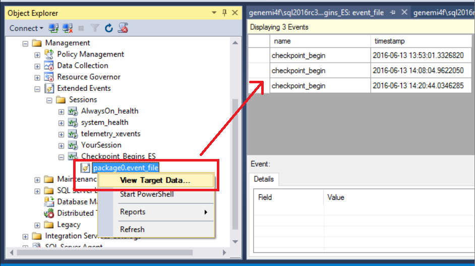

> [!NOTE] 
> **Afficher les données cibles** affiche les *données cumulées de plusieurs fichiers .XEL* d’une session d’événements donnée. Chaque cycle de **démarrage**-**arrêt** donne lieu à la création d’un fichier dont le nom incorpore un entier dérivé d’une heure ultérieure, mais chaque fichier partage le même nom racine.

#### B.3 Surveiller les données actives

Quand votre session d’événements est active, vous pouvez souhaiter surveiller les données d’événements en temps réel, à mesure que la cible les reçoit.

- **Gestion** > **Événements étendus** > **Sessions** > *[votre-session]* > **Surveiller les données actives**.

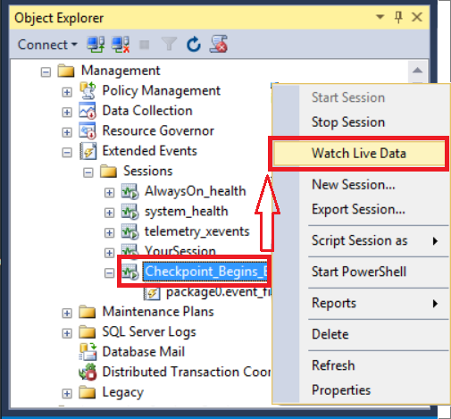

L’affichage des données est mis à jour à intervalles réguliers que vous pouvez spécifier au niveau du paramètre **Latence maximale de répartition** dans :

- **Événements étendus** > **Sessions** > *[votre-session]* > **Propriétés** > **Avancé** > **Latence maximale de répartition**

### B.4 Affichage d’un fichier .XEL à l’aide de la fonction sys.fn_xe_file_target_read_file

Pour un traitement par lots, la fonction système suivante permet de générer du code XML pour les enregistrements contenus dans un fichier XEL :

- [sys.fn\_xe\_file\_target\_read\_file](../../relational-databases/system-functions/sys-fn-xe-file-target-read-file-transact-sql.md)

## C. Exporter les données cibles

Une fois les données cibles dans SSMS, vous pouvez exporter les données dans différents formats en procédant comme suit :

1. Donner le focus à l’affichage de données.
    - Une nouvelle barre d’outils et un nouvel élément de menu pour les événements étendus deviennent aussitôt visibles.

    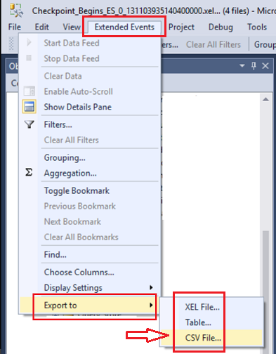

2. Cliquez sur le nouvel élément de menu **Événements étendus**.
3. Cliquez sur **Exporter vers**, puis choisissez un format.

## D. Manipuler les données dans l’affichage

Au-delà de la simple consultation des données telles quelles, l’interface utilisateur de SSMS vous permet de manipuler les données de différentes manières.

### D.1 Menus contextuels dans l’affichage de données

Les menus contextuels proposés dans l’affichage de données varient en fonction de l’endroit où vous cliquez avec le bouton droit.

#### D.1.1 Clic droit dans une cellule de données

La capture d’écran suivante montre le menu de contenu que vous obtenez quand vous cliquez avec le bouton droit dans une cellule de l’affichage de données. La capture d’écran montre également le menu **Copier** développé.

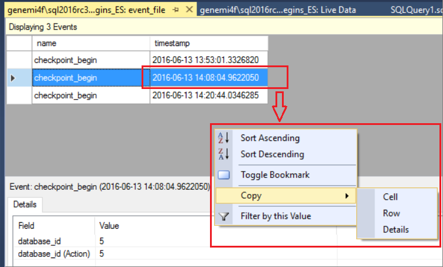

#### D.1.2 Clic droit dans un en-tête de colonne

La capture d’écran suivante montre le menu contextuel qui s’affiche après un clic droit dans l’en-tête **timestamp** .

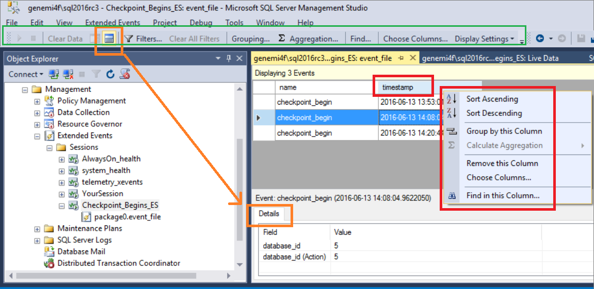

La capture d’écran précédente montre aussi la barre d’outils spéciale pour les événements étendus. L’éclat du bouton Détails indique qu’il est actif. De ce fait, l’illustration montre aussi l’onglet **Détails** et la grille est présente en tant que deuxième partie de l’affichage de données.

### D.2 Choisir les colonnes, Fusionner les colonnes

L’option **Choisir les colonnes** vous permet de contrôler l’affichage des colonnes de données. Vous pouvez trouver l’élément de menu **Choisir les colonnes** à plusieurs endroits :

- dans le menu **Événements étendus** ;
- dans la barre d’outils des événements étendus ;
- dans le menu contextuel d’un en-tête de l’affichage de données.

Quand vous cliquez sur **Choisir les colonnes**, la boîte de dialogue du même nom s’affiche.

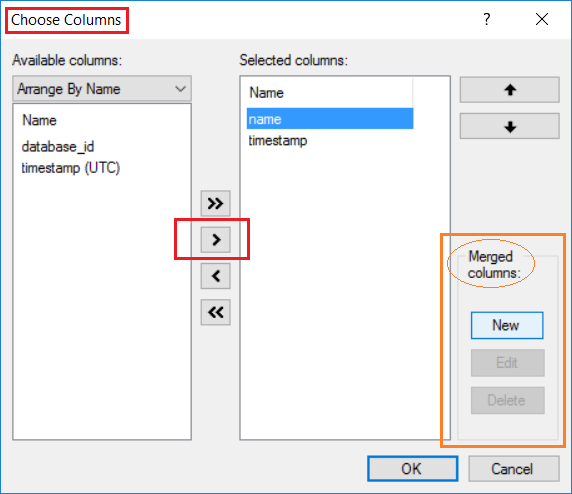

#### D.2.1 Fusionner les colonnes

La boîte de dialogue **Choisir les colonnes** comporte une section consacrée à la fusion de plusieurs colonnes en une seule, et ce aux fins suivantes :

- consultation ;
- exportation.

### D.3 Filtres

Dans le domaine des événements étendus, vous pouvez spécifier deux types de filtres principaux :

- *Filtre de préciblage :* filtres qui réduisent la quantité de données envoyées par le moteur d’événements à votre cible.

- *Filtres de post-ciblage :* filtres que vous pouvez sélectionner dans l’interface utilisateur de SSMS pour exclure certains enregistrements cibles de l’affichage.

Les filtres de l’affichage SSMS sont les suivants :

- un filtre d’ *intervalle de temps* , qui examine la colonne **timestamp** ;
- un filtre de *valeurs de colonne* .

La relation entre les filtres de temps et de colonne est une valeur booléenne «*AND*».

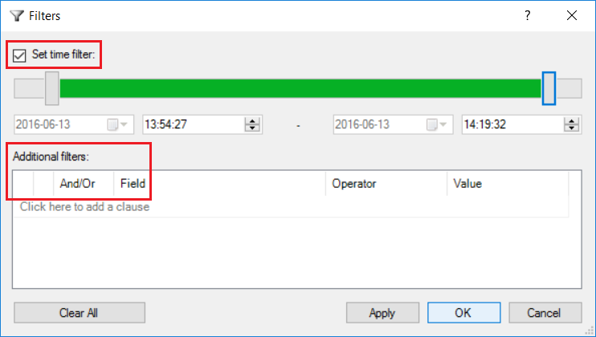

### D.4 Regroupement et agrégation

Regrouper des lignes par la mise en correspondance des valeurs d’une colonne donnée est la première étape de l’agrégation synthétique de données.

#### D.4.1 Regroupement

Dans la barre d’outils des événements étendus, le bouton **Regroupement** donne accès à une boîte de dialogue dans laquelle vous pouvez regrouper les données affichées par une colonne donnée. La capture d’écran suivante montre une boîte de dialogue qui permet d’effectuer un regroupement en fonction de la colonne *nom* .

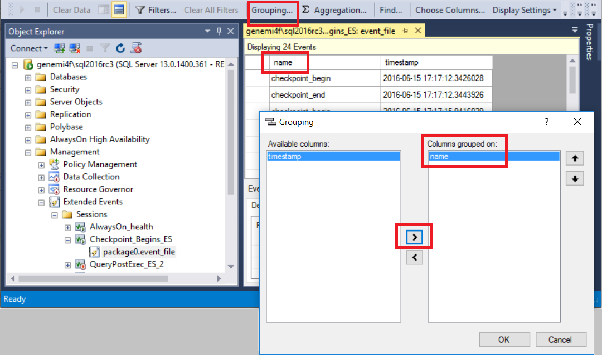

À l’issue du regroupement, l’affichage présente un nouvel aspect, comme le montre l’illustration suivante.

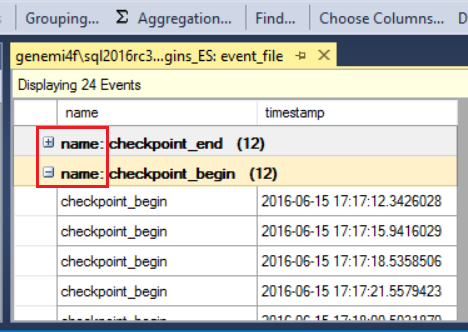

#### D.4.2 Agrégation

Une fois que les données affichées ont été regroupées, vous pouvez poursuivre en agrégeant les données dans d’autres colonnes.  La capture d’écran suivante illustre l’agrégation des données regroupées par nombre ( *count*).

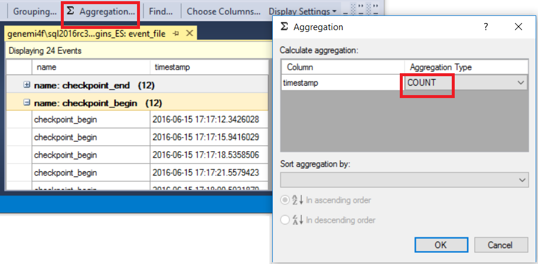

À l’issue de l’agrégation, l’affichage se présente différemment, comme le montre l’illustration suivante.

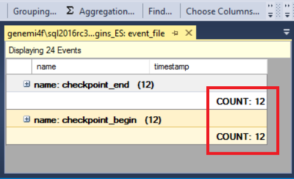

### D.5 Afficher le plan de requête au moment de l’exécution

L’événement **query_post_execution_showplan** vous permet d’afficher le plan de requête réel dans l’interface utilisateur de SSMS. Quand le volet **Détails** est visible, vous pouvez voir un graphique du plan de requête sous l’onglet **Plan de requête** . En plaçant le curseur sur un nœud du plan de requête, vous pouvez voir la liste des noms et des valeurs des propriétés du nœud.

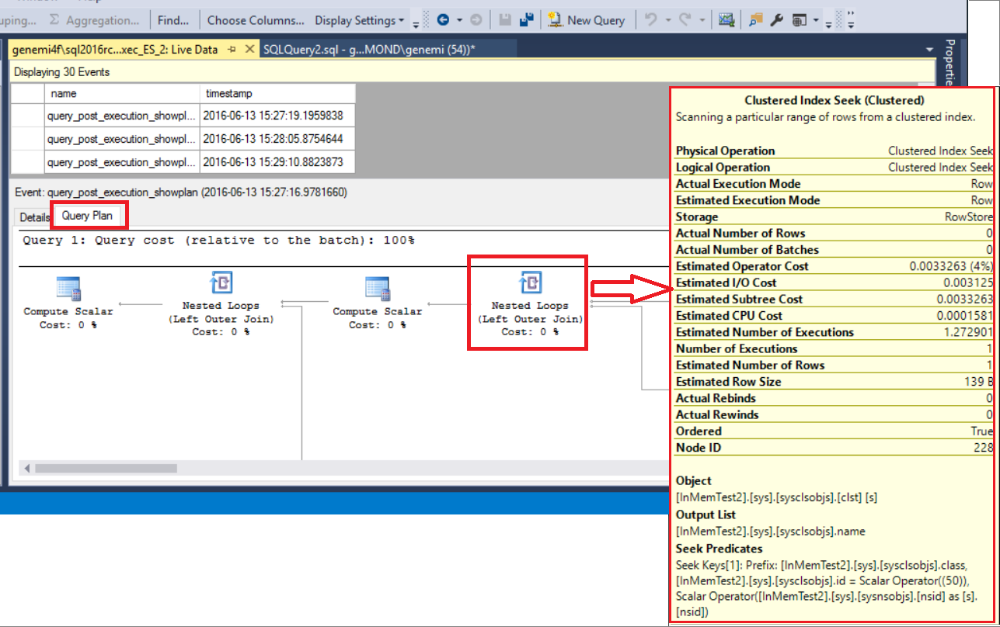

