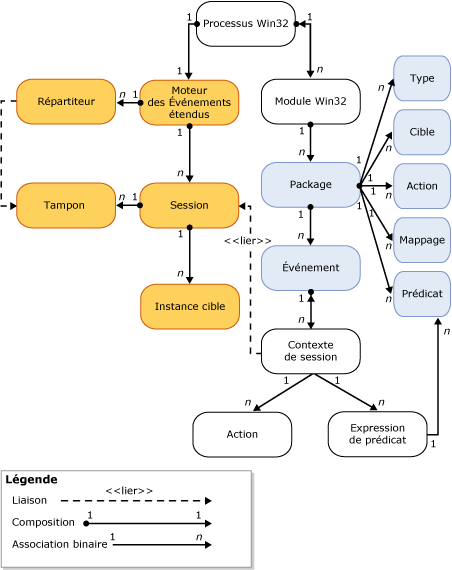

# Moteur des Événements étendus SQL Server
[!INCLUDE[tsql-appliesto-ss2014-asdb-xxxx-xxx_md](../../includes/tsql-appliesto-ss2014-asdb-xxxx-xxx-md.md)]

  Le moteur des Événements étendus [!INCLUDE[ssNoVersion](../../includes/ssnoversion-md.md)] est une collection de services et d'objets qui :  
  
-   activent la définition d'événements ;  
  
-   activent les données d'événement de traitement ;  
  
-   gèrent les services et objets des Événements étendus dans le système ;  
  
-   tiennent à jour une liste de sessions Événements étendus et gèrent l'accès à cette liste.  
  
 Le moteur des Événements étendus ne fournit lui-même aucun événement ni aucune action à entreprendre lors du déclenchement d'un événement. Les processus qui utilisent le moteur des Événements étendus définissent l'interaction avec le moteur. Ces processus ajoutent des points d'événement et fournissent les actions à entreprendre en réponse au déclenchement d'un événement.  
  
 L'illustration ci-dessous montre une vue simplifiée d'une session Événements étendus. Pour plus d’informations, consultez [Sessions Événements étendus SQL Server](../../relational-databases/extended-events/sql-server-extended-events-sessions.md).  
  
   
  
 Notez les points suivants :  
  
-   Chaque processus Windows peut avoir un ou plusieurs modules (**processus Win32**, **module Win32**). Ils sont également appelés *binaires* ou *modules exécutables*.  
  
-   Chaque module de processus Windows peut contenir un ou plusieurs packages des Événements étendus (**Package**), qui contiennent un ou plusieurs objets des Événements étendus (**Type**, **Cible**, **Action**, **Mappage**, **Prédicat**et **Événement**).  
  
-   Au sein d’un processus hôte, il ne peut exister qu’une seule instance du moteur des Événements étendus (**Moteur des Événements étendus**), qui effectue les opérations suivantes :  
  
    -   Gérer certains aspects de la session (par exemple, l'énumération des sessions).  
  
    -   Traiter la distribution (**Répartiteur**). Cela est similaire à un pool de threads.  
  
    -   Gérer les mémoires tampons (**Mémoire tampon**) pour les événements. Lorsque les mémoires tampons sont pleines, elles sont distribuées aux cibles.  
  
-   Une fois qu’une session a été créée et que les événements sont liés facultativement à la session (**Contexte de session**) :  
  
    -   des instances de cibles (**Instance cible**) peuvent également être créées et ajoutées à la session ;  
  
    -   lorsque les mémoires tampons sont pleines, elles sont distribuées aux cibles.  
  
## Voir aussi  
 [Événements étendus](../../relational-databases/extended-events/extended-events.md)  
  
  

