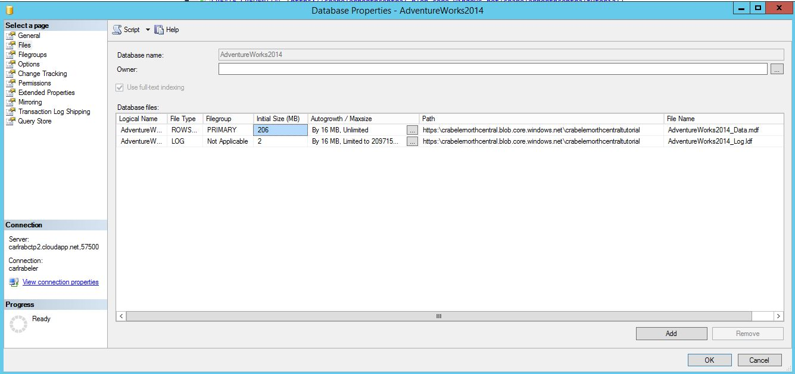

# <a name="lesson-4-restore-database-to-virtual-machine-from-url"></a>Leçon 4 : Restaurer une base de données sur une machine virtuelle à partir d’une URL
Dans cette leçon, vous restaurez la base de données AdventureWorks2014 sur votre instance de SQL Server 2016 sur votre machine virtuelle Azure.  
  
> [!NOTE]  
> Pour simplifier ce didacticiel, nous utilisons le même conteneur pour les fichiers journaux et les données que celui que nous avons utilisé pour la sauvegarde de base de données. Dans un environnement de production, vous utilisez probablement plusieurs conteneurs et souvent plusieurs fichiers de données. Avec SQL Server 2016, vous pouvez également envisager de répartir votre sauvegarde sur plusieurs objets blob pour augmenter les performances de sauvegarde quand vous sauvegardez une base de données volumineuse.  
  
Pour restaurer la base de données SQL Server 2014 à partir d’un stockage Blob Azure sur votre instance de SQL Server 2016 sur votre machine virtuelle, procédez comme suit :  
  
1.  Connectez-vous à SQL Server Management Studio.  
  
2.  Ouvrez une nouvelle fenêtre de requête et connectez-vous à l’instance SQL Server 2016 du moteur de base de données sur votre machine virtuelle Azure.  
  
3.  Copiez et collez le script Transact-SQL suivant dans la fenêtre de requête. Modifiez l’URL en fonction du nom de votre compte de stockage et du conteneur que vous avez spécifiés à la Leçon 1, puis exécutez ce script.  
  
    ```  
  
    -- Restore AdventureWorks2014 from URL to SQL Server instance using Azure blob storage for database files  
    RESTORE DATABASE AdventureWorks2014   
       FROM URL = 'https://<mystorageaccountname>.blob.core.windows.net/<mystorageaccountcontainername>/AdventureWorks2014_onprem.bak'   
       WITH  
          MOVE 'AdventureWorks2014_data' to 'https://<mystorageaccountname>.blob.core.windows.net/<mystorageaccountcontainername>/AdventureWorks2014_Data.mdf'  
         ,MOVE 'AdventureWorks2014_log' to 'https://<mystorageaccountname>.blob.core.windows.net/<mystorageaccountcontainername>/AdventureWorks2014_Log.ldf'  
    --, REPLACE  
  
    ```  
  
4.  Ouvrez l’Explorateur d’objets et connectez-vous à votre instance Azure SQL Server 2016.  
  
5.  Dans l’Explorateur d’objets, développez le nœud Bases de données et vérifiez que la base de données AdventureWorks2014 a été restaurée (actualisez le nœud si nécessaire).  
  
      
  
6.  Dans l’Explorateur d’objets, cliquez avec le bouton droit sur AdventureWorks2014, puis cliquez sur Propriétés (cliquez sur Annuler une fois terminé).  
  
7.  Cliquez sur Fichiers et vérifiez que le chemin des deux fichiers de base de données sont des URL qui pointent sur des objets blob dans votre conteneur d’objets blob Azure.  
  
      
  
8.  Dans l’Explorateur d’objets, connectez-vous au stockage Azure.  
  
9. Développez Conteneurs, développez le conteneur que vous avez créé à la Leçon 1 et vérifiez que les fichiers AdventureWorks2014_Data.mdf et AdventureWorks2014_Log.ldf de l’étape 3 ci-dessus s’affichent dans ce conteneur, ainsi que le fichier de sauvegarde de la Leçon 3 (actualisez le nœud si nécessaire).  
  
      
  
**Leçon suivante :**  
  
[Leçon 5 : Sauvegarder une base de données à l’aide d’une sauvegarde d’instantanés de fichiers](../relational-databases/lesson-5-backup-database-using-file-snapshot-backup.md)  
  
  
  
