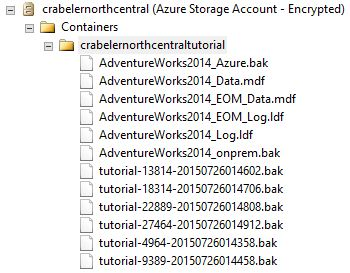

# <a name="lesson-9-manage-backup-sets-and-file-snapshot-backups"></a>Leçon 9 : Gérer des jeux de sauvegarde et des sauvegardes de captures instantanées de fichiers
Dans cette leçon, vous allez supprimer une sauvegarde à l’aide de la procédure stockée système [sp_delete_backup &#40;Transact-SQL&#41;](../relational-databases/system-stored-procedures/snapshot-backup-sp-delete-backup.md) . Cette procédure stockée système supprime le fichier de sauvegarde et la capture instantanée de fichier sur chaque fichier de base de données associé à ce jeu de sauvegarde.  
  
> [!NOTE]  
> Si vous essayez de supprimer un jeu de sauvegarde en supprimant simplement le fichier de sauvegarde du conteneur d’objets blob Azure, vous supprimerez uniquement le fichier de sauvegarde proprement dit : les captures instantanées de fichiers associées ne seront pas supprimées. Si vous vous trouvez dans ce scénario, utilisez la fonction système [sys.fn_db_backup_file_snapshots &#40;Transact-SQL&#41;](../relational-databases/system-functions/sys-fn-db-backup-file-snapshots-transact-sql.md) pour identifier l’URL des captures instantanées de fichiers orphelines et utilisez la procédure stockée système [sp_delete_backup_file_snapshot &#40;Transact-SQL&#41;](../relational-databases/system-stored-procedures/snapshot-backup-sp-delete-backup-file-snapshot.md) pour supprimer chaque capture instantanée de fichier orpheline. Pour plus d’informations, consultez  [Sauvegarde d’instantanés de fichiers pour les fichiers de base de données dans Azure](../relational-databases/backup-restore/file-snapshot-backups-for-database-files-in-azure.md).  
  
Pour supprimer un jeu de sauvegarde de captures instantanées de fichiers, procédez comme suit :  
  
1.  Connectez-vous à SQL Server Management Studio.  
  
2.  Ouvrez une nouvelle fenêtre de requête et connectez-vous à l’instance de SQL Server 2016 du moteur de base de données sur votre machine virtuelle Azure (ou à n’importe quelle instance de SQL Server 2016 disposant d’autorisations de lecture et d’écriture sur ce conteneur).  
  
3.  Copiez et collez le script Transact-SQL suivant dans la fenêtre de requête. Sélectionnez la sauvegarde du journal à supprimer, ainsi que ses captures instantanées de fichiers associées. Modifiez l’URL en fonction du nom de votre compte de stockage et du conteneur que vous avez spécifié à la Leçon 1, fournissez le nom du fichier de sauvegarde du journal, puis exécutez ce script.  
  
    ```  
  
    sys.sp_delete_backup 'https://<mystorageaccountname>.blob.core.windows.net/<mystorageaccountcontainername>/tutorial-9164-20150726012420.bak';  
  
    ```  
  
4.  Dans l’Explorateur d’objets, connectez-vous au stockage Azure.  
  
5.  Développez Conteneurs, développez le conteneur que vous avez créé lors de la Leçon 1, et vérifiez que le fichier de sauvegarde que vous avez utilisé à l’étape 3 n’apparaît plus dans ce conteneur (actualisez le nœud si nécessaire).  
  
      
  
6.  Copiez, collez et exécutez le script Transact-SQL suivant dans la fenêtre de requête pour vérifier que les deux captures instantanées de fichiers ont été supprimées.  
  
    ```  
  
    -- verify that two file snapshots have been removed  
    SELECT * from sys.fn_db_backup_file_snapshots ('AdventureWorks2014');  
  
    ```  
  
      
  
**Fin du didacticiel**  
  
## <a name="see-also"></a>Voir aussi  
[Sauvegarde d’instantanés de fichiers pour les fichiers de base de données dans Azure](../relational-databases/backup-restore/file-snapshot-backups-for-database-files-in-azure.md)  
[sp_delete_backup &#40;Transact-SQL&#41;](../relational-databases/system-stored-procedures/snapshot-backup-sp-delete-backup.md)  
[sys.fn_db_backup_file_snapshots &#40;Transact-SQL&#41;](../relational-databases/system-functions/sys-fn-db-backup-file-snapshots-transact-sql.md)  
[sp_delete_backup_file_snapshot &#40;Transact-SQL&#41;](../relational-databases/system-stored-procedures/snapshot-backup-sp-delete-backup-file-snapshot.md)  
  
  
  


