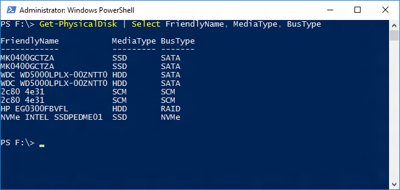
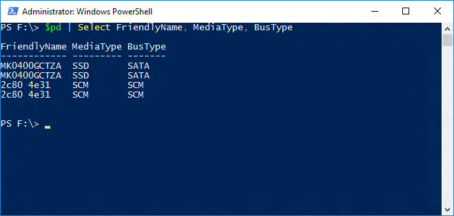
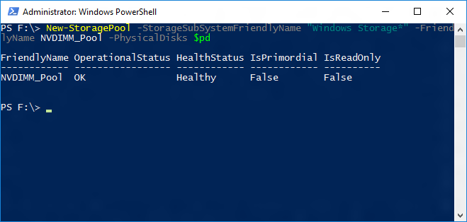
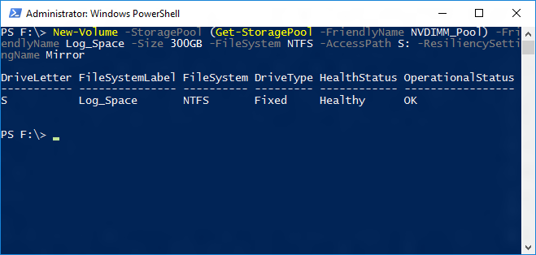
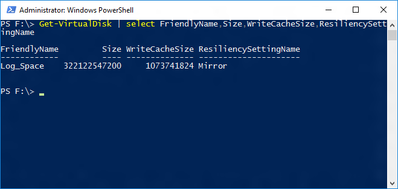
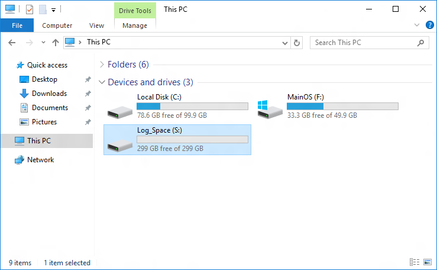

# <a name="configuring-storage-spaces-with-a-nvdimm-n-write-back-cache"></a>Configuration des espaces de stockage avec un cache en écriture différée NVDIMM-N
  Windows Server 2016 prend en charge les périphériques NVDIMM-N qui permettent des opérations d’entrée/sortie (E/S) extrêmement rapides. Une façon intéressante d’utiliser ces périphériques consiste à en faire un cache en écriture différée pour obtenir des latences d’écriture faibles. Cette rubrique explique comment configurer un espace de stockage mis en miroir avec un cache en écriture différée NVDIMM-N mis en miroir en tant que lecteur virtuel pour stocker le journal des transactions SQL Server. Si vous cherchez à l’utiliser pour également stocker des tables de données ou d’autres données, vous pouvez inclure davantage de disques dans le pool de stockage, ou créer plusieurs pools, si l’isolation est importante.  
  
 Pour visualiser une vidéo Channel 9 qui utilise cette technique, consultez [Utilisation de la mémoire non volatile (NVDIMM-N) en tant que stockage de bloc dans Windows Server 2016](https://channel9.msdn.com/Events/Build/2016/P466).  
  
## <a name="identifying-the-right-disks"></a>Identification des disques adéquats  
 L’installation des espaces de stockage dans Windows Server 2016, surtout avec des fonctionnalités avancées, telles que les caches en écriture différée, se réalise très facilement via PowerShell. La première étape consiste à identifier les disques devant faire partie du pool d’espaces de stockage à partir duquel sera créé le disque virtuel. Les NVDIMM-N ont un type de support et un type de bus SCM (Storage Class Memory, mémoire de classe de stockage), qui peut être interrogé via l’applet de commande PowerShell Get-PhysicalDisk.  
  
```  
Get-PhysicalDisk | Select FriendlyName, MediaType, BusType  
```  
  
   
  
> [!NOTE]  
>  Avec les périphériques NVDIMM-N, vous n’avez plus besoin de sélectionner les périphériques précis qui peuvent être des cibles de cache en écriture différée.  
  
 Pour créer un disque virtuel mis en miroir avec un cache en écriture différée mis en miroir, vous avez besoin d’au moins 2 NVDIMM-N et de 2 autres disques. Assigner les disques physiques voulus à une variable avant de créer le pool facilite le processus.  
  
```  
$pd =  Get-PhysicalDisk | Select FriendlyName, MediaType, BusType | WHere-Object {$_.FriendlyName -like 'MK0*' -or $_.FriendlyName -like '2c80*'}  
```  
  
 La capture d’écran montre la variable $pd ainsi que les 2 disques SSD et les 2 NVDIMM-N auxquels son retour est assigné à l’aide de l’applet de commande PowerShell suivante.  
  
```  
$pd | Select FriendlyName, MediaType, BusType  
```  
  
   
  
## <a name="creating-the-storage-pool"></a>Création du pool de stockage  
 À l’aide de la variable $pd contenant les disques physiques, il est facile de créer le pool de stockage en utilisant l’applet de commande PowerShell New-StoragePool.  
  
```  
New-StoragePool –StorageSubSystemFriendlyName “Windows Storage*” –FriendlyName NVDIMM_Pool –PhysicalDisks $pd  
```  
  
   
  
## <a name="creating-the-virtual-disk-and-volume"></a>Création du disque virtuel et du volume  
 Maintenant qu’un pool a été créé, l’étape suivante consiste à extraire un disque virtuel et à le formater. Ici, un seul disque virtuel est créé et l’applet de commande PowerShell New-Volume peut servir à rationaliser ce processus :  
  
```  
New-Volume –StoragePool (Get-StoragePool –FriendlyName NVDIMM_Pool) –FriendlyName Log_Space –Size 300GB –FileSystem NTFS –AccessPath S: -ResiliencySettingName Mirror  
```  
  
   
  
 Le disque virtuel est créé, initialisé et formaté avec NTFS. La capture d’écran ci-dessous montre que sa taille s’élève à 300 Go et que celle de son cache d’écriture s’élève à 1 Go, le tout hébergé sur les NVDIMM-N.  
  
   
  
 Vous pouvez désormais voir ce nouveau volume sur votre serveur. Vous pouvez utiliser ce lecteur pour votre journal des transactions SQL Server.  
  
   
  
## <a name="see-also"></a>Voir aussi  
 [Espaces de stockage Windows dans Windows 10](http://windows.microsoft.com/en-us/windows-10/storage-spaces-windows-10)   
 [Espaces de stockage Windows dans Windows 2012 R2](https://technet.microsoft.com/en-us/library/hh831739.aspx)   
 [Journal des transactions &#40;SQL Server&#41;](../../relational-databases/logs/the-transaction-log-sql-server.md)   
 [Afficher ou modifier les emplacements par défaut des fichiers de données et des fichiers journaux &#40;SQL Server Management Studio&#41;](../../database-engine/configure-windows/view-or-change-the-default-locations-for-data-and-log-files.md)  
  
  
