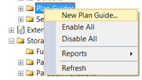
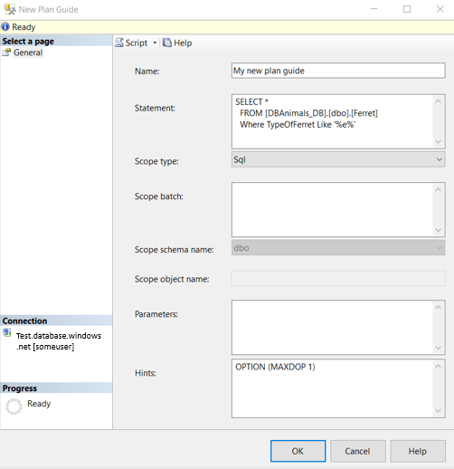

# <a name="create-a-new-plan-guide"></a>Créer un repère de plan
[!INCLUDE[appliesto-ss-xxxx-xxxx-xxx-md](../../includes/appliesto-ss-xxxx-xxxx-xxx-md.md)]
Les repères de plan influencent l'optimisation des requêtes en attachant des indicateurs de requête ou un plan fixe de requête à celles-ci. Dans le repère de plan, vous spécifiez l’instruction que vous voulez optimiser et une clause OPTION contenant les indicateurs de requête à utiliser. ou un plan de requête spécifique à utiliser pour optimiser la requête. Lorsque la requête s'exécute, l'optimiseur de requête fait correspondre l'instruction [!INCLUDE[tsql](../../includes/tsql-md.md)] au repère de plan et attache la clause OPTION à la requête au moment de l'exécution ou fait appel au plan de requête spécifié.  

Un repère de plan applique un plan de requête fixe et/ou des indicateurs de requête à une requête.
  
##  <a name="Restrictions"></a> Limitations et restrictions  
  
-   Les arguments de sp_create_plan_guide doivent être indiqués dans l'ordre affiché. Quand vous fournissez des valeurs pour les paramètres de **sp_create_plan_guide**, tous les noms de paramètres doivent être spécifiés explicitement, ou aucun nom ne doit être spécifié. Par exemple, si **@name =** est spécifié, alors **@stmt =**, **@type =**, etc.) doit l’être aussi. De même, si **@name =** est omis et que seule la valeur du paramètre est indiquée, les noms de paramètres restants doivent également être omis, et seules leurs valeurs doivent être indiquées. Les noms d'arguments sont utilisés à des fins descriptives uniquement, pour une meilleure compréhension de la syntaxe. [!INCLUDE[ssNoVersion](../../includes/ssnoversion-md.md)] ne vérifie pas que le nom de paramètre spécifié correspond au nom du paramètre à l'emplacement où le nom est utilisé.  
  
-   Vous pouvez créer plusieurs repères de plan OBJECT ou SQL pour la même requête et le même lot ou module. Toutefois, un seul repère de plan peut être activé à un moment donné.  
  
-   Vous ne pouvez pas créer de repère de plan de type OBJECT pour une valeur @module_or_batch qui fait référence à une procédure stockée, une fonction ou un déclencheur DML temporaire ou qui spécifie la clause WITH ENCRYPTION.  
  
-   Si vous tentez de supprimer ou de modifier une fonction, une procédure stockée ou un déclencheur DML référencé par un repère de plan, qu'il soit activé ou désactivé, une erreur se produit. Une erreur se produit également si vous tentez de supprimer une table dont un des déclencheurs est référencé par un repère de plan.  
 
  
##  <a name="Permissions"></a> Permissions  
 Pour créer un repère de plan de type OBJECT, il vous faut une autorisation ALTER sur l’objet référencé. Pour créer un repère de plan de type SQL ou TEMPLATE, il vous faut une autorisation ALTER pour la base de données active.  
  
##  <a name="SSMSProcedure"></a> Créer un repère de plan à l’aide de SSM  

 
1.  Cliquez sur le signe plus (+) pour développer la base de données dans laquelle vous souhaitez créer un repère de plan, puis cliquez sur le signe plus (+) pour développer le dossier **Programmabilité** .  
  
2.  Cliquez avec le bouton droit sur le dossier **Repères de plan** et sélectionnez **Nouveau repère de plan**.

  
3.  Dans la boîte de dialogue **Nouveau repère de plan** , dans la zone **Nom** , entrez le nom du repère de plan.  
  
4.  Dans la zone **Instruction** , entrez l'instruction [!INCLUDE[tsql](../../includes/tsql-md.md)] en fonction de laquelle le repère de plan doit être appliqué.  
  
5.  Dans la liste **Type d'étendue** , sélectionnez le type de l'entité dans laquelle l'instruction [!INCLUDE[tsql](../../includes/tsql-md.md)] apparaît. Ce type spécifie le contexte pour la mise en correspondance de l'instruction [!INCLUDE[tsql](../../includes/tsql-md.md)] avec le repère de plan. Les valeurs possibles sont **OBJECT**, **SQL**et **TEMPLATE**.  
  
6.  Dans la zone **Lot de l'étendue** , entrez le texte du lot dans lequel l'instruction [!INCLUDE[tsql](../../includes/tsql-md.md)] apparaît. Le texte du lot ne peut pas inclure d’instruction USE``*database* . La zone **Lot de l'étendue** est disponible uniquement lorsque **SQL** est sélectionné comme type d'étendue. Si aucune valeur n'est entrée dans la zone Lot de l'étendue lorsque SQL est le type de portée, la valeur du texte du lot est la même que celle figurant dans la zone **Instruction** .  
  
7.  Dans la liste **Nom de schéma de l'étendue** , entrez le nom du schéma dans lequel l'objet est contenu. La zone **Nom de schéma de l'étendue** est disponible uniquement lorsque **Objet** est sélectionné comme type d'étendue.  
  
8.  Dans la zone **Nom d’objet de l’étendue** , entrez le nom de la procédure stockée [!INCLUDE[tsql](../../includes/tsql-md.md)] , la fonction scalaire définie par l’utilisateur, la fonction table à instructions multiples ou le déclencheur DML dans lequel l’instruction [!INCLUDE[tsql](../../includes/tsql-md.md)] apparaît. La zone **Nom d'objet de l'étendue** est disponible uniquement lorsque **Objet** est sélectionné comme type d'étendue.  
  
9. Dans la zone **Paramètres** , entrez le nom de paramètre et le type de données de tous les paramètres incorporés dans l'instruction [!INCLUDE[tsql](../../includes/tsql-md.md)] .  
  
     Les paramètres s'appliquent uniquement lorsque l'une des conditions suivantes est remplie :  
  
    -   Le type de portée est **SQL** ou **TEMPLATE**. Si le type est **TEMPLATE**, les paramètres ne doivent pas avoir la valeur NULL.  
  
    -   L'instruction [!INCLUDE[tsql](../../includes/tsql-md.md)] est soumise à l'aide de sp_executesql et une valeur est spécifiée pour le paramètre ou [!INCLUDE[ssNoVersion](../../includes/ssnoversion-md.md)] soumet une instruction en interne après l'avoir paramétrée.  
  
10. Dans la zone **Indicateurs** , entrez les indicateurs de requête ou le plan de requête à appliquer à l'instruction [!INCLUDE[tsql](../../includes/tsql-md.md)] . Pour spécifier un ou plusieurs indicateurs de requête, entrez une clause OPTION valide.  
  
11. Cliquez sur **OK**.  

  

  
##  <a name="TsqlProcedure"></a> Créer un repère de plan à l’aide de T-SQL  
  
1.  Dans l' **Explorateur d'objets**, connectez-vous à une instance de [!INCLUDE[ssDE](../../includes/ssde-md.md)].  
  
2.  Dans la barre d'outils standard, cliquez sur **Nouvelle requête**.  
  
3.  Copiez et collez l'exemple suivant dans la fenêtre de requête, puis cliquez sur **Exécuter**.  
  
    ```  
    -- creates a plan guide named Guide1 based on a SQL statement  
    EXEC sp_create_plan_guide   
        @name = N'Guide1',   
        @stmt = N'SELECT TOP 1 *   
                  FROM Sales.SalesOrderHeader   
                  ORDER BY OrderDate DESC',   
        @type = N'SQL',  
        @module_or_batch = NULL,   
        @params = NULL,   
        @hints = N'OPTION (MAXDOP 1)';  
  
    ```  
  
 Pour plus d’informations, consultez [sp_create_plan_guide &#40;Transact-SQL&#41;](../../relational-databases/system-stored-procedures/sp-create-plan-guide-transact-sql.md).  
  
  
