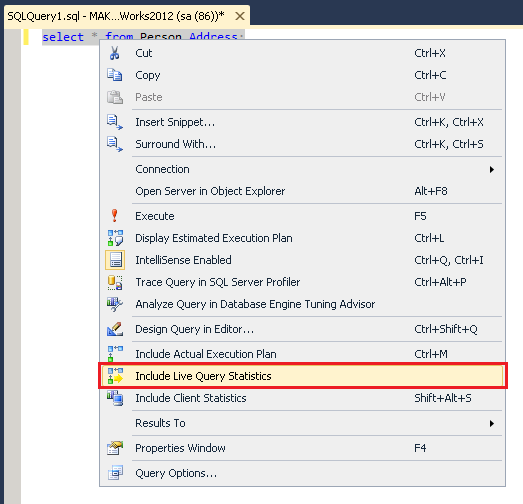
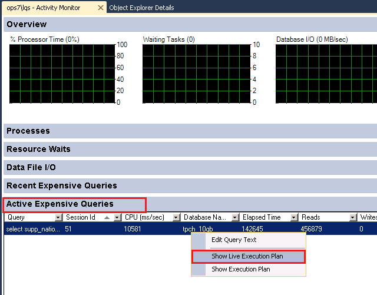

# Statistiques des requêtes actives
  [!INCLUDE[ssManStudioFull](../../includes/ssmanstudiofull-md.md)] offre la possibilité de visualiser le plan d’exécution dynamique d’une requête active. Ce plan de requête active fournit des informations en temps réel sur le processus d’exécution des requêtes à mesure que les commandes basculent d’un opérateur de plan de requête à un autre. Le plan de requête active affiche la progression globale de la requête ainsi que des statistiques d’exécution de niveau opérateur telles que le nombre de lignes produites, le temps écoulé, la progression de l’opérateur, etc. Vous pouvez accéder à ces données en temps réel sans avoir à attendre l’exécution de la requête ; ces statistiques d’exécution se révèlent donc extrêmement utiles pour résoudre les problèmes de performances de requêtes. Cette fonctionnalité est disponible avec [!INCLUDE[ssSQL15](../../includes/sssql15-md.md)] [!INCLUDE[ssManStudio](../../includes/ssmanstudio-md.md)], mais elle peut également fonctionner avec [!INCLUDE[ssSQL14](../../includes/sssql14-md.md)].  
  
||  
|-|  
|**S'applique à**: [!INCLUDE[ssNoVersion](../../includes/ssnoversion-md.md)] ([!INCLUDE[ssSQL14](../../includes/sssql14-md.md)] via la [version actuelle](http://go.microsoft.com/fwlink/p/?LinkId=299658)).|  
  
> [!WARNING]  
>  Cette fonctionnalité est principalement utilisée à des fins de dépannage. Son utilisation peut légèrement ralentir les performances globales de la requête. Cette fonctionnalité peut être utilisée avec le [débogueur Transact-SQL](../../relational-databases/scripting/configure-firewall-rules-before-running-the-tsql-debugger.md).  
  
#### Affichage des statistiques de requêtes actives  
  
1.  Pour afficher le plan d’exécution des requêtes actives, accédez au menu Outils et cliquez sur l’icône **Statistiques des requêtes actives** .  
  
       
  
     Vous pouvez également cliquer avec le bouton droit sur une requête sélectionnée dans [!INCLUDE[ssManStudio](../../includes/ssmanstudio-md.md)] , puis cliquer sur **Inclure les statistiques des requêtes actives**.  
  
       
  
2.  Exécutez maintenant la requête. Le plan de requête active affiche la progression globale de la requête et les statistiques d’exécution (par exemple, temps écoulé, progression, etc.) pour les opérateurs du plan de requête. Les informations relatives à la progression de la requête et les statistiques d’exécution sont régulièrement mises à jour tout au long de l’exécution de la requête. Vous pouvez utiliser ces informations pour comprendre le processus global d’exécution de la requête, déboguer les longues requêtes, les requêtes qui s’exécutent indéfiniment et les requêtes qui entraînent un dépassement tempdb, ou encore résoudre les problèmes de délai d’attente.  
  
       
  
 Vous pouvez également cliquer avec le bouton droit sur les requêtes de votre choix dans la table **Requêtes coûteuses actives** du **Moniteur d’activité** pour accéder au plan d’exécution dynamique.  
  
   
  
## Notes  
 L’infrastructure de profil de statistiques doit être activée pour que les statistiques de requêtes actives puissent capturer des informations sur la progression des requêtes. En spécifiant le paramètre **Inclure les statistiques des requêtes actives** dans [!INCLUDE[ssManStudio](../../includes/ssmanstudio-md.md)] , vous pouvez activer l’infrastructure de statistiques pour la session de requête en cours. 
 
Jusqu’à [!INCLUDE[ssSQL15](../../includes/sssql15-md.md)], il existe deux autres façons d’activer l’infrastructure de statistiques pour afficher les statistiques des requêtes actives d’autres sessions (par exemple, à partir du Moniteur d’activité) :  
  
-   Exécutez `SET STATISTICS XML ON;` ou `SET STATISTICS PROFILE ON;` dans la session cible.  
  
 ou  
  
-   Activez l’événement étendu **query_post_execution_showplan** . Ce paramètre de niveau serveur permet d’activer les statistiques de requêtes actives sur toutes les sessions. Pour activer les événements étendus, consultez [Monitor System Activity Using Extended Events](../../relational-databases/extended-events/monitor-system-activity-using-extended-events.md).  

À compter de [!INCLUDE[ssSQL15](../../includes/sssql15-md.md)] SP1, [!INCLUDE[ssNoVersion](../../includes/ssnoversion-md.md)] inclut une version légère de l’infrastructure de profil de statistiques. Il existe deux façons d’activer l’infrastructure légère de statistiques pour afficher les statistiques des requêtes actives d’autres sessions (par exemple, à partir du Moniteur d’activité) :

-   Utilisez l’indicateur de trace global 7412.  
  
 ou  
  
-   Activez l’événement étendu **query_thread_profile** . Ce paramètre de niveau serveur permet d’activer les statistiques de requêtes actives sur toutes les sessions. Pour activer les événements étendus, consultez [Monitor System Activity Using Extended Events](../../relational-databases/extended-events/monitor-system-activity-using-extended-events.md).
  
 > [!NOTE]
 > Les procédures stockées compilées en mode natif ne sont pas prises en charge.  
  
## Autorisations  
 Nécessite une autorisation **SHOWPLAN** de niveau base de données pour l’écriture de données dans la page de résultats **Statistiques des requêtes actives** , une autorisation **VIEW SERVER STATE** de niveau serveur pour l’affichage des statistiques actives, ainsi que toutes les autorisations nécessaires pour l’exécution de la requête.  
  
## Voir aussi  
 [Surveiller et optimiser les performances](../../relational-databases/performance/monitor-and-tune-for-performance.md)   
 [Outils de surveillance et d’optimisation des performances](../../relational-databases/performance/performance-monitoring-and-tuning-tools.md)   
 [Ouvrir le Moniteur d’activité &#40;SQL Server Management Studio&#41;](../../relational-databases/performance-monitor/open-activity-monitor-sql-server-management-studio.md)   
 [Moniteur d’activité](../../relational-databases/performance-monitor/activity-monitor.md)   
 [Analyse des performances à l’aide du magasin de requêtes](../../relational-databases/performance/monitoring-performance-by-using-the-query-store.md)   
 [sys.dm_exec_query_statistics_xml](../../relational-databases/system-dynamic-management-views/sys-dm-exec-query-statistics-xml-transact-sql.md)   
 [sys.dm_exec_query_profiles](../../relational-databases/system-dynamic-management-views/sys-dm-exec-query-profiles-transact-sql.md)   
 [Indicateurs de trace](../../t-sql/database-console-commands/dbcc-traceon-trace-flags-transact-sql.md)

