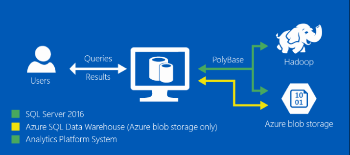

# Guide de PolyBase
[!INCLUDE[appliesto-ss-xxxx-asdw-pdw-md](../../includes/appliesto-ss-xxxx-asdw-pdw-md.md)]
  PolyBase est une technologie qui permet d’accéder aux données en dehors de la base de données via le langage t-sql.  Dans SQL Server 2016, elle vous permet d’exécuter des requêtes sur des données externes dans Hadoop, ou d’importer/exporter des données à partir de Stockage Blob Azure. Les requêtes sont optimisées pour déléguer les calculs à Hadoop. Dans Azure SQL Data Warehouse, vous pouvez importer/exporter des données depuis Stockage Blob Azure et Azure Data Lake Store.
  
  
 Pour utiliser PolyBase, consultez [Prise en main de PolyBase](../../relational-databases/polybase/get-started-with-polybase.md).  
  
   
  
## Pourquoi utiliser PolyBase ?  
Pour prendre de bonnes décisions, il est nécessaire d’analyser des données relationnelles et d’autres données qui ne sont pas structurées dans des tables, telles que les données Hadoop. Il s’agit d’une tâche délicate si vous n’avez pas les moyens de transférer les données entre les différents types de magasins de données. PolyBase comble cette lacune en fonctionnant avec des données externes à SQL Server.  
  
Pour plus de simplicité, PolyBase vous dispense d’installer des logiciels supplémentaires dans votre environnement Hadoop. La syntaxe utilisée pour interroger des données externes est la même que celle utilisée pour interroger une table de base de données. Cela s’effectue en toute transparence. PolyBase gère tous les détails en arrière-plan. Aucune connaissance de Hadoop n’est nécessaire à l’utilisateur final pour interroger des tables externes. 
  
 PolyBase offre les fonctionnalités suivantes :  
  
-   **Interrogation des données stockées dans Hadoop à partir de SQL Server ou PDW.** Les utilisateurs stockent des données dans des systèmes distribués et évolutifs économiques, tels que Hadoop. Avec PolyBase, il est facile d’interroger les données via T-SQL.  
  
-   **Interrogation des données stockées dans Stockage Blob Azure.** Pratique, Azure Blob Storage est un emplacement qui permet de stocker les données destinées à être utilisées par les services Azure.  PolyBase permet d’accéder facilement aux données à l’aide de T-SQL.  
  
-   **Importation des données depuis Hadoop, Stockage Blob Azure ou Azure Data Lake Store.** Profitez de la rapidité des fonctionnalités d’analyse et de la technologie columnstore de Microsoft SQL en important les données de Hadoop, de Stockage Blob Azure ou d’Azure Data Lake Store dans des tables relationnelles. Vous n’avez pas besoin d’un outil ETL ou d’importation distinct.  

-   **Exportation de données vers Hadoop, Stockage Blob Azure ou Azure Data Lake Store.** Archivez les données sur Hadoop, Stockage Blob Azure ou Azure Data Lake Store. Vous bénéficierez ainsi d’un mode de stockage économique et vos données resteront en ligne et donc facilement accessibles.  
  
-   **Intégration à des outils d’aide à la décision (BI).** Vous pouvez utiliser PolyBase avec la pile d’analyse et d’aide à la décision de Microsoft ou n’importe quel outil tiers compatible avec SQL Server.  
  
## Performances  
  
-   **Délégation des calculs à Hadoop.** L’optimiseur de requête prend une décision basée sur les coûts de déléguer les calculs à Hadoop si doit permettre d’améliorer les performances des requêtes.  Il s’appuie sur les statistiques des tables externes pour prendre la décision basée sur les coûts. La délégation des calculs a pour effet de créer des tâches MapReduce et de tirer parti des ressources de calcul distribuées de Hadoop.  
  
-   **Mise à l’échelle des ressources de calcul.** Pour améliorer les performances des requêtes, vous pouvez utiliser des [groupes de scale-out PolyBase](../../relational-databases/polybase/polybase-scale-out-groups.md)SQL Server. Cela autorise un transfert de données en parallèle entre les instances SQL Server et les nœuds Hadoop, et cela ajoute des ressources de calcul qui permettent d’exploiter les données externes.  
  
## Rubriques du guide de PolyBase  
 Ce guide vous propose des rubriques destinées à vous aider à utiliser PolyBase avec efficacité.  
  
|||  
|-|-|  
|**Rubrique**|**Description**|  
|[Prise en main de PolyBase](../../relational-databases/polybase/get-started-with-polybase.md)|Étapes de base pour installer et configurer PolyBase. Cette rubrique vous montre comment créer des objets externes qui pointent vers des données stockées dans Hadoop ou Azure Blob Storage, et propose des exemples de requêtes.|  
|[Récapitulatif des fonctionnalités avec version de PolyBase](../../relational-databases/polybase/polybase-versioned-feature-summary.md)|Décrit les fonctionnalités de PolyBase qui sont prises en charge par SQL Server, Base de données SQL et SQL Data Warehouse.|  
|[groupes de scale-out PolyBase](../../relational-databases/polybase/polybase-scale-out-groups.md)|Faites monter en puissance le parallélisme entre SQL Server et Hadoop au moyen de groupes de scale-out SQL Server.|  
|[Installation de PolyBase](../../relational-databases/polybase/polybase-installation.md)|Informations de référence et étapes à suivre pour installer PolyBase avec l’Assistant Installation ou un outil en ligne de commande.|  
|[Configuration de PolyBase](../../relational-databases/polybase/polybase-configuration.md)|Configurez les paramètres SQL Server pour PolyBase.  Par exemple, configurez la délégation des calculs et la sécurité kerberos.|  
|[Objets T-SQL PolyBase](../../relational-databases/polybase/polybase-t-sql-objects.md)|Créez les objets T-SQL dont se servira PolyBase pour définir et accéder aux données externes.|  
|[Requêtes PolyBase](../../relational-databases/polybase/polybase-queries.md)|Utilisez des instructions T-SQL pour interroger, importer ou exporter des données externes.|  
|[Résolution des problèmes de Polybase](../../relational-databases/polybase/polybase-troubleshooting.md)|Techniques de gestion des requêtes PolyBase. Utilisez des vues de gestion dynamique (DMV) pour surveiller les requêtes PolyBase, et apprenez à lire un plan de requête PolyBase pour identifier les goulots d’étranglement.|  
  
  
