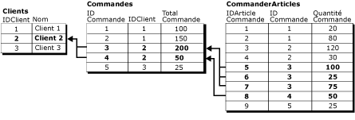
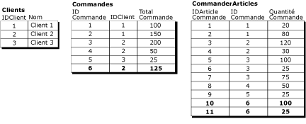

# Regrouper les modifications apport&#233;es &#224; des lignes connexes &#224; l&#39;aide d&#39;enregistrements logiques
    
> [!NOTE]  
>  [!INCLUDE[ssNoteDepFutureAvoid](../../../includes/ssnotedepfutureavoid-md.md)]  
  
 Par défaut, la réplication de fusion traite les modifications de données ligne par ligne. Dans de nombreux cas, c'est parfaitement justifié mais pour certaines applications, il est primordial de traiter les lignes connexes en tant qu'unité. La fonctionnalité d'enregistrements logiques de la réplication de fusion permet de définir une relation entre des lignes connexes de différentes tables afin que les lignes soient traitées en tant qu'unité.  
  
> [!NOTE]  
>  Cette fonctionnalité peut être utilisée seule ou avec des filtres de jointure. Pour plus d’informations sur les filtres de jointure, consultez [filtres de jointure](../../../relational-databases/replication/merge/join-filters.md). Pour utiliser les enregistrements logiques, le niveau de compatibilité de la publication doit être au minimum égal à 90RTM.  
  
 Prenons l'exemple des trois tables liées suivantes :  
  
   
  
 Les **clients** table est la table parente de cette relation et possède une colonne de clé primaire **CustID**. La **commandes** table possède une colonne clé primaire **OrderID**, avec une contrainte de clé étrangère sur la **CustID** colonne qui fait référence à la **CustID** colonne dans la **clients** table. De même, la **OrderItems** table possède une colonne clé primaire **OrderItemID**, avec une contrainte de clé étrangère sur la **OrderID** colonne qui fait référence à la **OrderID** colonne dans la **commandes** table.  
  
 Dans cet exemple, un enregistrement logique se compose de toutes les lignes dans la **commandes** table qui sont liés à un seul **CustID** valeur et toutes les lignes dans la **OrderItems** table sont liées aux lignes de la **commandes** table. Ce diagramme illustre toutes les lignes des trois tables figurant dans l'enregistrement logique de Customer2 :  
  
   
  
 Pour définir une relation d’enregistrements logiques entre des articles, consultez [définir une logique enregistrement relation entre fusionner des Articles de la Table](../../../relational-databases/replication/publish/define-a-logical-record-relationship-between-merge-table-articles.md).  
  
## Avantages des enregistrements logiques  
 La fonctionnalité des enregistrements logiques possède essentiellement deux avantages :  
  
-   Application des modifications de données en tant qu'unité.  
  
-   Détection et résolution de conflits simultanément sur plusieurs lignes de plusieurs tables.  
  
### Application des modifications en tant qu'unité  
 Si le traitement de fusion est interrompu, par exemple en cas d'abandon de la connexion, le jeu partiellement exécuté de modifications répliquées liées est restauré lorsque vous utilisez les enregistrements logiques. Par exemple, prenons le cas où un abonné qui ajoute une nouvelle commande avec **OrderID** = 6 et deux nouvelles lignes dans le **OrderItems** table avec **OrderItemID** = 10 et **OrderItemID** = 11 pour **OrderID** = 6.  
  
   
  
 Si le processus de réplication est interrompu après le **commandes** ligne **OrderID** = 6 est terminée, mais avant que le **OrderItems** 10 et 11 sont terminées et enregistrements logiques ne sont pas utilisés, le **OrderTotal** valeur **OrderID** = 6 ne seront pas cohérents avec la somme du **montant** valeurs pour le **OrderItems** lignes. Si des enregistrements logiques sont utilisés, la **commandes** ligne **OrderID** = 6 n’est pas validée tant que le **OrderItems** les modifications sont répliquées.  
  
 Dans un autre scénario, si les enregistrements logiques sont utilisés et qu'un utilisateur interroge les tables pendant l'application de modifications par le processus de fusion, il ne voit les modifications partiellement répliquées qu'à partir du moment où elles sont toutes terminées. Par exemple, le processus de réplication a téléchargé la ligne de commandes pour **OrderID** = 6, mais un utilisateur interroge les tables avant le processus de réplication a été répliqué le **OrderItems** lignes, le **OrderTotal** valeur ne serait pas la même que la somme de la **OrderAmount** valeurs. Si des enregistrements logiques sont utilisés, la **commandes** ligne ne serait pas visible jusqu'à ce que le **OrderItems** lignes sont terminées et que la transaction a été validée en tant qu’unité.  
  
### Application de la gestion des conflits à plusieurs tables  
 Envisageons le cas où deux Abonnés disposent du dataset ci-dessus :  
  
-   Un utilisateur au niveau du premier abonné remplace la **montant** de **OrderItemID** 5 de 100 à 150 et **OrderTotal** de **OrderID** 3 de 200 à 250.  
  
-   Un utilisateur à la seconde abonné modifie la **OrderAmount** de **OrderItemID** 6 de 25 à 125 et **OrderTotal** de **OrderID** 3 de 200 à 300.  
  
 Si ces modifications sont répliquées sans utiliser les enregistrements logiques, les différents **OrderTotal** valeurs entraînerait un conflit et seule d'entre elles est répliqué. Mais les modifications non conflictuelles dans le **OrderItems** seront répliquée sans conflit, la dernière table **OrderTotal** valeurs dans un état incohérent par rapport à la **OrderItems** lignes. Si les enregistrements logiques sont utilisés dans ce scénario, le **OrderItems** modification associée à la perte **commandes** modification de table sera également restaurée et que la dernière **OrderTotal** valeur serait synthèse exacte de la **OrderItems** lignes.  
  
 Pour plus d’informations sur les options relatives à la détection de conflit et la résolution des enregistrements logiques, consultez [détection et résolution des conflits dans les enregistrements logiques](../../../relational-databases/replication/merge/detecting-and-resolving-conflicts-in-logical-records.md).  
  
## Considérations sur l'utilisation des enregistrements logiques  
 Les éléments suivants doivent être pris en compte lors de l'utilisation d'enregistrements logiques.  
  
### Considérations générales  
  
-   Il est recommandé de limiter au maximum le nombre de tables dans un enregistrement logique : cinq tables ou moins.  
  
-   Les enregistrements logiques ne peuvent pas référencer des colonnes contenant l'un des types de données suivants :  
  
    -   **varchar (max)** et **nvarchar (max)**  
  
    -   **varbinary(max)**  
  
    -   **texte** et **ntext**  
  
    -   **image**  
  
    -   **XML**  
  
    -   **UDT**  
  
-   Les relations de clé étrangère dans les tables publiées ne peuvent pas être définies avec l'option CASCADE. Pour plus d’informations, consultez [CREATE TABLE & #40 ; Transact-SQL & #41 ;](../../../t-sql/statements/create-table-transact-sql.md) et [ALTER TABLE & #40 ; Transact-SQL & #41 ;](../../../t-sql/statements/alter-table-transact-sql.md).  
  
-   Vous ne pouvez pas mettre à jour des colonnes utilisées dans la clause de relation logique.  
  
-   La résolution de conflits personnalisée avec des gestionnaires de logique métier ou des outils de résolution personnalisés n'est pas prise en charge pour les articles inclus dans un enregistrement logique.  
  
-   Si des enregistrements logiques sont utilisés dans une publication qui comprend des filtres paramétrés, vous devez initialiser chaque Abonné avec un instantané de sa partition. Si vous initialisez un Abonné avec une autre méthode, l'Agent de fusion échoue. Pour plus d'informations, voir [Snapshots for Merge Publications with Parameterized Filters](../../../relational-databases/replication/snapshots-for-merge-publications-with-parameterized-filters.md).  
  
-   Les conflits qui concernent des enregistrements logiques ne sont pas affichés dans l'Outil de résolution des conflits. Pour afficher des informations sur ces conflits, utilisez des procédures stockées de réplication. Pour plus d’informations, consultez [Afficher les informations de conflit pour les Publications de fusion & #40 ; Programmation de Transact-SQL de réplication & #41 ;](../../../relational-databases/replication/view conflict information for merge publications.md).  
  
### Paramètres de la publication  
  
-   La publication doit présenter un niveau de compatibilité supérieur ou égal à 90RTM. Pour plus d’informations, consultez la section « Niveau de compatibilité de Publication » de [compatibilité descendante de la réplication](../../../relational-databases/replication/replication-backward-compatibility.md).  
  
-   La publication doit utiliser le mode d'instantané natif. Ceci est le mode par défaut sauf lorsque vous effectuez une réplication vers [!INCLUDE[ssEW](../../../includes/ssew-md.md)], qui ne prend pas en charge les enregistrements logiques.  
  
-   La publication n'autorise pas la synchronisation Web. Pour plus d'informations sur la synchronisation Web, consultez [Web Synchronization for Merge Replication](../../../relational-databases/replication/web-synchronization-for-merge-replication.md).  
  
-   Pour utiliser des enregistrements logiques sur une publication filtrée :  
  
    -   Des partitions précalculées doivent également être utilisées. Les conditions requises associées aux partitions précalculées s'appliquent également aux enregistrements logiques. Pour plus d’informations, consultez [optimiser les performances de filtre paramétré avec des Partitions précalculées](../../../relational-databases/replication/merge/optimize-parameterized-filter-performance-with-precomputed-partitions.md).  
  
    -   Vous ne pouvez pas utiliser de filtres paramétrés qui ne se chevauchent pas. Pour plus d’informations, consultez la section « Définition des options de partition » de [filtres de lignes paramétrable](../../../relational-databases/replication/merge/parameterized-row-filters.md).  
  
-   Si la publication utilise des filtres de jointure, le **clé unique** propriété doit être définie sur **true** pour tous les filtres de jointure qui sont impliqués dans les relations d’enregistrements logiques. Pour plus d’informations, voir [Join Filters](../../../relational-databases/replication/merge/join-filters.md).  
  
### Relations entre tables  
  
-   Les tables liées par l'intermédiaire d'enregistrements logiques doivent avoir une relation clé primaire-clé étrangère.  
  
-   L'option NOT FOR REPLICATION ne peut pas être définie pour des contraintes de clé étrangère.  
  
-   Les tables enfants ne peuvent avoir qu'une table parent.  
  
     Par exemple, une base de données effectuant un suivi des classes et des étudiants peut présenter une conception similaire à :  
  
       
  
     Vous ne pouvez pas utiliser un enregistrement logique pour représenter les trois tables dans cette relation, car les lignes de **ClassMembers** ne sont pas associés à une seule ligne de clé primaire. Les tables **Classes** et **ClassMembers** peuvent néanmoins constituer un enregistrement logique, comme les tables **ClassMembers** et **étudiants**, mais pas les trois.  
  
-   La publication ne peut pas contenir des relations de filtre de jointure circulaires.  
  
     À l’aide de l’exemple avec les tables **clients**, **commandes**, et **OrderItems**, vous ne pouvez pas utiliser des enregistrements logiques si la **commandes** table comportait également une contrainte de clé étrangère qui référence le **OrderItems** table.  
  
## Impact des enregistrements logiques sur les performances  
 La fonctionnalité d'enregistrement logique a une incidence sur les performances. Si vous n'utilisez pas les enregistrements logiques, l'Agent de réplication peut traiter toutes les modifications d'un article donné en même temps et, comme les modifications sont appliquées ligne par ligne, le verrouillage et les activités du journal des transactions requis pour l'application des modifications sont minimes.  
  
 Si vous utilisez des enregistrements logiques, l'Agent de fusion doit traiter les modifications de tout l'enregistrement logique ensemble. Le temps nécessaire à l'Agent de fusion pour répliquer les lignes est alors plus long. En outre, comme l'Agent ouvre une transaction distincte pour chaque enregistrement logique, le verrouillage requis est plus important.  
  
## Voir aussi  
 [Options d'articles pour la réplication de fusion](../../../relational-databases/replication/merge/article-options-for-merge-replication.md)  
  
  