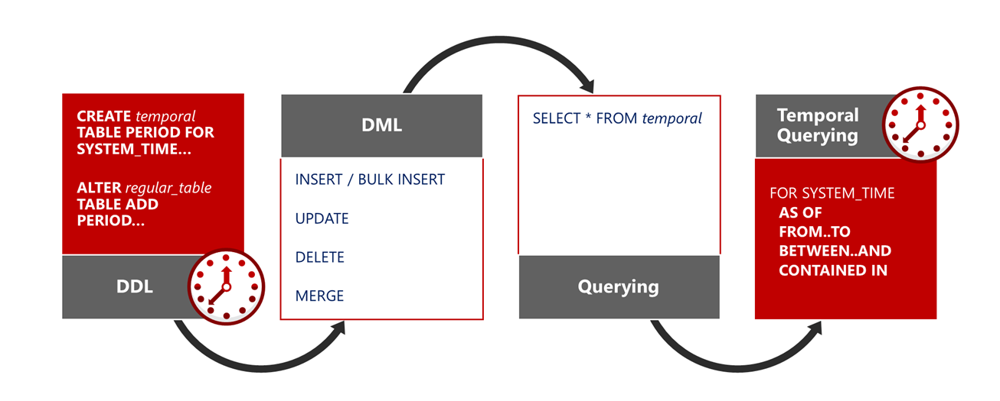

# Prise en main des tables temporelles de contr&#244;le de version du syst&#232;me
[!INCLUDE[tsql-appliesto-ss2016-asdb-xxxx-xxx_md](../../includes/tsql-appliesto-ss2016-asdb-xxxx-xxx-md.md)]

  En fonction de votre scénario, vous pouvez créer des tables temporelles de contrôle de version du système ou modifier des tables existantes en ajoutant des attributs temporels au schéma de table existant.   
Lorsque les données d’une table temporelle sont modifiées, le système crée un historique de version en toute transparence pour les applications et les utilisateurs finaux. Par conséquent, l’utilisation de tables temporelles de contrôle de version du système ne nécessite pas de changer la manière dont la table est modifiée ou dont le dernier état (réel) des données est interrogé.   
Outre des DML et des interrogations à un rythme régulier, la fonctionnalité temporelle offre un moyen simple et pratique d’obtenir des informations relatives à l’historique des données par le biais de la syntaxe étendue Transact-SQL.   
Une table d’historique est affectée à chaque table avec contrôle de version du système, mais elle est complètement transparente pour les utilisateurs, sauf s’ils souhaitent optimiser les performances de la charge de travail ou l’encombrement de stockage en créant des index supplémentaires ou en choisissant d’autres options de stockage.    
Le schéma suivant illustre le flux de travail type relatif aux tables temporelles avec version gérée par le système :   
  
  
 Cette rubrique est constituée des 5 sous-rubriques suivantes :  
  
-   [Création d’une table temporelle avec contrôle de version du système](../../relational-databases/tables/creating-a-system-versioned-temporal-table.md)  
  
-   [Modification des données dans une table temporelle avec système par version](../../relational-databases/tables/modifying-data-in-a-system-versioned-temporal-table.md)  
  
-   [Interrogation des données dans une table temporelle avec système par version](../../relational-databases/tables/querying-data-in-a-system-versioned-temporal-table.md)  
  
-   [Modification du schéma d’une table temporelle à version contrôlée par le système](../../relational-databases/tables/changing-the-schema-of-a-system-versioned-temporal-table.md)  
  
-   [Arrêt du contrôle de version par le système sur une table temporelle à version contrôlée par le système](../../relational-databases/tables/stopping-system-versioning-on-a-system-versioned-temporal-table.md)  
  
## Cet article vous a-t-il été utile ? Nous sommes à votre écoute  
 Quels renseignements souhaitez-vous obtenir ? Avez-vous trouvé ce que vous cherchiez ? Nous tenons compte de vos commentaires pour améliorer le contenu de nos articles. Envoyez vos commentaires à l’adresse suivante : [sqlfeedback@microsoft.com](mailto:sqlfeedback@microsoft.com?subject=Your%20feedback%20about%20the%20Getting%20Started%20with%20System-Versioned%20Temporal%20Tables%20page)  
  
## Voir aussi  
 [Tables temporelles](../../relational-databases/tables/temporal-tables.md)   
 [Vérifications de cohérence système des tables temporelles](../../relational-databases/tables/temporal-table-system-consistency-checks.md)   
 [Partitionnement des tables temporelles](../../relational-databases/tables/partitioning-with-temporal-tables.md)   
 [Considérations et limitations liées aux tables temporelles](../../relational-databases/tables/temporal-table-considerations-and-limitations.md)   
 [Sécurité de la table temporelle](../../relational-databases/tables/temporal-table-security.md)   
 [Gérer la rétention des données d’historique dans les tables temporelles avec version gérée par le système](../../relational-databases/tables/manage-retention-of-historical-data-in-system-versioned-temporal-tables.md)   
 [Tables temporelles à système par version avec tables optimisées en mémoire](../../relational-databases/tables/system-versioned-temporal-tables-with-memory-optimized-tables.md)   
 [Vues et fonctions de métadonnées de table temporelle](../../relational-databases/tables/temporal-table-metadata-views-and-functions.md)  
  
  