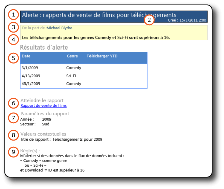
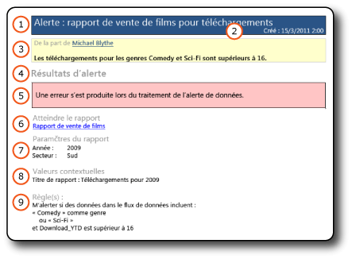

# Messages d'alerte de données

[!INCLUDE[ssrs-appliesto-sql2016-xpreview](../includes/ssrs-appliesto-sql2016-xpreview.md)][!INCLUDE[ssrs-appliesto-sharepoint-2013-2016i](../includes/ssrs-appliesto-sharepoint-2013-2016.md)]

[!INCLUDE[ssRSnoversion](../includes/ssrsnoversion-md.md)] Les alertes de données autorisent l’envoi de deux types de messages d’alerte de données par courrier électronique : les messages contenant les résultats de l’alerte de données et les messages sans description d’erreur. Les messages contenant des résultats avisent tous les destinataires des modifications apportées aux données d'un rapport dignes d'intérêt et importantes pour les décisions économiques. Si pour une raison quelconque une erreur se produit et les résultats ne sont pas disponibles, un message d'erreur est envoyé à la place.

Le propriétaire de la définition d'alerte de données peut également afficher des informations sur l'instance de l'alerte de données dans le Gestionnaire des alertes de données. Pour plus d’informations, consultez [Gestionnaire des alertes de données pour les utilisateurs SharePoint](../reporting-services/data-alert-manager-for-sharepoint-users.md).  

> [!NOTE]
> Intégration de Reporting Services avec SharePoint n’est plus disponible après SQL Server 2016.
  
##   Messages d'alerte de données  
 Les images suivantes montrent un message d'alerte de données avec des résultats et un message d'alerte avec la description de l'erreur.  
  
 **Message contenant les résultats**  
  
   
  
 **Message d'erreur**  
  
   
  
 Les messages incluent les mêmes types d'informations.  
  
1.  **De la part de** indique le nom de la personne qui a créé la définition d’alerte de données.  
  
2.  Si vous avez fourni une description dans la définition d’alerte, elle s’affiche sous **De la part de**.  
  
3.  Les**Résultats d’alerte** affichent les lignes dans le flux de données du rapport qui correspondent aux règles spécifiées dans la définition de l’alerte, organisées dans un format tabulaire ; en cas d’erreur, une description est affichée. Il n'existe aucune limite quant au nombre de lignes qui s'affiche.  
  
4.  **Atteindre le rapport** est un lien vers le rapport concerné par la définition de l’alerte. Si le lien n'est pas valide car le rapport a été déplacé ou supprimé, un message d'erreur s'affiche.  
  
5.  Les informations sous**Règle(s)** répertorient les règles et les clauses dans la définition de l’alerte. Ces informations vous permettent de vérifier et comprendre les résultats de l'alerte et d'identifier les règles dans la définition de l'alerte de données que vous pouvez modifier pour limiter ou élargir les résultats.  
  
6.  Les**Paramètres de rapport** présentent les paramètres et les valeurs de paramètres utilisés lors de l’exécution du rapport. Les paramètres et les valeurs de paramètre vous aident à comprendre les résultats des alertes.  
  
7.  Les**Valeurs contextuelles** répertorient les noms et les valeurs des éléments du rapport qui sont en dehors des régions de données de celui-ci. Les éléments sont généralement des zones de texte. Par exemple, il peut s'agir d'une zone de texte avec une valeur constante telle que l'objet ou la description d'un rapport.  
  
 La seule différence entre les deux types de messages est l’élément 5, **Résultats d’alerte**. Si une erreur se produit quand une instance d’alerte de données ou un message d’alerte de données est créé, l’élément **Résultats d’alerte** affiche un message d’erreur qui décrit le problème. Le message d'erreur, envoyé à tous les destinataires, les informe que les résultats de l'alerte qu'ils attendent et sur lesquels ils s'appuient pour prendre des décisions ne sont pas valides.  
  
  
##   Tâches associées  
 Cette section répertorie les procédures de création et de modification des définitions d'alerte de données qui fournissent la plupart des informations sur les éléments affichés dans les messages d'alerte de données.  
  
-   [Créer une alerte de données dans le Concepteur d'alertes](../reporting-services/create-a-data-alert-in-data-alert-designer.md)  
  
-   [Modifier une alerte de données dans le Concepteur d'alertes](../reporting-services/edit-a-data-alert-in-alert-designer.md)  

## Voir aussi

[Concepteur d'alertes de données](../reporting-services/data-alert-designer.md)   
[Alertes de données Reporting Services](../reporting-services/reporting-services-data-alerts.md)  

D’autres questions ? [Essayez de poser le forum Reporting Services](http://go.microsoft.com/fwlink/?LinkId=620231)
