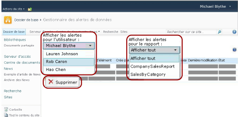

# Gérer toutes les alertes de données sur un site SharePoint dans le Gestionnaire des alertes de données

[!INCLUDE[ssrs-appliesto](../includes/ssrs-appliesto.md)] [!INCLUDE[ssrs-appliesto-2016](../includes/ssrs-appliesto-2016.md)] [!INCLUDE[ssrs-appliesto-not-pbirsi](../includes/ssrs-appliesto-not-pbirs.md)] [!INCLUDE[ssrs-appliesto-sharepoint-2013-2016i](../includes/ssrs-appliesto-sharepoint-2013-2016.md)]

Les administrateurs d'alertes SharePoint peuvent consulter la liste des alertes de données que tous les utilisateurs du site ont créées et les informations sur les alertes. Ils peuvent également supprimer des alertes. L'illustration suivante montre les fonctionnalités disponibles aux administrateurs d'alertes dans le Gestionnaire des alertes de données.

 

> [!NOTE]
> Intégration de Reporting Services avec SharePoint n’est plus disponible après SQL Server 2016.

## Afficher la liste des alertes créées par un utilisateur de site  
  
1.  Accédez au site SharePoint où les définitions d'alertes de données sont enregistrées.  
  
2.  Dans la page d’accueil, cliquez sur **Actions de site**.  
  
3.  Faites défiler jusqu’au fond de la liste et cliquez sur **Paramètres du site**.  
  
4.  Sous **Reporting Services**cliquez sur **Gérer les alertes de données**.  
  
5.  Cliquez sur la flèche vers le bas dans la liste **Afficher les alertes pour l’utilisateur** et sélectionnez l’utilisateur dont vous souhaitez afficher les alertes.  
  
6.  Cliquez sur la flèche vers le bas en regard de la liste **Afficher les alertes pour le rapport** et sélectionnez une alerte spécifique ou cliquez sur **Afficher tout** pour répertorier toutes les alertes créées par l’utilisateur sélectionné.  
  
     Une table répertorie le nom de l'alerte, le nom du rapport, le nom de la personne qui a créé l'alerte de données, le nombre de fois que l'alerte de données a été envoyée, la dernière fois que la définition d'alerte de données a été modifiée et l'état de l'alerte de données. Si l'alerte de données ne peut pas être générée ou envoyée, la colonne d'état contient des informations sur l'erreur et vous aide à dépanner le problème.  
  
## Supprimer une définition d’alerte  
  
-   Cliquez avec le bouton droit sur l’alerte de données à supprimer, puis cliquez sur **Supprimer**.  
  
    > [!NOTE]  
    >  Une fois que vous avez supprimé l’alerte, aucun message d’alerte n’est envoyé. Toutefois, si vous interrogez la base de données des alertes, vous constaterez que la définition d'alerte existe encore. Le service d'alertes effectue un nettoyage planifié qui supprimera définitivement la définition d'alerte lors du nettoyage suivant. L'intervalle de nettoyage par défaut est de 20 minutes. Cet intervalle, ainsi que d'autres paramètres de nettoyage, sont configurables. Pour plus d’informations, consultez [Alertes de données Reporting Services](../reporting-services/reporting-services-data-alerts.md).  

## Voir aussi

[Gestionnaire des alertes de données pour les administrateurs d’alertes](../reporting-services/data-alert-manager-for-alerting-administrators.md)   
[Alertes de données Reporting Services](../reporting-services/reporting-services-data-alerts.md)  

D’autres questions ? [Essayez de poser le forum Reporting Services](http://go.microsoft.com/fwlink/?LinkId=620231)

