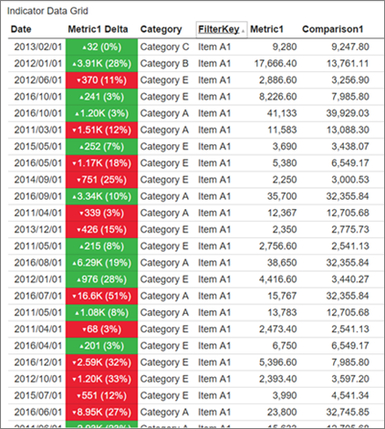
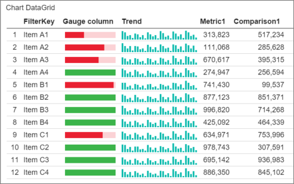

# Ajouter des grilles de données aux rapports mobiles | Reporting Services
La meilleure visualisation est parfois les données elles-mêmes. Découvrez les trois *grilles de données*, ou tables, avec lesquelles vous pouvez afficher des données dans [!INCLUDE[SS_MobileReptPub_Long](../../includes/ss-mobilereptpub-long.md)]:
* Grille de données simple
* Grille de données d’indicateur
* Grille de données de graphique

## Grille de données simple
La plus élémentaire, la grille de données simple, peut afficher plusieurs colonnes de données avec des en-têtes et une mise en forme personnalisés. 

Après avoir ajouté une grille de données à l’aire de conception, vous pouvez la connecter à des données réelles.

1. Faites glisser une grille de données simple de l’onglet **Disposition** vers la grille de création et ajustez sa taille à votre convenance.

2. Obtenez des [données à partir d’Excel ou d’un dataset partagé](../../reporting-services/mobile-reports/data-for-reporting-services-mobile-reports.md).

3. Sélectionnez l’onglet **Données** puis, dans le volet **Propriétés des données** , sous **Données pour l’affichage de grille** , sélectionnez une table de données.

4. Dans le volet **Colonnes** , sélectionnez les colonnes de votre choix. Réorganisez-les, renommez-les et définissez leurs format et agrégation. 

 
##  Grille de données d’indicateur
Vous pouvez ajouter des colonnes avec des jauges à une grille de données d’indicateur.

1. Faites glisser une grille de données d’indicateur de l’onglet **Disposition** vers la grille de création et ajustez sa taille à votre convenance.

2. Sous l’onglet **Données** du volet **Colonnes** , sélectionnez **Ajouter une colonne de jauge**. 

3. Sélectionnez **Options**, puis sélectionnez un **Type de jauge**. 

4. Définissez les champs **Valeur** , **Comparaison** et **Sens des valeurs**, exactement comme dans la [procédure d’ajout direct de jauges à un rapport mobile](../../reporting-services/mobile-reports/add-gauges-to-mobile-reports-reporting-services.md).

La grille de données alimente automatiquement la jauge avec uniquement les données spécifiques à cette ligne de la grille de données.  

## Grille de données de graphique
Vous pouvez ajouter des colonnes avec des jauges ou des graphiques à une grille de données de graphique. 

Quand vous ajoutez une colonne de graphique à une grille de données, vous devez ajouter une table de données distincte pour fournir les données du graphique de chaque ligne. Cette seconde table de données doit partager un champ avec la table de données principale, pour lier chaque ligne aux données de graphique correspondantes. 

1. Faites glisser une grille de données de graphique de l’onglet **Disposition** vers la grille de création et ajustez sa taille à votre convenance.

2. Sous l’onglet **Données** du volet **Colonnes** , sélectionnez **Ajouter une colonne de graphique**. 

3. Si ce n’est déjà fait, récupérez [des données à partir d’Excel ou d’un dataset partagé](../../reporting-services/mobile-reports/data-for-reporting-services-mobile-reports.md) pour ajouter une deuxième table de données qui partage un champ avec la table de données principale.

4. Sous **Propriétés des données**, sélectionnez la table de données principale dans **Données pour l’affichage de grille**, puis sélectionnez la seconde table dans **Données de référence pour les visualisations de graphiques**.

5. Sélectionnez **Options**, puis sélectionnez un **Type de graphique**.
 
6. Sélectionnez **Champ de données du graphique**, **Recherche de source**et **Recherche de destination**. 
   Ces trois propriétés déterminent la façon dont la grille de données fournit des données à chaque graphique dans la colonne.
   
   *   **Recherche de source** est défini sur un champ de la table de données indiquée dans **Données pour l’affichage de grille**. Ce champ fait office de filtre « par ligne » appliqué à la table de données de référence de graphique pour fournir des données au graphique incorporé pour chaque ligne. 
   * **Recherche de destination** est le champ correspondant dans la table de données indiquée dans **Données de référence pour les visualisations de graphiques**. Les données du graphique dans chaque ligne sont jointes sur ces deux champs.   
   * **Champ de données du graphique** détermine la métrique à utiliser dans la table de données **Données de référence pour les visualisations de graphiques** comme valeur de l’axe X ou série dans le graphique au sein de chaque ligne.  

## Voir aussi 
* [Cartes dans les rapports pour mobiles Reporting Services](../../reporting-services/mobile-reports/maps-in-reporting-services-mobile-reports.md)
* [Navigateurs dans les rapports mobiles Reporting Services](../../reporting-services/mobile-reports/add-navigators-to-reporting-services-mobile-reports.md)
* [Visualisations dans les rapports mobiles Reporting Services](../../reporting-services/mobile-reports/add-visualizations-to-reporting-services-mobile-reports.md)
* [Jauges dans les rapports mobiles Reporting Services](../../reporting-services/mobile-reports/add-gauges-to-mobile-reports-reporting-services.md)  
 
  
