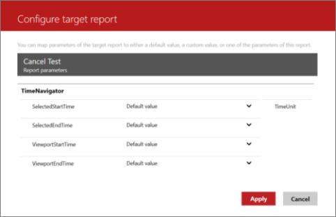
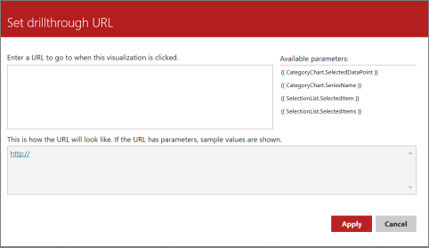

# Ajouter l’extraction &#224; partir d’un rapport mobile &#224; d’autres rapports mobiles ou des URL
Vous pouvez ajouter l’extraction à partir de n’importe quelle grille de données, graphique ou jauge dans un rapport mobile [!INCLUDE[ssRSnoversion_md](../../includes/ssrsnoversion-md.md)] vers un autre rapport mobile ou une URL personnalisée. 

Une *extraction* est un lien à partir d’un rapport source qui ouvre une URL ou un autre rapport cible. Le rapport d’extraction cible contient souvent des détails sur un élément dans le rapport de synthèse. En fonction du rapport mobile source, un ou plusieurs paramètres peuvent être passés au rapport mobile cible ou intégrés dans une URL personnalisée.  
  
Quand vous affichez le rapport mobile source dans le portail web [!INCLUDE[ssRSnoversion_md](../../includes/ssrsnoversion-md.md)] et que vous sélectionnez un élément avec une cible d’extraction, vous accédez à cette cible (un autre rapport mobile ou une URL).  

Les éléments de rapport avec une extraction, vers une URL ou un autre rapport mobile, ont une icône d’extraction  en haut à droite.

 

>**Conseil** : créez le rapport cible et enregistrez-le d’abord dans un portail web [!INCLUDE[ssRSnoversion_md](../../includes/ssrsnoversion-md.md)]. Si vous envisagez de passer des paramètres à partir du rapport source, ajoutez aussi les paramètres au rapport cible. Vous pouvez ensuite configurer l’extraction du rapport source vers le rapport cible. [Ajoutez des paramètres à un rapport mobile](../../reporting-services/mobile-reports/add-parameters-to-a-mobile-report-reporting-services.md).
 
## Configurer l’extraction vers un rapport mobile  

1. En mode Mise en page dans [!INCLUDE[SS_MobileReptPub_Long](../../includes/ss-mobilereptpub-long.md)], sélectionnez une visualisation qui prend en charge l’extraction.   

   Les cartes et les jauges prennent en charge l’extraction, comme la plupart des graphiques et des grilles de données simples.
   
2. Dans le volet **Propriétés visuelles**, sélectionnez **Cible d’extraction** > **Rapport mobile**.  
3. Sélectionnez le serveur et le rapport mobile cible.  

   >Remarque : Si le rapport mobile cible n’est pas sur le même serveur que le rapport mobile source, connectez-vous plutôt avec une URL personnalisée, comme expliqué dans la section suivante.  
 
4. Une fois que vous avez sélectionné un rapport mobile cible, ses paramètres d’entrée disponibles sont visibles, notamment les propriétés qui peuvent être liées à des contrôles de navigateur et les paramètres configurés sur des datasets du rapport mobile cible.  

   
   
   *Propriétés d’extraction pour le rapport mobile cible*  
  
5. Cliquez sur la flèche à droite de chaque propriété pour connecter des propriétés avec des types de données correspondants aux propriétés de sortie disponibles sur le rapport mobile source. Vous pouvez également définir des valeurs par défaut pour chaque sortie ici, au cas où l’utilisateur du rapport n’aurait pas interagi avec le rapport mobile source avant l’extraction vers le rapport mobile de destination.  
  
## Configurer une extraction vers une URL personnalisée  
  
1. En mode Mise en page dans [!INCLUDE[SS_MobileReptPub_Long](../../includes/ss-mobilereptpub-long.md)], sélectionnez une visualisation qui prend en charge les cibles d’extraction.    
2. Dans le volet **Propriétés visuelles**, sélectionnez **Cible d’extraction** > **URL personnalisée**.  Cette opération ouvre la boîte de dialogue de configuration d’extraction.  
  
3. Dans **Définir une URL d’extraction**, entrez l’URL de destination à atteindre quand vous cliquez sur la visualisation, puis sélectionnez parmi les **Paramètres disponibles** répertoriés à droite. Un aperçu de l’URL personnalisée combinée avec des exemples de paramètres résolus (s’ils sont inclus) s’affiche dans le volet ci-dessous.  
  
   
  
   *Extraction vers des propriétés d’URL personnalisée*  
  
4. Cliquez sur **Appliquer**.  

  
Quand vous prévisualisez un rapport mobile dans [!INCLUDE[SS_MobileReptPub_Short](../../includes/ss-mobilereptpub-short.md)], si vous cliquez sur une visualisation avec extraction, un message s’affiche pour signaler que l’extraction est désactivée. Vous ne pouvez extraire vers la cible qu’après avoir enregistré ou publié un rapport mobile puis l’avoir affiché (pas à partir du mode Aperçu ou Mise en page de [!INCLUDE[SS_MobileReptPub_Short](../../includes/ss-mobilereptpub-short.md)]).  

## Masquer un rapport mobile cible sur le portail web
Si vous ne prévoyez pas de définir une valeur par défaut pour le rapport cible, vous pouvez le masquer sur le portail web. Si vous ne le masquez pas, si quelqu’un tente de l’afficher directement sur le portail web sans passer par le rapport source, il sera vide.

1. Dans le portail web, sélectionnez les points de suspension (...) sur le rapport cible que vous souhaitez masquer, puis cliquez sur Gérer.

2. Dans **Propriétés**, sélectionnez **Masquer en mode vignette**.

Vous pouvez choisir d’afficher les éléments masqués dans le portail web : 

* Dans l’angle supérieur droit du portail web, sélectionnez **Affichage** > **Afficher les éléments masqués.** 

Les éléments masqués sont affichés dans une couleur plus claire.
    
### Voir aussi  
 
* [Ajouter des paramètres à un rapport mobile Reporting Services](../../reporting-services/mobile-reports/add-parameters-to-a-mobile-report-reporting-services.md)
* [Créer des rapports mobiles avec l’Éditeur de rapports mobiles SQL Server](../../reporting-services/mobile-reports/create-mobile-reports-with-sql-server-mobile-report-publisher.md) 
* [Portail web Reporting Services](../../reporting-services/web-portal-ssrs-native-mode.md)
