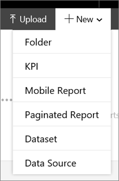
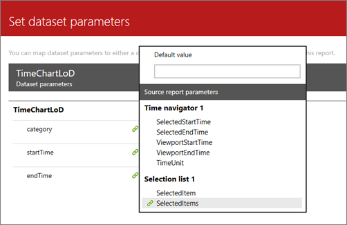
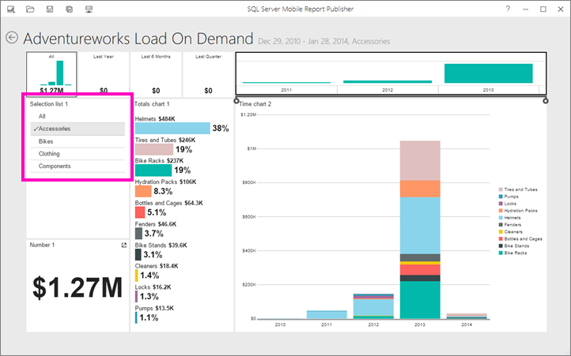

# Ajouter des paramètres à un rapport mobile | Reporting Services
Vous pouvez créer un rapport mobile [!INCLUDE[ssRSnoversion_md](../../includes/ssrsnoversion-md.md)] avec des paramètres, afin que vous et les lecteurs de vos rapports puissiez filtrer vos rapports. Un rapport avec des paramètres peut également être la cible d’une [extraction dans un rapport source](../../reporting-services/mobile-reports/add-drillthrough-from-a-mobile-report-to-other-mobile-reports-or-urls.md). 

Pour créer un rapport mobile avec des paramètres, vous commencez avec un dataset partagé comportant au moins un paramètre. Découvrez comment [créer des paramètres dans un dataset partagé](../../reporting-services/report-data/create-a-shared-dataset-or-embedded-dataset-report-builder-and-ssrs.md).  

Une fois que vous avez ajouté les paramètres à un rapport mobile, vous créez une URL afin d’ [ouvrir le rapport avec des paramètres de chaîne de requête](../../reporting-services/mobile-reports/open-a-mobile-report-with-specific-query-string-parameters-reporting-services.md).

1. Dans la barre située en haut du portail web de [!INCLUDE[ssRSnoversion](../../includes/ssrsnoversion.md)] , sélectionnez **Nouveau** > **Rapport mobile**.  
  
     
     
2. Sélectionnez l’onglet **Données** dans le coin en haut à gauche de [!INCLUDE[SS_MobileReptPub_Long](../../includes/ss-mobilereptpub-long.md)].   
  
3. Dans le coin en haut à droite, sélectionnez **Ajouter des données**.  
  
4. Sélectionnez **Serveur de rapports**, puis sélectionnez un serveur.  
  
5. Accédez aux datasets partagés sur le serveur, puis sélectionnez-en un qui possède des paramètres.  
  
   Dans la grille, vous voyez les données contenues dans le dataset. Le cercle vert avec des accolades **{ }** marque un ensemble de données avec un paramètre.  
     
     
  
6. Sélectionnez l’icône de rouage sous l’onglet, puis sélectionnez **Param {}**.  
  
     
  
7. Sélectionnez l’élément de rapport qui transmettra des valeurs au paramètre.  
  
     
     
8. Sélectionnez **Aperçu** afin de découvrir l’apparence du rapport. Dans ce rapport, la liste des sélections utilise le paramètre de catégorie.

    
   
9. Quand vous sélectionnez une valeur dans la liste de sélections, le rapport est filtré sur cette valeur, dans le cas présent Accessories.

      
  
### Voir aussi  
-  [Ouvrir un rapport mobile avec des paramètres spécifiques de chaîne de requête](../../reporting-services/mobile-reports/open-a-mobile-report-with-specific-query-string-parameters-reporting-services.md)
-  [Ajouter l’extraction à partir d’un rapport mobile à d’autres rapports mobiles ou des URL](../../reporting-services/mobile-reports/add-drillthrough-from-a-mobile-report-to-other-mobile-reports-or-urls.md)
-  [Créer un dataset partagé ou incorporé](../../reporting-services/report-data/create-a-shared-dataset-or-embedded-dataset-report-builder-and-ssrs.md)
- [Créer et publier des rapports mobiles avec l’Éditeur de rapports mobiles SQL Server](../../reporting-services/mobile-reports/create-mobile-reports-with-sql-server-mobile-report-publisher.md)  
  
  

