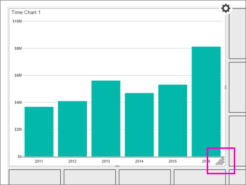

# Créer un rapport mobile Reporting Services
Avec SQL Server Mobile Report Publisher, vous pouvez créer rapidement des rapports mobiles SQL Server 2016 Reporting Services bien adaptés à n’importe quelle taille d’écran, sur une aire de conception avec des lignes de grille réglables et des colonnes et des éléments de rapport mobile flexibles.  
  
La première fois que vous créez un rapport mobile, vous pouvez installer SQL Server Mobile Report Publisher sur votre ordinateur local à partir du portail web de Reporting Services. Vous pouvez aussi l’installer à partir du [Centre de téléchargement Microsoft](http://go.microsoft.com/fwlink/?LinkID=733527). Après cela, vous pouvez le démarrer à partir du portail web ou localement.   
    
1. Dans la barre supérieure du portail web Reporting Services, sélectionnez **nouveau** > **rapport Mobile**.  
  
     
     
2. Sur le **disposition** dans l’éditeur de rapports mobiles, sélectionnez un navigateur de jauge, graphique ou carte datagrid et faites-le glisser vers la grille de création.  
  
3. Saisissez le coin inférieur droit de l’élément et redimensionnez-le.  
  
     
  
   Il s’agit de la grille de création **principale** dans laquelle vous définissez les éléments à inclure dans votre rapport. Vous pouvez ensuite [ajuster la disposition du rapport pour un affichage sur tablette ou téléphone](../../reporting-services/mobile-reports/lay-out-a-reporting-services-mobile-report-for-phone-or-tablet.md).     
     
   La zone **Propriétés visuelles** , située en dessous de la grille de création, vous permet de définir différentes propriétés.  
     
4. Sélectionnez l’onglet **Données** dans le coin supérieur gauche. Le graphique s’affiche avec des données simulées déjà associées.   
  
     
  
5. Sélectionnez **Ajouter des données** dans le coin supérieur droit.  
  
6. Sélectionnez **Excel local** ou **Serveur de rapports**.  
  
   >**Conseils**: si vous ajoutez des données à partir d’Excel, veillez à :  
    >* [Préparer les données Excel](../../reporting-services/mobile-reports/prepare-excel-data-for-reporting-services-mobile-reports.md) à utiliser dans votre rapport mobile.  
    >* Fermer le fichier avant d’ajouter les données.  
7. Sélectionnez les feuilles de calcul souhaitées, puis sélectionnez **Importer**.   
   Vous pouvez ajouter plusieurs feuilles de calcul d’un classeur en même temps.  
    
       
  
8. Toujours sous l’onglet **Données** , dans la zone **Propriétés des données** , sélectionnez la table et le champ de votre choix dans le graphique.  
  
     
  
9. Sous l’onglet **Disposition** , la zone **Propriétés visuelles** vous permet de définir des propriétés telles que **Titre**, **Unité de temps**et **Format de nombre**.  
  
     
    
10. Sélectionnez **Aperçu** dans le coin supérieur gauche pour afficher un aperçu de votre rapport.  
  
11. Il est désormais temps d’enregistrer votre rapport. Sélectionnez l’icône Enregistrer dans le coin supérieur gauche, puis **Enregistrer localement** ou **Enregistrer sur le serveur**.  
  
   Pour l’enregistrer sur un serveur, vous devez accéder à un serveur de rapports SQL Server 2016 Reporting Services.  
     
   ### Voir aussi  
     
-   [Créer et publier des rapports mobiles avec l’Éditeur de rapports mobiles SQL Server](../../reporting-services/mobile-reports/create-mobile-reports-with-sql-server-mobile-report-publisher.md)  
-   [Concevoir un rapport mobile Reporting Services pour téléphone ou tablette](../../reporting-services/mobile-reports/lay-out-a-reporting-services-mobile-report-for-phone-or-tablet.md)  
  
   
