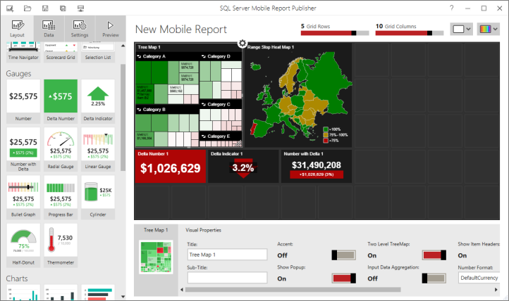

# Design first or data first when creating in Reporting Services mobile reports
  
L’ [!INCLUDE[PRODUCT_NAME](../../includes/ss-mobilereptpub-long.md)]vous permet de créer rapidement des rapports mobiles bien adaptés à la taille de votre écran, sur une aire de conception avec des lignes et des colonnes de grille réglables et des éléments de rapport mobile flexibles.   
  
Lorsque vous créez des rapports mobiles, vous avez le choix entre deux approches : commencer par les données ou commencer par la conception. [!INCLUDE[SS_MobileReptPub_Long](../../includes/ss-mobilereptpub-short.md)] prend en charge ces deux approches.   
  
## Commencer par la conception  
  
Le diagramme ci-après illustre les composants de la vue de mise en page de l’ [!INCLUDE[SS_MobileReptPub_Long](../../includes/ss-mobilereptpub-short.md)] :   
  
  
  
Dans l’approche qui consiste à commencer par la conception, vous créez tout d’abord une mise en page de rapport mobile sans importer de données. Cette méthode vous offre un bon moyen de créer un rapport mobile lorsque vous n’êtes pas certain que les données sont correctement formatées. En l’absence de données réelles, les éléments de la galerie sont automatiquement liés aux données simulées générées, que vous pouvez exporter et utiliser comme modèle pour décrire les données requises.  
  
## Commencer par les données  
Dans l’approche qui consiste à commencer par les données, vous importez tout d’abord la totalité des données requises, puis vous concevez le rapport mobile et vous définissez les propriétés de données sur les éléments du rapport mobile. Cette méthode offre l’avantage de permettre la connexion de chacun des éléments aux données réelles lorsque vous les ajoutez à la mise en page. Si vous utilisez l’approche qui consiste à commencer par les données, assurez-vous que vos données réelles sont correctement formatées pour être utilisées avec l’ [!INCLUDE[SS_MobileReptPub_Long](../../includes/ss-mobilereptpub-short.md)].   
  
 Le diagramme ci-après illustre les composants de la vue de données de l’ [!INCLUDE[SS_MobileReptPub_Long](../../includes/ss-mobilereptpub-short.md)] :  
  
  
  
### Voir aussi  
- [Créer et publier des rapports mobiles avec l’Éditeur de rapports mobiles SQL Server](../../reporting-services/mobile-reports/create-mobile-reports-with-sql-server-mobile-report-publisher.md)  
-  Affichez les [rapports mobiles SQL Server et les indicateurs de performance clés dans l’application iPad](https://pbiwebprod-docs.azurewebsites.net/en-us/documentation/powerbi-mobile-ipad-kpis-mobile-reports)  (Power BI pour iOS)  
-  Affichez les [rapports mobiles SQL Server et les indicateurs de performance clés dans l’application iPhone](https://pbiwebprod-docs.azurewebsites.net/en-us/documentation/powerbi-mobile-iphone-kpis-mobile-reports) (Power BI pour iOS)  
  
  
  
  

